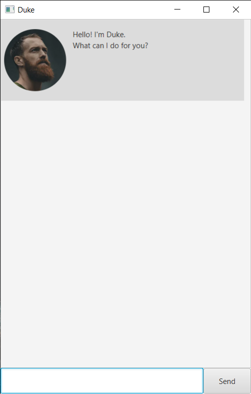

# Duke
> A task management app built for me, for you and for everyone

Are you constantly **stressed** about the tasks you need to do?

Fret not, Duke is here to help you!

Why use Duke? Because it
- is easy to learn and use
- comes ~~with a subscription price of $10/month~~ **FREE** forever

The project is named after the Java mascot _Duke_. It builds upon a template for a greenfield Java project provided by the CS2103/T teaching team.

## Quick set-up

The set-up is easy. Simply,
1. Download the jar file [here](https://github.com/botr99/ip/releases/tag/v0.2).
2. Copy the jar file into an *empty* folder.
3. Open a terminal at that folder.
4. Run `java -jar duke.jar` and you are good to go! 😎

## Features:
- Managing todos
- Managing events and deadlines
- Saving of tasks to the hard disk at all times
- Searching tasks by their descriptions
- Reminding users of their upcoming undone tasks
- GUI support

## Setting up in Intellij

Prerequisites: JDK 11, update Intellij to the most recent version, enable the Gradle plugin in Intellij.

1. Open Intellij (if you are not in the welcome screen, click `File` > `Close Project` to close the existing project first)
2. Open the project into Intellij as follows:
   1. Click `Open`.
   1. Select the project directory, and click `OK`.
   1. If there are any further prompts, accept the defaults.
3. Configure the project to use **JDK 11** (not other versions) as explained in [here](https://www.jetbrains.com/help/idea/sdk.html#set-up-jdk). 
   In the same dialog, set the **Project language level** field to the `SDK default` option.
4. Ensure that the selected version of `Gradle JVM` matches the JDK used.
5. After that, locate the `src/main/java/duke/Launcher.java` file, right-click it, and choose `Run Launcher.main()` (if the code editor is showing compile errors, try restarting the IDE). If the setup is correct, you should see something like the below as the output:

   
