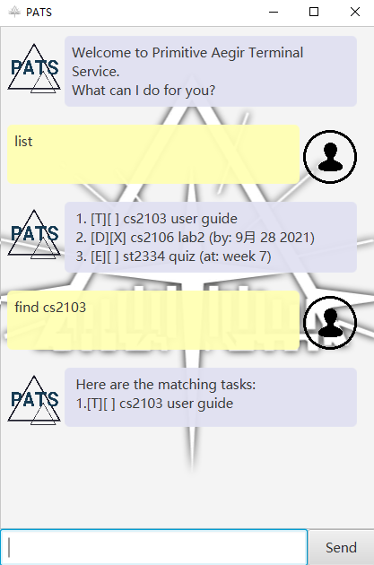

# PATS: User Guide

PATS stands for "Primitive Aegir Terminal Service". It is a task manager that helps you to manage todos, events and 
deadlines.

--------------------------------------------------------------------------------------------------------------------

## Setup:

1. Ensure you have Java `11` or above installed in your Computer.

1. Download the jar package `ip-all.jar` from the release **PATS v0.2**.

1. Pick a directory as home directory, then copy the jar file to it. Note that PATS would create directories to store 
   data on runtime.

1. Double-click the file to start the app. The GUI similar to the below should appear in a few seconds.  
   

--------------------------------------------------------------------------------------------------------------------

## Features

**Notes about the command format:**

* Words in curly brackets are the parameters to be supplied by the user.  eg. In `todo {Description}`, 
  `{Description}` is a parameter which can be used as `todo read book`.
  
* Whitespaces between keywords (like `todo`, `done`) and parameters cannot be ignored.

* PATS is _case-sensitive_ with both commands and contents.   eg. If there is a task with description "CS2103",
  `find cs` will not return that task.

* PATS stores data in hard disc automatically. **Do not** externally modify any file generated by PATS. 
  This will result in PATS's saving/loading error.

* PATS cannot recognize the symbol "|" (_vertical bar character_), so please do not include it in your commands.

### Listing all tasks : `list`

Shows a list of all tasks in PATS.

Format: `list`

### Adding a todo task: `todo`

Adds a todo task to PATS.

Format:`todo {Description}`

Example:
* `todo read book`

### Adding a deadline task: `deadline`

Adds a deadline task to PATS. 

Format:`deadline {Description} /by {Due_Time}`
* If `Due_Time` is in format "yyyy-mm-dd" _(eg. 2021-09-17)_, PATS will transform the date to your local date format.

Example:
* `deadline CS2103 iP user guide /by 2021-09-17`

### Adding a event task: `event`

Adds a event task to PATS.

Format:`event {Description} /at {Period}`

Example:
* `event CS2103 tP /at Week 7 to Week 12`

### Locating a task by description: `find`

Finds tasks whose descriptions contain all the given keywords.

Format: `find {Keyword}`

* The search is case-insensitive. e.g `cs` will match `cs2103` but not `CS2103`

Examples:
* `find cs2103`

### Marking a task as done: `done`

Marks the specified task as done in PATS.

Format: `done {Index}`

* Marks the task at the specified `Index`. Use `list` command to check index of tasks.
* The index **must be a positive integer** 1, 2, 3, …

Examples:
* `done 2`

### Deleting a task : `delete`

Deletes the specified task from PATS.

Format: `delete {Index}`

* Deletes the task at the specified `Index`. Use `list` command to check index of tasks.
* The index **must be a positive integer** 1, 2, 3, …

Examples:
* `delete 2`

### Deleting all tasks : `deleteall`

Removes all tasks from PATS.

Format: `deleteall`

### Stop reacting with PATS: `bye`

Stops reacting with PATS. 

Format: `bye`

--------------------------------------------------------------------------------------------------------------------

## Command summary

Action | Format
--------|------------------
**list** | `list`
**todo** | `todo read book`
**deadline** | `deadline read book /by tonight`
**event** | `event read book /at this weekend`
**find** | `find read book`
**done** | `done 1`
**delete** | `delete 1`
**deleteall** | `deleteall`
**bye** | `bye`
