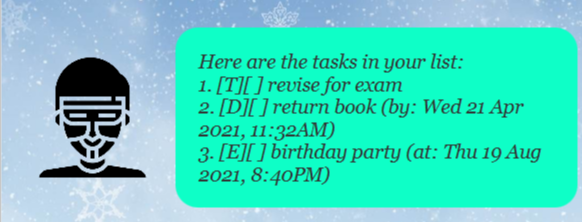
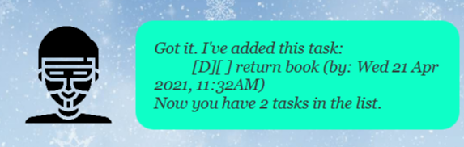

# Nyx
Nyx is a **desktop app for managing tasks, events and deadlines**. 

## Features
### List all tasks
Shows a list of all tasks currently stores by Nyx.

### Add a task
Adds a task to Nyx.

There are 3 different types of tasks that can be added:
* **ToDo**: A task without a deadline
* **DeadLine**: A task that needs to be completed by a certain date and time
* **Event**: Something that will occur at a specific date and time

### Mark a task as done
Marks a specific task as done once it is completed.

### Delete a task
Deletes a specific task from Nyx.

### Updates a task
Updates a specific task in Nyx.

### Search for tasks
Find tasks using the given keywords.

## Usage
### `list` - Displays all tasks
Displays all tasks currently stored in Nyx.

Example of usage:

`list`

Expected outcome:

### `todo` - Adds a ToDo task
Adds a ToDo task to Nyx.

Required format: `todo <description>`

Example of usage:

`todo revise for exam`

Expected outcome:

### `deadline` - Adds a DeadLine task
Adds a DeadLine task to Nyx.

Required format: `deadline <description> /by YYYY-MM-DD H:m`

Example of usage:

`deadline return book /by 2021-04-21 11:32`

Expected outcome:

### `event` - Adds an Event task
Adds an Event task to Nyx.

Required format: `event <description> /at YYYY-MM-DD H:m`

Example of usage:

`event birthday party /at 2021-08-19 20:40`

Expected outcome:

### `done` - Mark a specific task as done
Sets the task at the specified index as completed.

Required format: `done <index>`

Example of usage:

`done 1`

Expected outcome:

### `delete` - Deletes a specific task
Removes the task at the specified index from Nyx.

Required format: `delete <index>`

Example of usage:

`delete 1`

Expected outcome:

### `update` - Updates a specific task
Edits the task at the specified index.

Required format: 
* ToDo: `update <index> <description>`
* DeadLine: `update <index> <description> /by YYYY-MM-DD H:m` 
* Event: `update <index> <description> /at YYYY-MM-DD H:m`

Example of usage:

`update 2 gary's birthday /at 2021-08-19 18:00`

Expected outcome:

### `find` - Search for a task
Search for a task using the specified keywords

Required format: `find <keywords>`

Example of usage:

`find ret`

Expected outcome:

### `bye` - Exits the program
Shuts down the app immediately.

Example of usage:

`bye`

## Credits
1. https://www.flaticon.com/free-icon/user_1736218?term=user&related_id=1736218 Kiranshastry
2. https://www.flaticon.com/free-icon/hacker_1473736?term=hackers&related_id=1473736 Eucalyp
3. https://www.pinterest.com/pin/540291286525012021/ Gr8desktopbackgrounds.com
