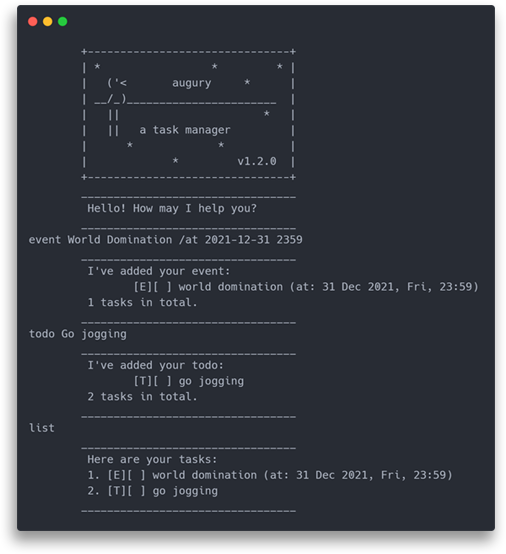

# Augury

#### Task management app for organized minds 🐤

---
- [What is Augury?](#what-is-augury)
- [Features](#features)
- [Download and Usage](#download-and-usage)
- [Development](#development)
- [Acknowledgements](#acknowledgements)
---

## What is Augury?
Augury is a task-management application built for CS2103T - Software Engineering, as part of the Individual Project (IP).

Much like a certain (very dead) [Prince of Denmark](https://www.youtube.com/watch?v=EHUZ1_cxdyw), indecision is a common source of downfall for us humans.
Turn your future tasks into omens of good fortune, today!

>Hold Infinity in the palm of your hand
> 
>And Eternity in an hour.
>
> — William Blake

  

## Features
### 1. **Customizable UI built with JavaFX**

   
Love customization? Augury is fully responsive, supporting fullscreen and windows of various sizes.
Switch between your favourite colour themes within the app!

This was my first time working on JavaFX, and I sought to create the best UI I could.
Overall, it was a great learning experience.

### 2. **Persistent data storage** 
   
You no longer have to be afraid of losing your data, or worry about transferring data to another device!
Augury automatically saves your tasks in plaintext files (in the `data/tasks.txt` directory), so you can easily export to other formats.

### 3. **Command Line Interface for CLI lovers**
   

Are you a power user who loves the terminal?
Simply run Augury with the flag `-mode console` to launch the CLI mode!

### 4. **Cross-platform**

   
Augury runs smoothly on Windows, Linux and MacOS systems!

### 5. **Automated Unit Testing and Github Continuous Integration**
   
Unit tests were written using JUnit in order to test the individual parts of the code.
Gradle is used in conjunction with Github Continuous Integration (CI) to ensure tests run properly every commit.

### 6. **Fast and intuitive task management** 

Augury provides a super-intuitive way to manage your tasks -- just create a task, include the relevant details, and mark as done once completed!

Additional features included:
- **Search** - Blazing fast search to find tasks, with clever built-in search filters.
- **Batch operations** - Delete or Mark multiple tasks at once!
- **Manage date & time** - Create Deadline or Event tasks that have a time associated with them!
- **Command aliases** - Less keystrokes to type, more time for productivity!

Check out the [full features included with Augury](docs/README.md)!

## Download and Usage

Cross-platform JAR of Augury can be downloaded [here](https://github.com/qreoct/ip/releases).

Launch Augury by double-clicking the .jar file, or run `java -jar duke.jar -mode console` to run Augury in console mode. 

### Using Augury
Here are some commands to get you started. For more information, read the [User Guide](docs/README.md).

#### `todo <description>` - Create new todo task

#### `list` - Show all tasks

#### `done <tasknumber>` - Mark task as done

## Development

**Prerequisites**

- Java 11.0.9
- Fork this repository to your GitHub account and clone the fork to your computer
  
**Running Augury**
- Open the `ip` directory as a Project file in your IDE of choice
- Java source code is found in `ip/src/main/java/duke`
- Running `Launcher.java` with CLI arguments `-mode console` starts Augury in CLI mode
- Running `Launcher.java` without CLI arguments starts Augury in GUI mode
- Unit tests are located in the `ip/src/test/java/duke` directory

**Contributing**
- Augury is open source, and any feedback or pull requests are welcome 😊

## Acknowledgements
- [Pigeon image](https://www.irasutoya.com/2018/01/blog-post_419.html) from [Irastoya](https://www.irasutoya.com/p/terms.html)
- [Windy Cloudy Icon](https://www.s-ings.com/typicons/) from Typicons 
- Themes are based off [Hundred Rabbits' Theme Framework](https://github.com/hundredrabbits/Themes).
