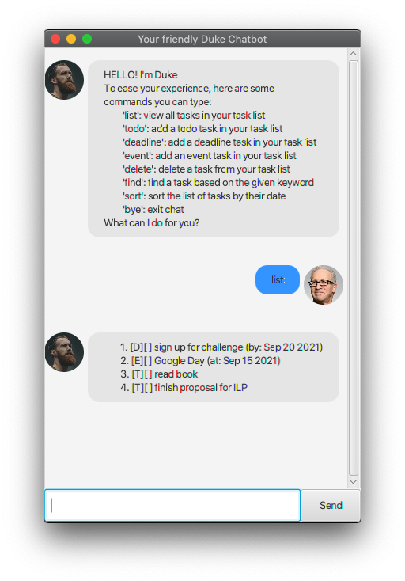
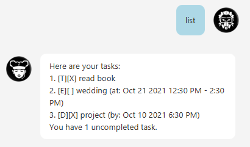

# TaskMan User Guide
TaskMan is your one-stop-shop for all your task management! TaskMan tracks your various types of task and compiles it in a neat list for your convinience. Make TaskMan your personalised *TASK MAN*ager today!

## Quick Navigation
* [Quick Setup](#quick-setup)
* [Features](#features)
* [Usage](#usage)
    * [Adding a task to do :`todo`](#adding-a-task-to-do-todo)
    * [Adding a task with a deadline: `deadline`](#adding-a-task-with-a-deadline-deadline)
    * [Adding an event: `event`](#adding-an-event-event)
    * [Looking at all the task being tracked: `list`](#looking-at-all-the-task-being-tracked-list)
    * [Finding task using keyword: `find`](#finding-task-using-keyword-find)
    * [Mark task as complete: `done`](#mark-task-as-complete-done)
    * [Remove a task: `delete`](#remove-a-task-delete)
    * [Viewing help : `help`](#viewing-help--help)
*  [Exiting the application: `bye`](#exiting-the-application-bye)
## Quick Setup
    1. Ensure you have Java 11 or above installed in your Computer.
    2. Using the Command Line, run the command java -jar duke.jar (i.e., run the command in the same folder as the jar file)

Successfully opening TaskMan would lead you to a window like this



** Common Errors **
1. Please ensure that Java 11 or above is installed. You may download the lastest version [here](#https://www.oracle.com/java/technologies/downloads/)


## Features
Listed below is a short description of what TaskMan can do as a task manager

### Types of tasks
- [_Todo:_](#adding-a-task-to-do-todo) a simple task with a short description
- [_Event:_](#adding-an-event-event) a Event **date** that you want to keep track of
- [_Deadline:_](#adding-a-task-with-a-deadline-deadline) a Deadline that you want to keep track of

### Set status of task
- [_Done Status:_](#mark-task-as-complete-done) After task completion, task may be set as done

### Other useful features
- [_Delete:_](#remove-a-task-delete) Deleting a task if you dont want to keep track of it anymore
- [_List:_](#looking-at-all-the-task-being-tracked-list) A list of all the tasks being tracked
- [_Find:_](#finding-task-using-keyword-find) Finding a task based on a keyword in its description

## Usage

### Adding a task to do :`todo`
A task with a description. You may use either the **Command Line Format** or the given **GUI button**

Command Line Format: `todo [description]`


GUI Button:

1. Click the `+` button on the top right 
2. Select `todo` under **Tasktype**
3. Add your task description under **Description**

Expected output for both methods:

```
 Got it, I've added this task:
  [T][] description
 Now you have x task in the list
```
_*x refers to the number of task in the list_

**Troubleshoot common errors:**
1. Missing Description, TaskMan requires a description to be attached to all task


###Adding a task with a deadline: `deadline`
A task with a day to be set as a deadline. You may use either the **Command Line Format** or the given **GUI button**

Command Line Format:  
`deadline [description] /by [YYYY-MM-DD] [Time in 24 Hour Format]`

GUI Button:

1. Click the `+` button on the top right
2. Select `deadline` under **Tasktype**
3. Add your task description under **Description**
4. Pressing `add task`
5. Add your date in `YYYY-MM-DD` 
6. Add your time in `24 hour format`

Example: 'deadline description /by 2021-09-14 1200' 

Expected output for both methods:

```
 Got it, I've added this task:
  [D][] description (by: Sep 14 2021 1200 hrs)
 Now you have x task in the list
```
_*x refers to the number of task in the list_

**Troubleshoot common errors:**

1. Missing Description, TaskMan requires a description to be attached to all task
2. Missing/Wrong date input. Requires YYYY-MM-DD.
3. Missing/Wrong Time input. Requires time to be in 24 hour format (0000 to 2359)


###Adding an event: `event`
A task with a day to be set as an Event. 
You may use either the **Command Line Format** or the given **GUI button**

Command Line Format:  
`event [description] /at [YYYY-MM-DD] [Time in 24 Hour Format]`

GUI Button:

1. Click the `+` button on the top right
2. Select `event` under **Tasktype**
3. Add your task description under **Description**
4. Pressing `add task`
5. Add your date in `YYYY-MM-DD`
6. Add your time in `24 hour format`

Example: 'event description /at 2021-09-14 1200'

Expected output for both methods:

```
 Got it, I've added this task:
  [E][] description (by: Sep 14 2021 1200 hrs)
 Now you have x task in the list
```
_*x refers to the number of task in the list_

**Troubleshoot common errors:**
1. Missing Description, TaskMan requires a description to be attached to all task
2. Missing/Wrong date input. Requires YYYY-MM-DD
3. Missing/Wrong Time input. Requires time to be in 24 hour format (0000 to 2359)


### Looking at all the task being tracked: `list`
Get a list of all the task being tracked. 
You may use either the **Command Line Format** or the given **GUI button**

Command Line Format: `list`

GUI Button:
1. Click the  button on the top left

Expected output for both methods if the list is populated:
```
 1. [task1 details here]
 2. [task2 details here]
 ...
```
Expected output for both methods if the list is not populated:
```
Im sorry, the list seems to be empty
```

**Troubleshoot common errors:**
1. Adding something else after `list` in the Command Line. This will invalidate the command

### Finding task using keyword: `find`
Find a task based keyword description . 
You only have the Command Line for this feature. **_GUI option coming soon_**

Command Line Format: `find [keyword/s]`

Expected output:
```
 Here are the tasks with the keyword : [keyword/s]
 x. [taskx details here]
 ...
```
_*x refers to the task position in the whole list._  

**Troubleshoot common errors:**
1. No spacing between `find` and `[keywords]`. TaskMan would not recognize it as a command


### Mark task as complete: `done`
Marks a task as complete. You only have the Command Line for this feature. **_GUI option coming soon_**

Command Line Format: `done [task position in list]`

Expected output:
```
 Nice! ive marked this task as done:
 x. [taskx details here]
 ...
```
_*Note, to find `[task position in list]` , user may use either [find](#finding-task-using-keyword-find) or 
[list](#looking-at-all-the-task-being-tracked-list)_

**Troubleshoot common errors:**
1. Invalid Task number. Task position may be invalid due to
    1. Number is out of bounds (Negative or larger than list size)
    2. task position is not in **NUMERICAL** form


### Remove a task: `delete`
Delete a task. You only have the Command Line for this feature. **_GUI option coming soon_**

Command Line Format: `delete [task position in list]`

Expected output:
```
 Noted. Ive removed this task: 
  [taskx details here]
 Now you have x tasks in the list
```
_*x refers to the number of task in the list_

**Troubleshoot common errors:**
1. Invalid Task number. Task position may be invalid due to
    1. Number is out of bounds (Negative or larger than list size)
    2. task position is not in **NUMERICAL** form

###Viewing help : `help`
A quick way to access instructions for Command Line Commands
A task with a description. You may use either the **Command Line Format** or the given **GUI button**

Command Line Format: `help`

GUI Button:

1. Click the `?` button on the top right

Expected Output:
```
 Here is a quick guide on the Command line Commands:
 ----------------------------------------------
 Viewing help : help
 ----------------------------------------------
 List all task : list
 ----------------------------------------------
 Add task: todo [task details]
 ----------------------------------------------
 Add deadline : deadline [details] /by 
 [YYYY-MM-DD] [24-hour] 
 ----------------------------------------------
 Adding a event : event [task details] /at 
 [YYYY-MM-DD] [24-hour]
 ----------------------------------------------
 Completing a task: done [task list position]
 ----------------------------------------------
 Search task by keyword: find [keyword] 
 ----------------------------------------------
 Deleting a person : delete [task list position]
 ----------------------------------------------
 Exiting the program : bye";
```

###Exiting the application `bye`
There are two ways to close the application.
Either a Command Line or simply closing `x` on the top right

Format: `bye`

Expected Output:
```aidl
 Bye! Hope to see you soon
```

*Note, these are the only two ways to ensure that all previous commands are properly saved. 


## Reporting an Issue
If there are any bugs found, do kindly file report with a screenshot and a short description of 
the encountered bug.


