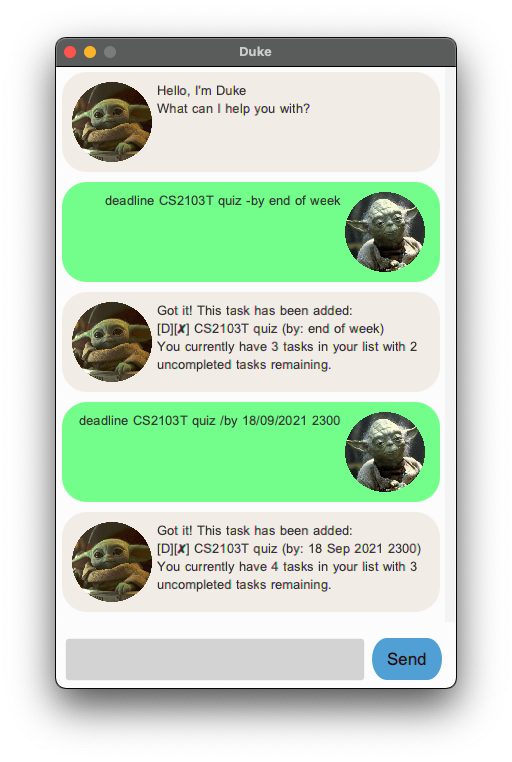
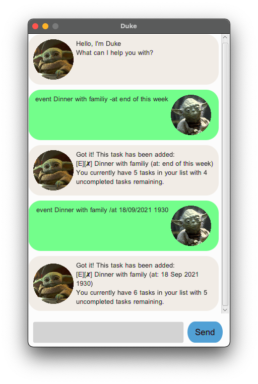
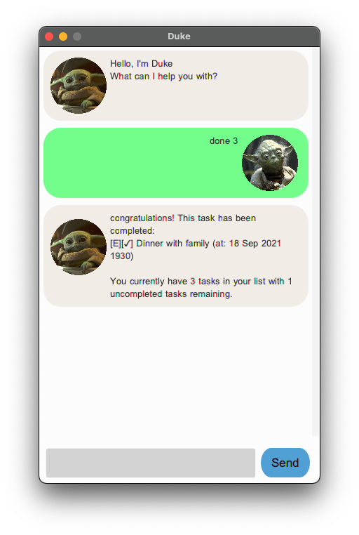
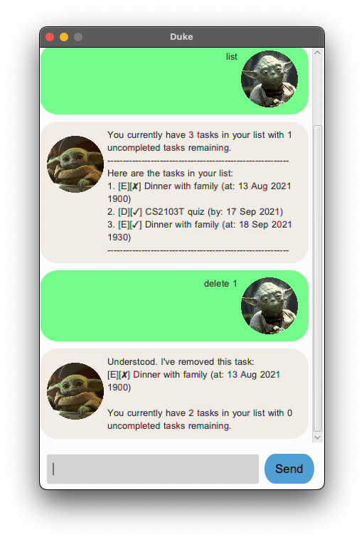
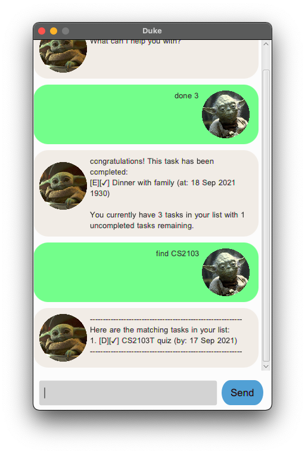

# Duke User Guide
Duke is a text-based, lightweight and easy-to-learn chatbot that frees your mind from having to remember all your important tasks in a day. Duke is able to save all your tasks on your local computer so that you can easily access and update it even when you are offline.

* [Quick start](#quick-start)
* [Features](#features)
  * [Deadline](#deadline--add-deadline-tasks)
  * [Event](#event--add-event-tasks)
  * [Todos](#todos--add-todo-tasks)
  * [List](#list--view-all-tasks)
  * [Done](#done--mark-tasks-as-done)
  * [Dlete](#delete--delete-tasks)
  * [Find](#find--search-for-a-task)
  * [Undo](#undo--undo-a-previous-change)
  * [Bye](#bye--exits-the-programme)
* [Command summary](#command-summary)

## Quick start

## Features 

* [Deadline](#deadline--add-deadline-tasks)
* [Event](#event--add-event-tasks)
* [Todos](#todos--add-todo-tasks)
* [List](#list--view-all-tasks)
* [Done](#done--mark-tasks-as-done)
* [Dlete](#delete--delete-tasks)
* [Find](#find--search-for-a-task)
* [Undo](#undo--undo-a-previous-change)
* [Bye](#bye--exits-the-programme)

### Add Different types of tasks

Duke allows you to add three different types of tasks to a task list that saves all your tasks.

The three tasks supported by duke are:
* `Todos`: Tasks without any date or time attached to it *e.g., Visit a new theme park*
* `Deadlines`: Tasks that needs to be done before a specific date/time *e.g., Submit an assignment by Monday*
* `Events`: Tasks that start at a specific date/time *e.g., Dinner tomorrow night at 7pm*
####
### Keep track of tasks

Duke allows you to easily keep track of tasks.

You can:
* Easily view all your tasks
* Mark any completed tasks as done
* Delete any old tasks
* Search for tasks by name
* Undo any previous changes
 

## Usage

**All command works given in duke are case-insensitive.** e.g The command `LIST` and `list` are equivalent.

### `Deadline` : Add deadline tasks

Add a new deadline task to the task list. A task name, and a deadline date has to be specified with the command. For the date, dude accepts two types of dates, formatted dates and unformatted dates. A formatted date allows Duke to recognise the specific date/time.

Unformatted dates are simply generic Strings such as "tomorrow at 6 pm" or "next week".

Formatted dates are specific dates/times which are entered in the format `DD/MM/YYYY HHMM`. The time portion is optional. Only a date is required. e.g. 24/06/2022 1800 (date and time), 01/08/2021 (date only)

#### Format:
To enter a deadline with an unformatted date:
`deadline {task name} -by {unformatted date}`

To enter a deadline with a formatted date
`deadline {task name} /by {formatted date}`

#### Examples of usages:
Adding a deadline task with an unformatted date:
`deadline CS2103T quiz -by end of this week`

Adding a deadline task with a formatted date:
`deadline CS2103T quiz /by 18/09/2021`

Adding a deadline task with a formatted date and time:
`deadline CS2103T quiz /by 18/09/2021 2300`

 
 
### `Event` : Add event tasks

Add a new event task to the task list. A task name and an event date has to be specified with the command. For the date, dude accepts two types of dates, formatted dates and unformatted dates. A formatted date allows Duke to recognise the specific date/time. More information on formatted dates in Duke can be found above under the deadline command.

The command to enter a deadline with an unformatted date:
`event {task name} -at {unformatted date}`

The command to enter a deadline with a formatted date
`event {task name} /at {formatted date}`

#### Examples of usages:
Adding a deadline task with an unformatted date:
`event Dinner with family -at end of this week`

Adding a deadline task with a formatted date:
`event Dinner with family /at 18/09/2021`

Adding a deadline task with a formatted date and time:
`event Dinner with family /at 18/09/2021 1930`

 
 
### `Todo` : Add todo tasks

Add a new todo task to the task list. Only the name of the task has to be specified with the command.

#### Format:
`todo {todo task name}`

#### Examples of usages:
`todo buy milk`
 
 
### `List` : View all tasks:

Displays all your added task in the task list along with the appropriate details such as the task date and completed status.

#### Format:
`list`

![List](listExample.png
 
 
### `Done` : Mark tasks as done

Mark a task in the task list as completed using its index. The index can be obtained by using the `list` command above. Duke supports marking multiple tasks as done in one go. Hence, you can enter more than 1 index in a single command.

#### Format:
`done {task index/indexes}`

#### Examples of usages
Mark task 1 as completed: `done 1`

Mark task 1, 4 and 6 as completed: `done 1 4 6`

 
 
### `Delete` : Delete tasks

Delete a task in the task list using its index. The index can be obtained by using the `list` command above. Duke supports the deletion of multiple tasks in one command. Hence, you can enter more than 1 index in a single command.

#### Format:
`delete {task index/indexes}`

#### Examples of usages
Delete task 1: `delete 1`

Delete task 1, 4 and 6: `delete 1 4 6`

 
 
### `Find` : Seach for a task

Find a task in the task list whose name matches the provided keywords. The search is case insensetive but the order of the word matters.

#### Format:
`Find [keywords]`

#### Examples of usages:
`Find CS2100` will find tasks that has the keyword "CS2100" in its name.

 
 
### `Undo` : Undo a previous change

Undo any previous changes made to the task list.
#### Format: 
`Undo`
 
 
### `Bye` : Exits the programme

Close the chat bot.
#### Format: 
`Bye`
 
 
## Command summary

**Command** | **Format**
------------ | -------------
**Add todo task** | Content from cell 2
**Add deadline task with unformatted date** | `deadline {task name} -by {unformatted date}` e.g., deadline IP -by end of week
**Add deadline task with formatted date** | `deadline {task name} /by DD/MM/YYYY HHmm` e.g., deadline IP /by 24/09/2021 2359
**Add event task with unformatted date** | `event {task name} -at {unformatted date}` e.g., event Dinner -at tomorrow evening
**Add event task with formatted date** | `event {task name} /at DD/MM/YYYY HHmm` e.g., event Dinner /at 15/09/2021 1930
**List all tasks** | `list`
**Mark task as completed** | `done {task index/indexes}` e.g., done 2 or done 2 3 4
**Delete task** | `delete {task index/indexes}` e.g., delete 2 or delete 2 3 4
**Finding a task** | `find {keywords}` e.g., find CS2103
**Undoing a command** | `undo`
**Closing the session** | `bye`
