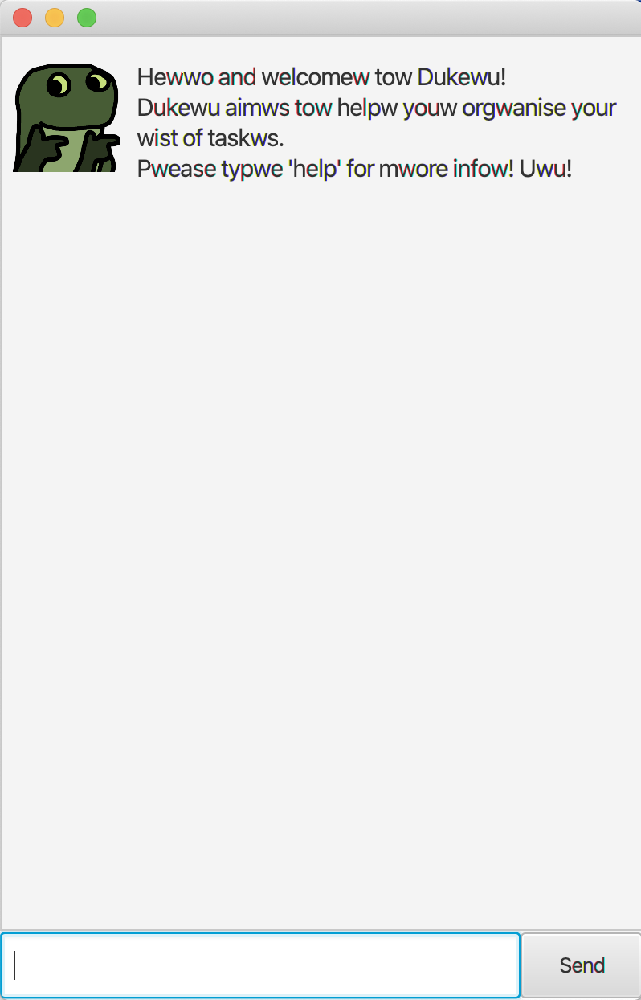
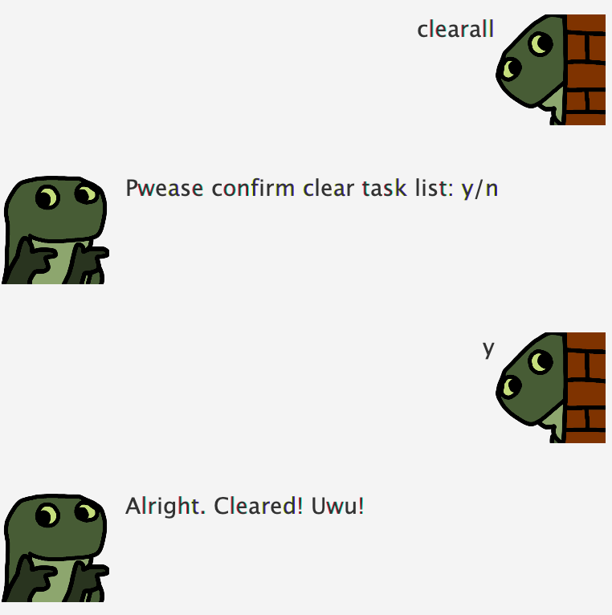

# Super Pretty Ultra Hyper Mega Cute Shining God of Destruction Dukuwu ~~☆☆☆ tehe
> dowcto, wewre losing him!! 
> qwick, hand me the defibwiwatow!! 
> please. turn off my [redacted] life support 
>                              - You after you use Dukuwu [(source)](https://i.redd.it/qcsnneo5fyh01.jpg)

By: `Ruth Poh` Since: `September 2021`

## 1. Introduction
***
Dukewu is a modified version of the Personal Assistant Chatbot Duke, complete with owo language support. 
Dukewu can help you **manage your tasks** with an **easy-to-read Graphical User Interface (GUI)** that 
operates using **text commands**.

## 2. Quick Start
***
* Ensure you have Java `11` or above installed in your Computer.
* Download the latest `duke.jar` [(here)](https://github.com/ruthpohrp/ip/releases).
* Copy the file to the folder you want to use as the home folder for your Dukewu.
* Double-click the file to start the app. The GUI should appear in a few seconds.

## 3. Command Summary
***

| Summary | Command | Example |
|---------| ------- |---------|
|**Help:**|`help`|-|
|**List:**|`list`|-|
|**Todo:**|`todo TASK`|`todo finish my homework`|
|**Deadline:**|`deadline TASK /by DATE [TIME]`|`deadline Finish my homework /by 2021-09-16`
|**Event:**|`event TASK /at DATE [TIME]`|`event Christmas party at my neighbour's /at 2021-12-25`
|**Find:**|`find KEYWORDS [MORE KEYWORDS]`|`find catboys`
|**Delete:**|`delete NUMBER`|`delete 5`
|**Done:**|`done NUMBER`|`done 5`|
|**Clearall:**|`clearall` followed by `y`|-|
|**Exit:**|`bye`|-|

## 4. Command Features
***
**Command Format**
* Words in `UPPER_CASE` are the parameters to be supplied by the user e.g. in `todo TASK`, `TASK` is a 
  parameter which can be used as `todo TASK`.
* Commands are case-insensitive, e.g. `todo TASK` is computed the same way as `ToDo TASK`
* Items in square brackets are optional e.g. `TASK DATE [TIME]` can be used as `TASK DATE` or as `TASK 
  DATE TIME`.
* Parameters must be input in the order specified.

> 💡 By the way, I heard that if you type in 'love' into Dukewu, something nice will happen...

### 4.1 Viewing help: `help`
Displays a list of commands that Dukewu supports.

Format: `help`

### 4.2 Viewing the task list: `list`
Displays your list of tasks.

Format: `list`

### 4.3 Creating a Todo task
Adds a task with no deadline to the task list.

Format: `todo TASK`

Examples:
* `todo finish my homework`
* `todo prepare a burial so my teammates can let me down one last time`

### 4.4 Creating a Deadline task
Adds a task with a deadline to the task list.

Format: `deadline TASK /by DATE [TIME]`
* `DATE` must be in the format `YYYY-MM-DD`
* `TIME`, if any, must be in the 24-hour format `XX:XX`

Examples:
* `deadline Finish my homework /by 2021-09-16`
* `deadline Finish and submit my project /by 2021-09-17 23:59`

### 4.5 Creating a Event task
Adds a task with a time that it occurs to the task list.

Format: `event TASK /at DATE [TIME]`
* `DATE` must be in the format `YYYY-MM-DD`
* `TIME`, if any, must be in the 24-hour format `XX:XX`

Examples:
* `event Christmas party at my neighbour's /at 2021-12-25`
* `event Grab Delivery collection /at 2021-12-25 23:59`

### 4.6 Finding entries: `find KEYWORD [MORE KEYWORDS]`
Finds entries with certain keywords in them.

Format: `find KEYWORDS`
* The search is case-insensitive. e.g `cAt` will match `cat`
* The keywords are space-sensitive e.g. `cAtboy` will not match `catboy`
* Only the task description is searched, not date or time.

Examples:
* `find catboys`
  
  Returns `feed my catboys` and `buy clothes for my catboys`
* `find cat boys`
  
  Returns `feed my cat boys` but not `feed my catboys` 

### 4.7 Deleting entries: `delete`
Deletes task number `NUMBER` on the task list.

Format: `delete NUMBER`
* Dukewu only accepts positive integers. Any funny attempts will result in an error.
* Entry must be a valid entry in the task list i.e. Trying to `delete 11` when there are only 10 entries 
  in the list will result in an error.
> 💡 **NOTE:** After deletion, task entries listed below the deleted task will shift upwards.
> ⚠️ **WARNING:** This command cannot be reversed. Be careful when using this command!

Examples:
* `delete 3`
  
    Deletes the 3rd entry in the task list.

### 4.8 Marking entries as done: `done`
Marks a task in the task list as done.

Format: `done NUMBER`
* Dukewu only accepts positive integers. Any funny attempts will result in an error.
* Entry must be a valid entry in the task list i.e. Trying to `delete 11` when there are only 10 entries
  in the list will result in an error.

Examples:
* `done 4`
  
  Marks the 4th entry in the task list as done.

### 4.9 Clearing all entries: `clearall`
Clears all entries from the task list. Asks for confirmation before deletion.
> ⚠️ **WARNING:** This command cannot be reversed. Be careful when using this command!

Format: `clearall` followed by `y`

### 4.10 Exiting the program: `bye`
Exits the program. 
> ⚠️ **WARNING:** Do not attempt to input anything into the GUI after inputting this command. Bad things 
> will happen!

Format: `bye`

### 4.11 Saving the data
Task data is automatically saved into the hard disk after any command that changes the data. There is no 
need to save manually. 

## 5. FAQ
***
**Q:** `Dukewu.jar` isn't opening when I double click it. 
**A:** If you're on Windows, go to settings and change it so it runs Java(TM) Platform SE binary by 
default. If you're on Mac, make sure you have the latest version of Java installed before double-clicking 
on the .jar file. If all fails, you can manually open the .jar on the command terminal using the command 
`-java Dukewu.jar`. (Make sure your current directory is the directory where your .jar is before using the 
command.)  

**Q:** Will there be updates in the future? 
**A:** Sadly, I do not plan to have any big updates in the future. I'm trapped in homework hell.

**Q:** What is the secret to acing CS2103T? 
**A:** I would like to know that too :')
