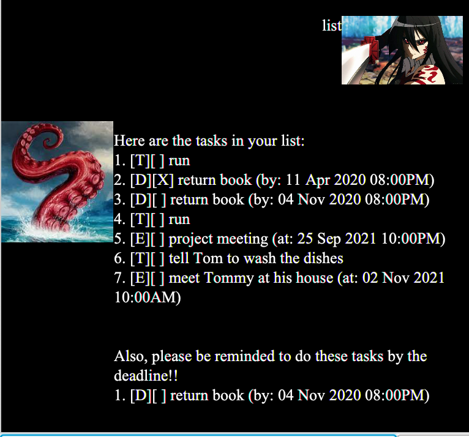
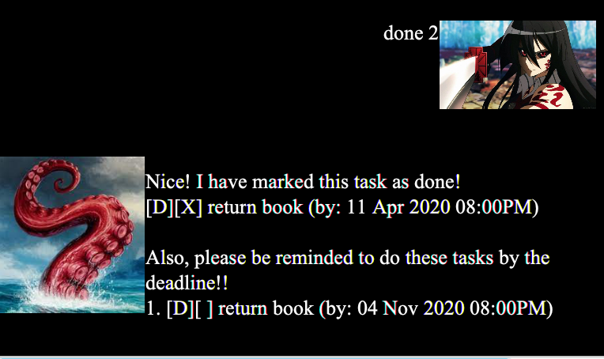
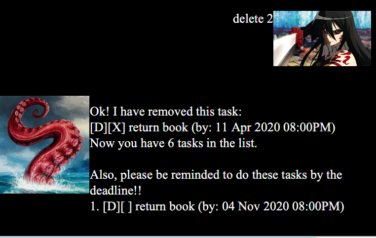
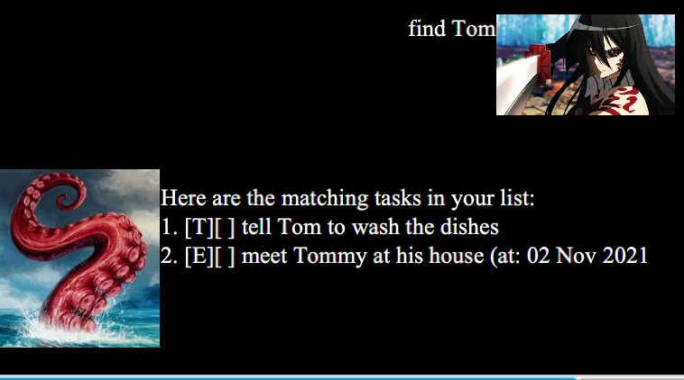

# User Guide for Duke

## Features 

### Adding task to be done: `todo`

Adds a task to be done to Duke.

Format: `todo TASK_TO_BE_DONE`

Examples:
- `todo running`
- `todo wash the dishes`

### Adding event to attend: `event`

Adds an event to be attended to Duke.

Format: `event EVENT_TO_ATTEND /at DATE_TIME`
- DATE_TIME is to be in the format of dd/mm/yyyy HHmm, time will follow the 24hour clock format.

Examples:
- `event project meeting /at 25/09/2021 2200`
- `event concert /at 25/12/2022 1500`

### Adding deadline to be completed: `deadline`

Adds a task with a deadline to be completed by to Duke. It will also be added as a reminder.

Format: `deadline TASK_TO_COMPLETED_BY_DEADLINE /at DATE_TIME`
- DATE_TIME is to be in the format of dd/mm/yyyy HHmm, time will follow the 24hour clock format.

Examples:
- `deadline project /by 25/09/2021 2200`
- `deadline buy presents /by 25/12/2022 1200`

### Listing all tasks and reminders for deadlines to be completed: `list`

Shows a list of all tasks in Duke and also shows a list of all deadlines to be completed as a reminder.

Format: `list`

Examples: `list`

### Marking task as done: `done`

Marks a task in Duke as done. If the task has a deadline, it will be removed from the reminder list in Duke.

Format: `done INDEX`
- Deletes the task at the specified `INDEX`.
- The index refers to the index number shown in the displayed task list.
- The index **must be a positive integer** 1, 2, 3, ...

Example:
- `done 2` marks the second task in the task list as done.
  

### Deleting task from Duke: `delete`

Deletes a task from the task list in Duke. If the task has a deadline, it will be removed from the reminder 
list in Duke.

Format: `delete INDEX`
- Deletes the task at the specified `INDEX`.
- The index refers to the index number shown in the displayed task list.
- The index **must be a positive integer** 1, 2, 3, ...

Examples:
- `delete 2` removes the second task in the task list. If it
has a deadline, remove it from the reminder list too.

### Finding tasks from Duke: `find`

Finds tasks which descriptions contain the given String.

Format: `find ANY_STRING`
- Description of the tasks does not include the date and time of the task.

Examples:
- `find Tom` returns a list of tasks that contains the string Tom.

