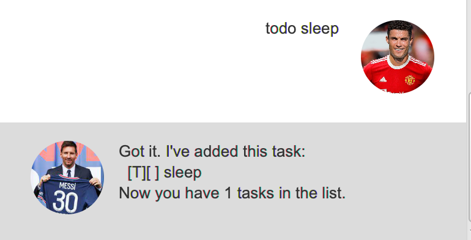
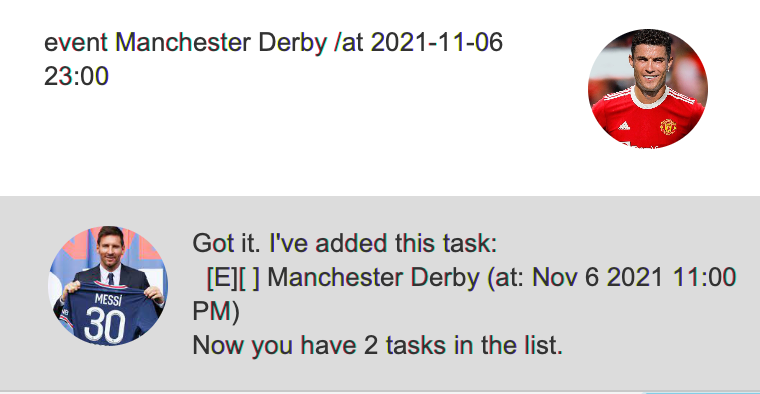
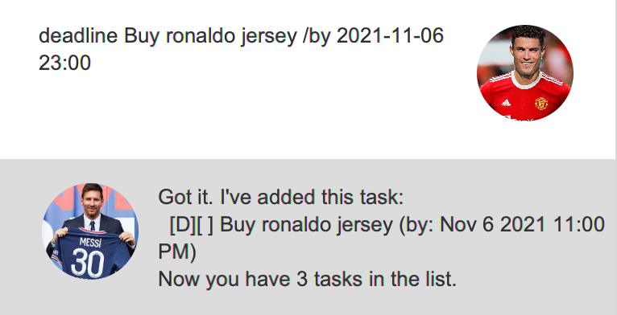
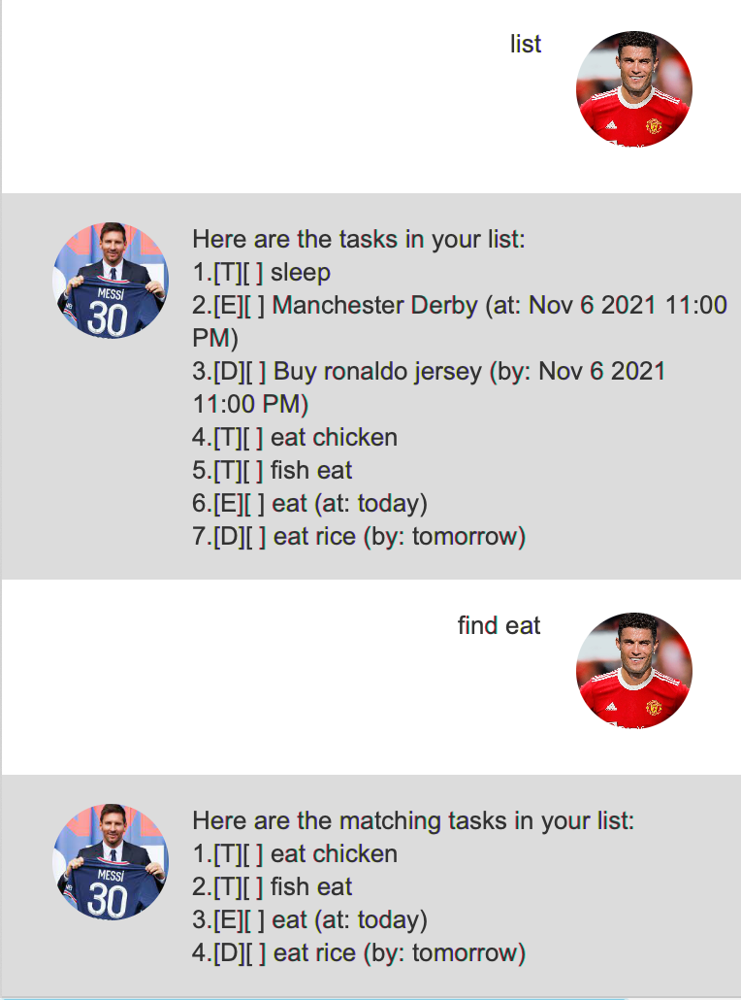
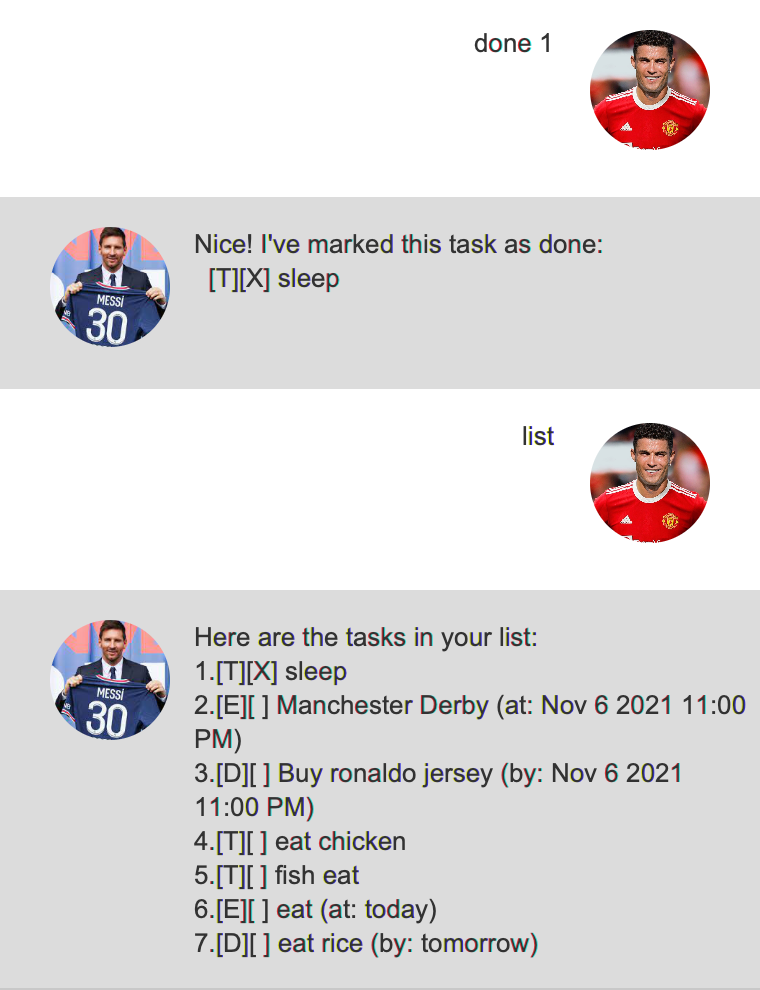
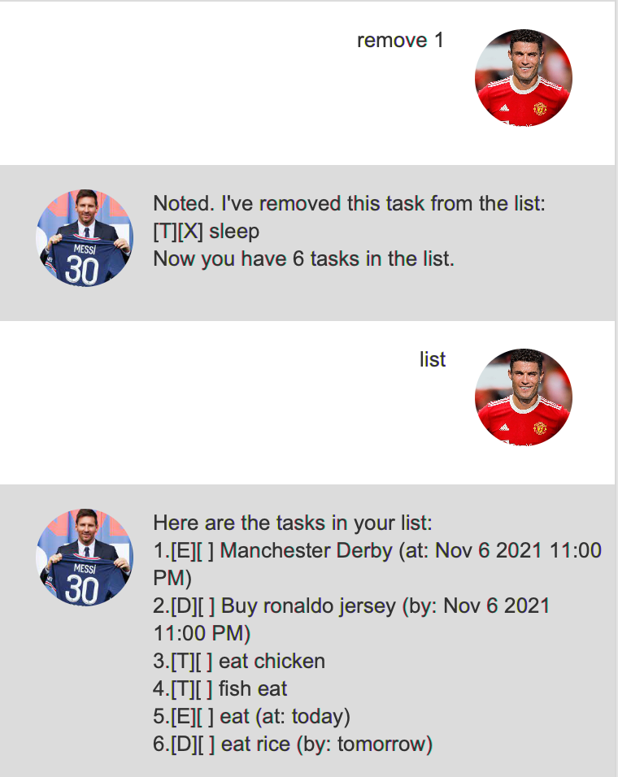
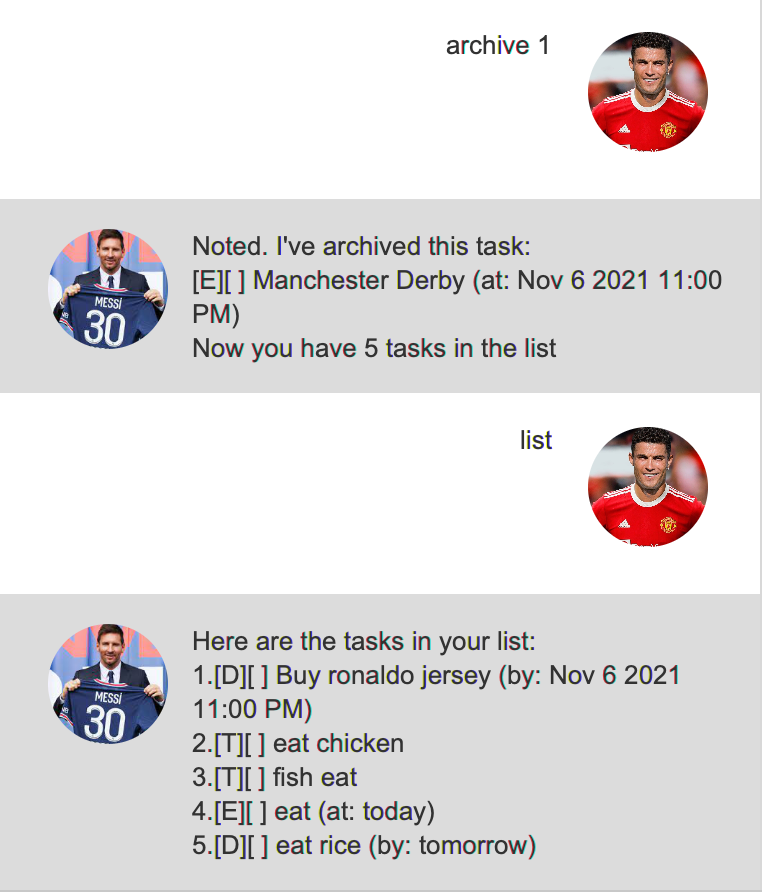
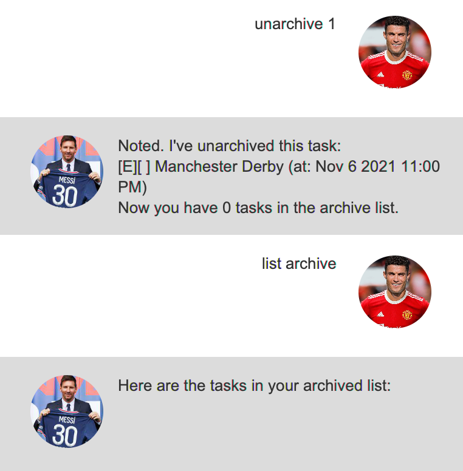
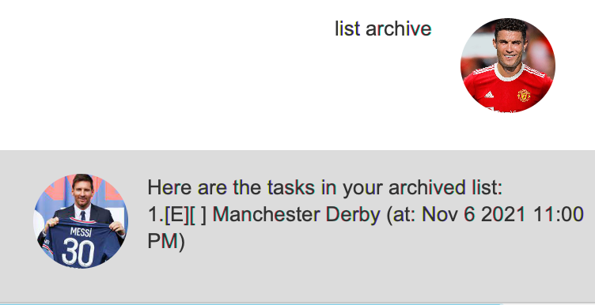
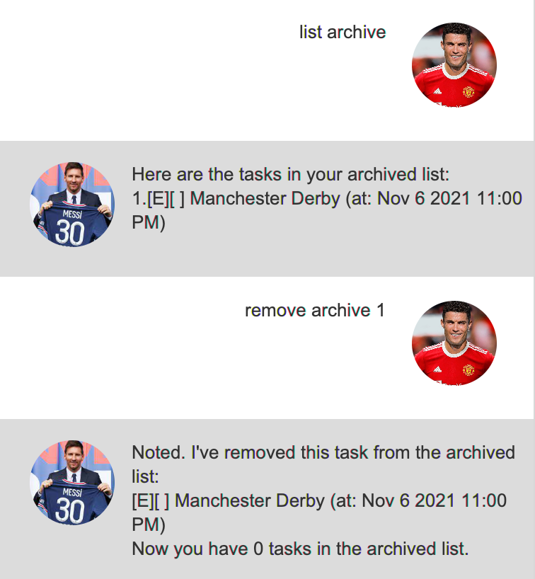

# User Guide

## Features of StuDo

### 1. Add tasks
StuDo can add your tasks to its list of tasks which you need to do for you.
These tasks come in different
types:

1. **todo** - a general task to do.
2. **event** - an event task which happens at a certain time or date.
3. **deadline** - a deadline task which has a deadline to complete by.

### 2. Mark as done
StuDo is able to mark your tasks as done once you complete them.

### 3. Remove tasks
StuDo is able to remove tasks from your list anytime.

### 4. Find tasks
StuDo is able to find your tasks with a given keyword for you from your list when you cannot find them.

### 5. List tasks
StuDo is able to show you your list of tasks and their details, such as the type of task and if they are complete or not.

### 6. Archive tasks
StuDo is able to archive your tasks if you do not want to show them on your list and also do not want to delete them.

### 7. Unarchive tasks
StuDo is able to unarchive your tasks if you want to move them back from your archive into your list of tasks.

### 8. List archived tasks
StuDo is able to show you the tasks you have archived.

### 9. Remove archived tasks
StuDo is able to remove tasks from your list of archived tasks anytime.

## Usage

### 1. `list` - displays the list of tasks

The `list` command displays the list of tasks to the user.

Example of usage:

`list`

Expected outcome:

Shows the list of tasks to the user.

### 2. `todo <task name>` - adds a todo task

Adds a todo task to StuDo's list of tasks.

Example of usage: 

`todo sleep`

Expected outcome:

Adds a todo task called `sleep` to the list of task.

### 3. `event <task name> /at <date/time>` - adds an event task

Adds an event task to StuDo's list of tasks.

Example of usage:

`event Manchester Derby /at 2021-11-06 23:00`

Expected outcome:

Adds an event task called `Manchester Derby (at: Nov 6 2021 11:00 PM)` to the list of task.

### 4. `deadline <task name> /by <date/time>` - adds a deadline task

Adds a deadline task to StuDo's list of tasks.

Example of usage:

`deadline Buy ronaldo jersey /by 2021-11-06 23:00`

Expected outcome:

Adds a deadline task called `Buy ronaldo jersey (by: Nov 6 2021 11:00 PM)` to the list of task.

### 5. `find <keyword>` - finds a task with specified keyword

Finds task with specified keyword from StuDo's list of tasks.

Example of usage:

`find eat`

Expected outcome:

Find tasks with keyword `eat` from StuDo's list of tasks.

### 6. `done <task index number>` - marks task at given index number as done

Marks task at given index number as done from StuDo's list of tasks.

Example of usage:

`done 1`

Expected outcome:

Marks task at index `1` as done from StuDo's list of tasks.

### 7. `remove <task index number>` - removes task at given index number

Removes task at given index number from StuDo's list of tasks.

Example of usage:

`remove 1`

Expected outcome:

Removes task at index `1` from StuDo's list of tasks.

### 8. `archive <task index number>` - archives task at given index number

Archives task at given index number from StuDo's list of tasks.

Example of usage:

`archive 1`

Expected outcome:

Archives task at index `1` from StuDo's list of tasks.

### 9. `unarchive <task index number>` - unarchives task at given index number

Unarchives task at given index number from StuDo's list of archived tasks, adding it back to StuDo's list of tasks.

Example of usage:

`unarchive 1`

Expected outcome:

Unarchives task at index `1` from StuDo's list of archived tasks, adding back to StuDo's list of tasks.

### 10. `list archive` - displays the list of archived tasks

The `list archive` command displays the list of archived tasks to the user.

Example of usage:

`list archive`

Expected outcome:

Shows the list of archived tasks to the user.

### 11. `remove archive <task index number>` - removes task at task index number from list of archived tasks

Removes task at task index number from StuDo's list of archived tasks.

Example of usage:

`remove archive 1`

Expected outcome:

List of archived tasks does not contain the task which we removed.

