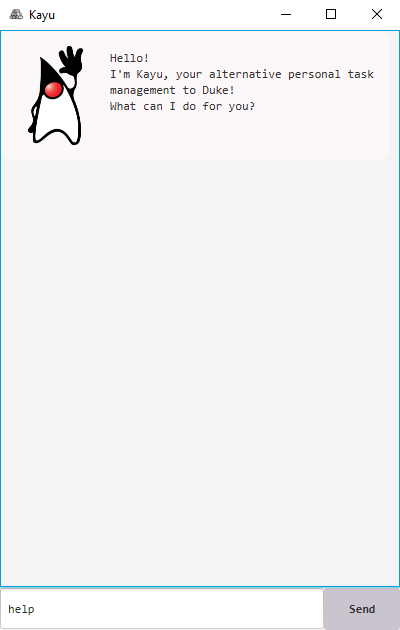

# User Guide

```
 /$$   /$$  /$$$$$$  /$$     /$$ /$$   /$$
| $$  /$$/ /$$__  $$|  $$   /$$/| $$  | $$
| $$ /$$/ | $$  \ $$ \  $$ /$$/ | $$  | $$
| $$$$$/  | $$$$$$$$  \  $$$$/  | $$  | $$
| $$  $$  | $$__  $$   \  $$/   | $$  | $$
| $$\  $$ | $$  | $$    | $$    | $$  | $$
| $$ \  $$| $$  | $$    | $$    |  $$$$$$/
|__/  \__/|__/  |__/    |__/     \______/ 

___________________________________________________________________________
Hello!
I'm Kayu, your alternative personal task management to Duke!
What can I do for you?
___________________________________________________________________________
```

## Welcome to Kayu!

**Kayu** is a project template for a greenfield Java project. It's renamed after the Java mascot _Duke_.


## Features

1. Viewing help: `help`
2. Listing all tasks: `list`
3. Find tasks based on description keywords: `find`
4. Adding a to-do task: `todo`
5. Adding an event task: `event`
6. Adding a deadline task: `deadline`
7. Marking a task as 'done': `done`
8. Deleting a task: `delete`
9. Listing all notes: `list-notes`
10. Adding a note: `note`
11. Deleting a note: `delete-note`
12. Exiting the program: `bye`
13. Saving the data
14. Editing the data files

## Installing Kayu

1. Ensure that you have Java `11` or above installed on your computer.
2. Download the `kayu.jar` from [here](https://github.com/muhammad-khair/ip/releases/tag/v0.2).
3. Copy the file to the folder you want to use as the _home folder_ for the application.
4. Double click to run the app. This is how you should be greeted with by the app.



## Features

### _Note:_
- Tasks here includes To-dos, Events, and Deadlines.
- Parameters with all caps, for example `COMPULSORY-PARAMTER`, are required for the command to process and execute.
- Commands with no parameters, such as `help`, `list` and `bye`, are sufficient commands to be inputted. Hence, any other words inputted together with this command statement will be ignored.
- For all tasks and notes, the `DESCRIPTION` parameter cannot be empty.
- Date formats can be inputted as such:

    format | example  
    ------ | -------
    `yyyy-MM-dd` | `2020-09-12`
    `yyyy-MM-dd` | `2020-09-12`
    `yyyy-M-dd`  | `2020-9-12`
    `dd-MM-yyyy` | `12-09-2020`
    `dd-M-yyyy`  | `12-9-2020`
    `yyyy/MM/dd` | `2020/09/12`
    `yyyy/M/dd`  | `2020/9/12`
    `dd/MM/yyyy` | `12/09/2020`
    `dd/M/yyyy`  | `12/9/2020`

- Time formats can be inputted as such.

    format | example  
    ------ | -------
    `HH:mm`   | `15:30`
    `HHmm`    | `1530`
    `hh:mm a` | `3:30 pm` or `3:30 PM`
    `hhmm a`  | `330 pm` or `330 PM`

<br>

### Viewing help: `help`

Shows the commands available to execute.  
Format: `help`

### Listing all tasks: `list`

Lists all tasks that exists presently.  
Format: `list`  

### Find tasks based on description keywords: `find`

Finds the tasks based on descriptions that matches the specified keywords.  
Format: `find KEYWORD [MORE_KEYWORDS]`  
Example: `find test` gives tasks such as `[T][X] test this case` and `[E][ ] do smoke tests (at: 2021-09-16 17:23)`.

### Adding a to-do task: `todo`

Adds a to-do task.  
Format: `todo DESCRIPTION`  
Example: `todo Complete powerpoint slides`

### Adding an event task: `event`

Adds an event task.  
Format: `event DESCRIPTION /at DATE TIME`  
Example: `event Do smoke tests /at 2021-09-16 17:23`

### Adding a deadline task: `deadline`

Adds a deadline task.  
Format: `deadline DESCRIPTION /by DATE TIME`  
Example: `deadline Clear papers /by 2021-10-18 12:34`

### Marking a task as 'done': `done`

Marks a task as done. `TASK-ID` must be a valid task id.  
Format: `done TASK-ID`  
Example: `done 3`

### Deleting a task: `delete`

Deletes a task. `TASK-ID` must be a valid task id.  
Format: `delete TASK-ID`  
Example: `delete 5`

### Listing all notes: `list-notes`

Lists all notes that exists presently.  
Format: `list-notes`

### Adding a note: `note`

Adds a note.  
Format: `note DESCRIPTION`  
Example: `note CS2103 is fun`

### Deleting a note: `delete-note`

Deletes a note. `NOTE-ID` must be a valid note id.  
Format: `delete-note NOTE-ID`  
Example: `delete-note 5`

### Exiting the program: `bye`

Terminates the program.
Format: `bye`

### Saving the data

Data is automatically saved to the relevant files after each command.

### Editing the data files

Tasks and Notes data are saved as text files `[JAR file location]/data/tasks.txt` and `[JAR file location]/data/notes.txt` respectively. Advanced users are welcome to update data directly by editing that data file.
