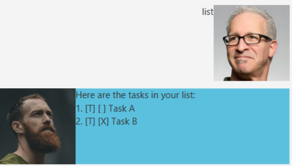
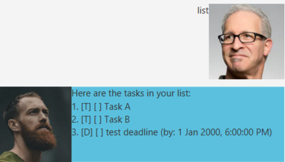
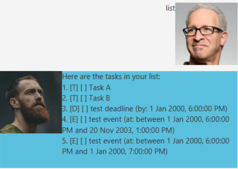
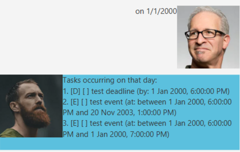
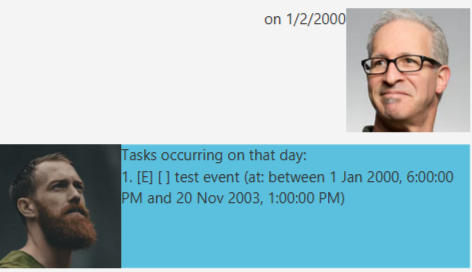

# Duke TodoApp

Duke is a todo task manager that helps you to track various sorts of tasks.

## Quick start

1. Ensure you have Java `11` or above installed in your Computer.
2. Download the latest `ip.jar` from [here](https://github.com/sunjc826/ip/releases).
3. Copy the file to the folder you want to use as the *home folder* for your Duke.
4. Double-click the file to start the app. The GUI should be similar to the below should appear in a few seconds. 
   
5. Type the command in the command box and press Enter to execute it.
   Some example commands you can try:

    * **`list`** : Lists all tasks.
    * **`todo`**`do stuff` : Adds a todo task named `do stuff` to Duke.
    * **`find`**`stuff` : Finds all tasks with name matching `stuff`.
    * **`delete`**`1` : Deletes the 1st task in the current list.
    * **`bye`** : Exits the app.

6. Refer to the [Usage](#Usage) below for details of each command.

--------------------------------------------------------------------------------------------------------------------
## Features 

### Todos
Track generic tasks.

### Deadlines
Track deadlines with a given date and time.

### Events
Track events taking place over a period of time.

### Completion
Record the completion status of your tasks.

## Usage

### `list` - Lists out all registered tasks.
Lists out all tasks in the task list.

Format: `list`

Example: 
- Having added two tasks named `Task A`, `Task B` and listing them will show the following. 

### `find` - Filters out tasks by name.
Given a keyword, lists out all tasks with name matching the keyword.

Format: `find SEARCH_KEYWORD`

Example:
- Having added two tasks named `Task A`, `Task B`, we use `find B`. 
 
Of the tasks `Task A`, `Task B`, only `Task B` matches the search keyword `B`. Hence, only
`Task B` is in the output.

### `done` - Completes a certain task.
Sets the completion status of a specified task to complete.

Format: `done INDEX`

Example:
- `done 2` 
 
Marks the task at index 2 as done. 
Using the list command now would show the following. 
 

### `todo` - Add a todo task.
Creates and adds a todo task to the task list.

Format: `todo NAME_OF_TASK`

Example 
- `todo test task` 
 
A task called `test task` will be created and added to the list of tasks.

### `deadline` - Add a deadline task.
Creates and adds a deadline task to the task list.

Format: `deadline NAME_OF_DEADLINE /by DATETIME`
- `DATETIME` format: `d/m/yyyy( HHmm)`. Note that the time portion is optional and defaults to
the start of the day.

Example
- `deadline test deadline /by 1/1/2000 1800` 
   
  This creates a deadline called `test deadline` that is due by **1st January, 2000 at 1800**.
  Using the list command now would show this. 
  

### `event` - Add an event.
Creates and adds an event to the task list.
Format: `event NAME_OF_EVENT /at DATERANGE`
- `DATERANGE` has two allowed formats. The second format is for a range of dates that are on the same day.
  1. `d/m/yyyy HHmm-d/m/yyyy HHmm`
  2. `d/m/yyyy HHmm-HHmm`

### `on` - Filters out tasks by date.
Filters tasks (**deadlines** and **events**) that occur on the given day.

Format: `on DATE`
- `DATE` format: `d/m/yyyy`

Example 
For context, these are the tasks currently registered in Duke. 
 
- `on 1/1/2000` 
   
  - The deadline `test deadline` matches since it occurs on the same day.
  - The events, both named `test event` match since 1st January 2000 falls in their respective date ranges.
- `on 1/2/2000` 
   
    - The deadline `test deadline` does not match since it occurs on a different day than 1 February 2000.
    - Of the 2 events, only the event that spans from the year 2000 to 2003 matches.

### `bye` - Exits the app.
Quits the program and saves your tasks to local storage. Note that tasks will **not** be saved during execution of other commands. 

Format: `bye`