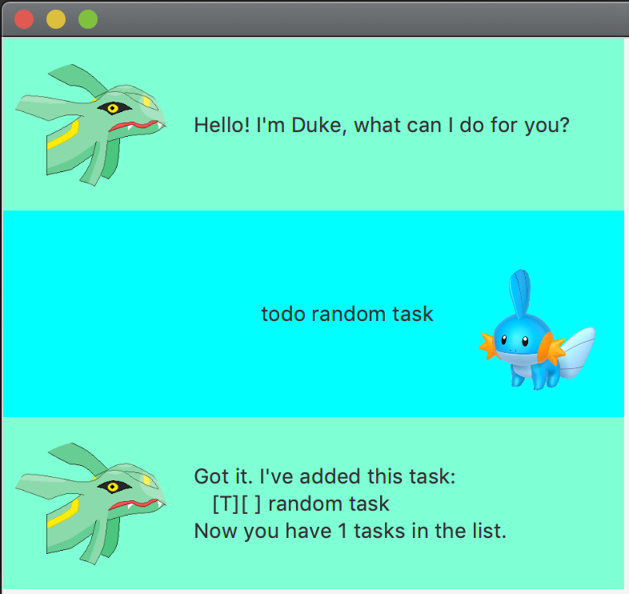

# User Guide

## Features 

### GUI

Application comes with a user friendly User Interface.

### Add, List, Delete, Find Tasks

Add, List, Delete, and Find To Do, Event, and Deadline tasks.

### Local Storage

Save Tasks in local file.

## Usage

### `todo <name>` - Add a ToDo Task

Adds a Task of type ToDo with name provided.

Example of usage: `todo random task`

### `event <name> /at dd/MM/yyyy HHmm` - Add a Event Task

Adds a Task of type Event with name, date and time provided.

Example of usage: `event random event /at 10/09/2021 1800`

### `deadline <name> /by dd/MM/yyyy HHmm` - Add a Deadline Task

Adds a Task of type Deadline with name, date and time provided.

Example of usage: `deadline readme /by 10/09/2021 2359`

### `list` - List all available Tasks

Lists all tasks available. Todo tasks are prefixed with `[T]`,
Event tasks are prefixed with `[E]`,
and Deadline tasks are prefixed with `[D]`.
If task has been marked as done, it will be further prefixed with a `[X]`, indicating that the Task is done.

Example of usage: `list`

### `done <num>` - Mark Task at num as done

Marks Task with index `num` as done. Get the indexes of the Tasks with `list`.

Example of usage: `done 1`

### `delete <num>` - Delete Task at num

Deletes Task with index `num`. Get the indexes of the Tasks with `list`.

Example of usage: `delete 1`

### `find <query>` - Finds all Tasks associated with the given query

Returns all tasks associated with a given query. A case-insensitive search over all components of the Task is done.
Below is an example of using `find` to obtain all tasks that happen on a particular month.

Example of usage: `find sep`

### `bye` - Exit application

Closes GUI and exits application.

Example of usage: `bye`