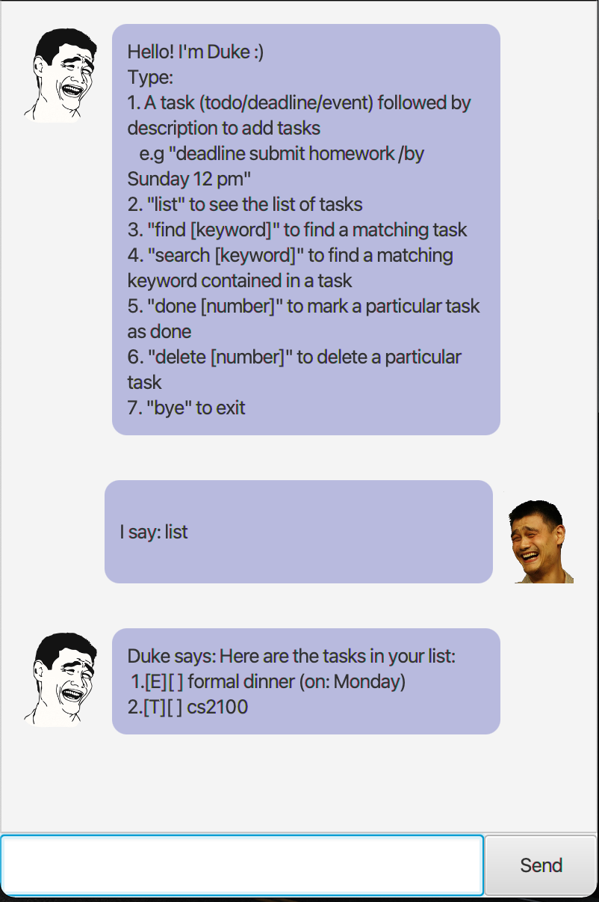

# User Guide

## Duke

Duke is a console/GUI app that lets you track upcoming tasks. To start using Duke, you can:

- Download the `duke.jar` file from the latest release
- Run `java -jar duke.jar` in the terminal to open the GUI app
- Or run `java -jar duke.jar --console` for console mode



## Features 

### Task tracking

Duke allows you to track 3 different kinds of tasks: todos, events and deadlines.

### Schedule

Duke allows you to view your schedule for any specified day.

## Usage

### `todo` - Add a new todo

The `todo` keyword adds a new todo item with the given description.

Example of usage: 

`todo Write a book`

Expected outcome:

Adds a new todo task with description `Write a book`.

```
> todo Write a book
------------------------------------------------
Added the following task:
    [T][ ] Write a book
You now have 1 tasks in your list.
------------------------------------------------
```

### `event` - Add a new event

The `event` keyword adds a new event item with the given description and timing.

Example of usage: 

`event CS2103T Lecture /at 2021-08-08 14:00:00`

Expected outcome:

Adds a new event with description `CS2103T Lecture` and time August 8 2021, 14:00:00.

```
> event CS2103T Lecture /at 2021-08-08 14:00:00
------------------------------------------------
Added the following task:
    [E][ ] CS2103T Lecture (at: Aug 8 2021 14:00:00)
You now have 2 tasks in your list.
------------------------------------------------
```

### `deadline` - Add a new deadline

The `deadline` keyword adds a new deadline item with the given description and timing.

Example of usage: 

`deadline CS2103T iP /by 2021-08-08 20:00:00`

Expected outcome:

Adds a new event with description `CS2103T iP` and time August 8 2021, 20:00:00.

```
> deadline CS2103T iP /by 2021-08-08 20:00:00
------------------------------------------------
Added the following task:
    [D][ ] CS2103T iP (by: Aug 8 2021 20:00:00)
You now have 3 tasks in your list.
------------------------------------------------
```

### `done` - Mark task as completed

The `done` keyword marks a given task as completed.

Example of usage: 

`done 1`

Expected outcome:

Marks the first task as completed.

```
> done 1
------------------------------------------------
Marking task as completed:
    [T][X] Write a book
------------------------------------------------
```

### `delete` - Delete task

The `delete` keyword deletes the given task.

Example of usage: 

`delete 1`

Expected outcome:

Deletes the first task.

```
> delete 1
------------------------------------------------
Removed the following task:
    [T][X] Write a book
You now have 2 tasks in your list.
------------------------------------------------
```

### `find` - Searches tasks

The `find` keyword searches your tasklist for any task description with matching text.

Example of usage: 

`find lecture`

Expected outcome:

Displays any task whose description contains the word lecture (case insensitive).

```
> find lecture
------------------------------------------------
Here are the matching tasks:
1. [E][ ] CS2103T Lecture (at: Aug 8 2021 14:00:00)
------------------------------------------------
```

### `schedule` - View your schedule for a given date

The `schedule` keyword displays your schedule for a given date.

Example of usage: 

`schedule 2021-08-08`

Expected outcome:

Views all events occuring on the specified date and all deadlines due on the specified date.

```
> schedule 2021-08-08
------------------------------------------------
Schedule for 2021-08-08

1. 14:00:00: CS2103T Lecture (Event)
2. 20:00:00: CS2103T iP (Deadline)
------------------------------------------------
```

### `bye` - Quits the app

The `bye` keyword quits Duke.

Example of usage: 

`bye`

Expected outcome:

Duke quits!

```
> bye
------------------------------------------------
Bye! Hope to see you again!
------------------------------------------------
```
