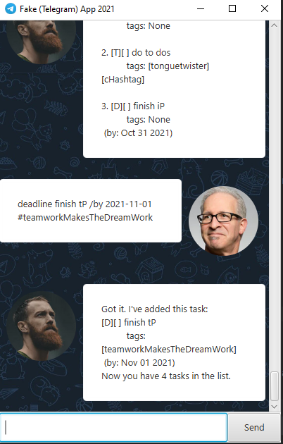

# User Guide


Duke is a personal task manager in the form of a chatbot. He can help you track your To-dos, events, and deadlines. He has a GUI and a CLI interface.
## Quick Start
1. Ensure you have Java 11 or above installed on your Computer.
2. Download the latest `ip.jar` [here](https://github.com/DrWala/ip/releases).
3. Double-click the file to start the app. If you do not see anything after a few seconds, navigate to the folder with the `.jar` file in your CLI and type `java -jar ip.jar`.  
4. Type a command into the text box and press <kbd>Enter</kbd> to execute it.

## Guide format and input restrictions
- User input for commands are surrounded with angular brackets as such `<deadline_name>`. The brackets themselves are not part of the command.
- All time input should be formatted as `yyyy-mm-dd`. For example, you if you want to indicate your data of 21st Jan, 2021, it should be inputted as `2021-01-21`.

## Features
Duke supports 3 main types of tasks: Todos, Deadlines and Events. You can perform Create, Read and Delete operations on these tasks, or mark them as done. Duke also helps you search for tasks if the list gets too long.

Furthermore, Duke recently supposed the function to add tags! You can now optionally add tag(s) to a post to highlight the category that post falls into. Remember to add the hex symbol infront of a tag to declare a tag. Also, tags do not have spaces.

## Usages

#### `list` &mdash; List Tasks
Lists all the tasks you have inserted into Duke. <br> `list` <br>
If the list is empty: <br>


If the list is not empty: <br>


#### `find` &mdash; Find Tasks
Search for tasks that match a given search string (Case-Sensitive, for further accuracy!). <br>
`find <search_string>`
```
find win hearts
```
If the keyword is present: <br>


If the keyword is absent: <br>


#### `done` &mdash; Mark a Task as done
Marks a task as done. The task index is its position as shown in `list`. <br>
`done <task_index>`
```
done 1
```
If the item is present: <br>


If the item is absent: <br>


#### `delete` &mdash; Remove a Task
Remove a task from Duke. The task index is its position as shown in `list`. <br>
`delete <task_index>`
```
delete 1
```
If the item is present: <br>


If the item is absent: <br>


#### `todo` &mdash; Add a Todo
Add a todo. Todos do not have any time specified.<br>
`todo <todo_name> <tag(s)>`
```
todo win hearts and minds #inspirational #YesWeCan
```
Without tags: <br>


With tags: <br>


#### `deadline` &mdash; Add a Deadline
Add a deadline. The `time` parameter should follow the format specified at `Guide format and input restrictions`. It must be strictly `yyyy-mm-dd`
<br> `deadline <deadline_name> /by <time> <tag(s)>`
```
deadline finish ip /by 2021-10-31
```
Without tags: <br>


With tags: <br>



#### `event` &mdash; Add an Event
Add an event. The `time` parameter should follow the format specified at `Guide format and input restrictions`.
<br> `event <event_name> /at <location / date time> <tag(s)>`
```
event music festival /at Sentosa, Dec 31st
```
Without tags: <br>


With tags: <br>


#### `bye` &mdash; Exit app
Exits the app. Duke will save your tasks to ensure that you do not need to re-enter them when you next launch Duke.
```
bye
```


#### Miscellaneous
For any commands that are not part of the command list, an error message will occur as follows: <br>


## Acknowledgements
* JSON formatting library from [Jackson](https://github.com/FasterXML/jackson)
* GUI from [JavaFX](https://openjfx.io)
* Unit Testing from [JUnit5](https://github.com/junit-team/junit5)
* [Azeem](https://github.com/DrWala/) for his repo to help me install Gradle and get my JavaFX GUI working since it was not working on my end even after following the steps provided
* [Prof Damith](https://github.com/damithc) for his gradle.yaml file for Continuous Integration
* Team [Duke](https://github.com/se-edu) for the skeleton code for the original Duke App
* [AB3](https://github.com/nus-cs2103-AY1920S1/addressbook-level3) for reference to the BCD-Extension regarding Tags
* All copyrighted images and their respective sources