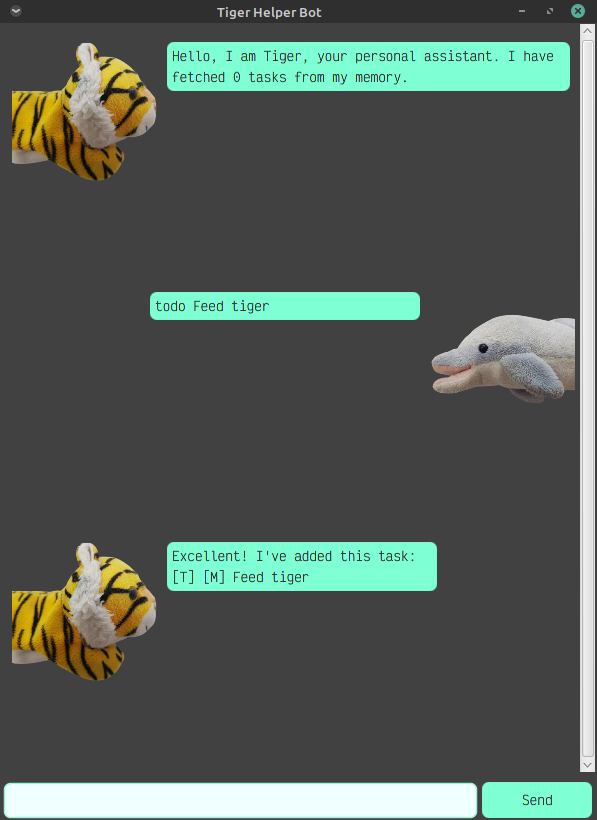

# User Guide

## Introduction

Tiger is a personal assistant that helps you manage the tasks you're too lazy to do right now. 



Tasks are classified into 3 types of catergories: Todos, Events or Deadlines. Events and deadlines are tasks associated with a specific time, and hence the user is required to enter in the time parameter. For events, the user is required to enter in when the event is **at**, while for deadlines, the user is required to enter when the deadline is **by**. All 3 tasks can be either marked as completed, or not completed.

Tasks are classified into 3 priorities, low, medium and high. 

Commands include a keyword, some mandatory arguments, and some optional arguments. The general usage is that the keyword comes first, then the mandatory arguments, then the optional arguments, ie. `[keyword] [mandatory arguments] [optional arguments]`.

## Features 

The features offered are:

- [Adding a task](#adding-tasks)
- [Deleting a task](#deleting-a-task)
- [Marking a task as done](#marking-a-task-as-done)
- [Finding a task](#finding-a-task)
- [Clearing all tasks](#clearing-all-tasks)
- [Listing all tasks](#listing-all-tasks)
- [Exiting the app](#exiting-the-app)
- Searching by priority (to be implemented)

Some advanced features include
- [Substitutable keywords](#substitutable-keywords)
- [Automatic date correction](#automatic-date-correction)
- [Partial loading in case the storage file is corrupted](#partial-loading)

## Usage

### Adding tasks
Tiger can help you keep track of 3 types of tasks: Todos, Events and Deadlines. When a task is added, Tiger will display a string representation of the task, as such:
```
[T|E|D] [H|M|L|X] [task description] [task date]
```
`T, E, D` represents if the task is a Todo, event or Deadline respectively, and `H, M, L` represents if the tasks is of high, medium or low priority respectively. `X` is used for completed tasks.
_________

To add a new Todo, the usage is: `todo [task description] /priority [H|M|L]`. The `/priority` command is optional.

Example: `todo homework` - adds a new Todo named "Homework".

Expected outcome:
```
Excellent! I've added this task:
[T] [M] Homework
```
Note that `[M]` indicates the tasks is of medium priority. **By default, if the priority is not assigned, the task is classified as medium priority.** To change the tasks' priority, use the priority flag.

Example: `todo homework /priority H` - adds a new Todo that is named "Homework" that is of high priority.

Expected outcome:
```
Excellent! I've added this task:
[T] [H] Homework
```
You might notice Tiger autocapitalises the first letter of `homework` for the user. This is because Tiger has noticed that users tend to input all tasks in lower case, making the tasks look ugly. There is no way to disable this; free will is a lie.

______
To add a new Event, the usage is: `event [event description] /at [event time] /priority [H|M|L]`. The `/priority` command is optional. Accepted date formats are `HH:mm` or `YYYY-MM-DD HH:mm`. The year input string should be **exactly** 4 characters, and their other date parameters should be **exactly** 2 characters. The year cannot be 0000. 

Example: `event eat dinner /at 2021-05-21 16:00` - creates a new Event named "eat dinner" at 2021-05-21 16:00.

Expected outcome:
```
Excellent! I've added this event:
[E] [M] Eat dinner (at 2021-05-21 16:00)
```
**If the user only specifies the time, but not the date, Tiger guesses that the date is today.**

Example: `event eat dinner /at 16:00` - creates a new Event named "eat dinner" at [today's date] 16:00.

Expected outcome: (assume today's date is 2021-08-31).
```
Excellent! I've added this event:
[E] [M] Eat dinner (at 2021-08-31 16:00)
```
Much like Todos, you can also specify a priority for your events.

Example: `event eat dinner /at 15:29 /priority L` - creates a new event named "eat dinner" at [today's date] 16:00 of low priority.

Expected outcome: (assume today's date is 2021-08-31).
```
Excellent! I've added this event:
[E] [L] Eat dinner (at 2021-08-31 16:00)
```
_________

To add a new Deadline, the usage is: `deadline [deadline description] /by [deadline due date] /priority [H|M|L]`. The `/priority` command is optional. Accepted date formats are `HH:mm` or `YYYY-MM-DD HH:mm`. The year input string should be **exactly** 4 characters, and their other date parameters should be **exactly** 2 characters. 

Example: `deadline eat dinner /by 16:00` - creates a new Deadline named "eat dinner" at [today's date] 16:00.

Expected outcome: (assume today's date is 2021-08-31).
```
Excellent! I've added this event: 
[D] [M] Eat dinner (by 2021-08-31 16:00)
```
Much like Todos, you can also specify a priority for your deadlines.

Example: `deadline eat dinner /by 15:29 /priority L` - creates a new Deadline named "eat dinner" at [today's date] 16:00 of low priority.

Expected outcome: (assume today's date is 2021-08-31).
```
Excellent! I've added this event:
[D] [L] Eat dinner (by 2021-08-31 16:00)
```
Substitutable keywords: `dateline`.

**Due to the way data is stored, Tiger bans you from inputting semicolons (;).**

### Deleting a task
Deletes the task at the specified index. Use `list` to get the list of tasks and indicies. The usage is `delete [task index]`.

Example: `delete 1` - deletes the task at index 1.

Expected outcome: 
```
Feeling lazy today? I've deleted:
[T] [M] CS2103 Code Review
```
Substitutable keywords: `del`, `remove`.

### Marking a task as done
Marks the task at a specified index as done. `list` to get the list of tasks and indicies. The usage is `done [task index]`.

Example: `delete 1` - deletes the task at index 1.

Expected outcome: 
```
Nice! I've marked this tasks as done:
[T] [X] Type out GT assignment
```


### Finding a task
Tiger can also help you find tasks based on a specific keyword. It is not case sensitive, ie. `search woodlands` and `search Woodlands` should return the same list. The usage is `search [substring]`. 

Example: `search Woodlands` - searches for tasks with task description containing the string "Woodlands".
Expected outcome: 
```
[T] [M] Buy earphones at Woodlands
```
Substitutable keywords: `find`. 

### Clearing all tasks
If for some reason your list of tasks is too full, or you're too lazy, you can clear all the tasks at one go. The usage is `clear`.

Example: `clear` -- clears all tasks.

Expected outcome: 
```
I've cleared all your tasks!
```

### Listing all tasks
Tiger can help you list all tasks. (After all, that's the whole point of a Todo app right?) The usage is `list`.

Example: `list` - lists all tasks.

Expected outcome:
```
1. [T] [M] Buy earphones at Woodlands
2. [E] [H] Feed fish (at 2021-09-01 16:00)
3. [D] [L] Graph theory assignment (by 2022-11-21 14:25)
```
Substitutable keywords: `ls`. 

### Exiting the app
If you're bored of Tiger, you can leave the app. The usage is `bye`. 

Example: `bye` - quits the app.

Expected outcome:
```
Bye! Hope to see you again!
```
Note that the window waits for a second to close.

Substitutable keywords: `exit`, `quit`.

## Advanced features

### Substitutable keywords
Tiger understands that some users are just bad at reading user manuals, so some commands can be substituted in place for regular commands and Tiger will act as if the regular command was keyed instead. This is indicated by the "Substitutable keywords" at the bottom of each section on command usage. 

For instance, `find` performs the same action as `search`. 

Example: `find Woodlands`.

Expected outcome:
```
[T] [M] Buy earphones at Woodlands
```

Similarly, `ls` lists all the tasks.

Example: `ls`.

Expected outcome:
```
1. [T] [M] Buy earphones at Woodlands
2. [E] [H] Feed fish (at 2021-09-01 16:00)
3. [D] [L] Graph theory assignment (by 2022-11-21 14:25)
```

### Automatic date correction
On top of interpreting the current date as today if the user doesn't specify the date, Tiger will do some minor corrections if the user inputs an invalid date by accident. 

For example, Tiger "rounds off" the date if the day number is between 1 and 31. 

Example: `event Event /at 2021-09-31 15:00`.

Expected outcome:
```
Excellent! I've added this event:
[E] [M] Event (at 2021-09-30 15:00)
```

Example: `event Event /at 2021-02-29 15:00` (this works for 30 and 31 as well).

Expected outcome:
```
Excellent! I've added this event:
[E] [M] Event (at 2021-02-28 15:00)
```

However, if Tiger detects that the user is trying to be malicious in entering the date, it starts screaming at the user:

Example: `event Event /at 2021-02-32 15:00` (this works for 30 and 31 as well).

Expected outcome:
```
Please ensure you key in dates in the input specified.
```

### Partial loading
Tiger knows that users love to mess around with its data files, sometimes corrupting it in the process. As such, Tiger is equipped with a mechanism called partial loading. If the data file is corrupted for _some reason_ (ahem ahem, the users), it tries to recover what it can. When Tiger detects it's data has been corrupted, it starts up with the following message, directly blaming the user:

```
Error encountered in loading the file! Did you alter my memory directly?

If you didn't backup my memory, would you like to try a partial load to see what can be removered? [Y/N]

Pressing N will wipe data currently stored.
```
At this point, the user is expected to enter in `Y` or `N` (lower case accepted). `Y` will attempt a partial load of the data files, and Tiger will load the subset of tasks which can be recovered.

Example: `Y`

Expected outcome:
```
Hello, I'm Tiger, your personal assistant. I've recovered 5 tasks from my memory.
```
Some tasks might be lost.


`N` will clear all tasks.

Example: `N`

Expected outcome:
```
Hello, I'm Tiger, your personal assistant. I've recovered 0 tasks from my memory.
```
If the user keys in any other input, the user is clearly incapable of reading. Tiger will prompt the user to input `Y` or `N` until either one of them is keyed in.

Example: `g`

Expected outcome:
```
Please enter Y or N only
```
At this point, the user has tried to alter Tiger's data files and is not following simple instructions. Tiger is clearly pissed and does not bother put in a full-stop at the end of his sentences anymore.