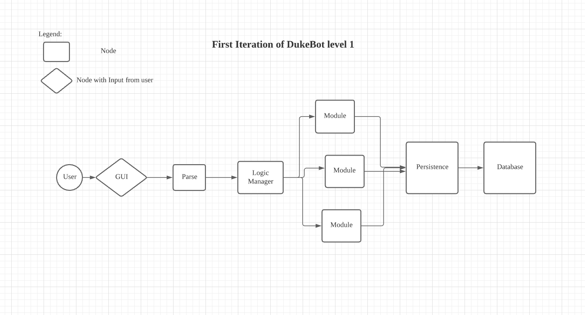

# User Guide
Project Duke Chatbot will be officially known as Dukebot for short

For the current version up til level 10, the bot still has no gui as of yet,
thus the Duke.java has to be ran. Inputs for the Project Duke chatbot can only
be input when the Duke.java script is ran.

# Dev Guide

This is the for the current version of Dukebot lvl 1.

The below is an attached image of what the architecture of the DukeBot is.


## Features 
Bot should echo commands of anything entered by the user.

### Feature-ABC

**Exit**
: Bot should be able to exit when the user enters the command "bye" or "BYE"


### Feature-XYZ

Description of the feature.

## Usage

### `Keyword` - Describe action

Describe the action and its outcome.

Example of usage: 

`keyword (optional arguments)`

Expected outcome:

Description of the outcome.

```
expected output
```
