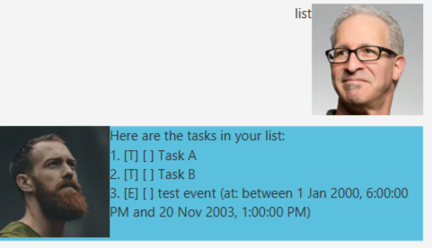
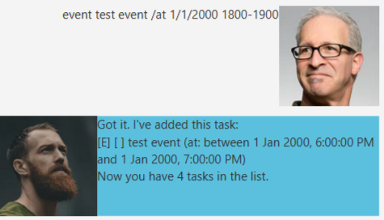
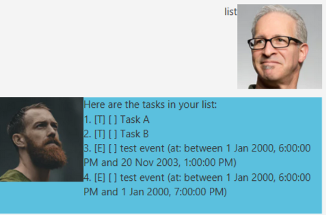

# Duke TodoApp

Duke is a todo task manager that helps you to track various sorts of tasks.

## Quick start

1. Ensure you have Java `11` or above installed in your Computer.
2. Download the latest `ip.jar` from [here](https://github.com/sunjc826/ip/releases).
3. Copy the file to the folder you want to use as the *home folder* for your Duke.
4. Double-click the file to start the app. The GUI should be similar to the below should appear in a few seconds. 
   
5. Type the command in the command box and press Enter to execute it.
   Some example commands you can try:

    * **`list`** : Lists all tasks.

    * **`todo`**`do stuff` : Adds a todo task named `do stuff` to Duke.

    * **`delete`**`1` : Deletes the 1st task in the current list.

    * **`bye`** : Exits the app.

6. Refer to the [Usage](#Usage) below for details of each command.

--------------------------------------------------------------------------------------------------------------------
## Features 

### Todos
Track generic tasks.

### Deadlines
Track deadlines with a given date and time.

### Events
Track events taking place over a period of time.

### Completion
Record the completion status of your tasks.

## Usage

### `list` - Lists out all registered tasks.
Lists out all tasks in the task list.

Format: `list`

Example: 
- Having added two tasks named `Task A`, `Task B` and listing them will show the following. 

### `done` - Completes a certain task.
Sets the completion status of a specified task to complete.

Format: `done INDEX`

Example:
- `done 2` 
 
Marks the task at index 2 as done. 
Using the list command now would show the following. 
 

### `todo` - Add a todo task.
Creates and adds a todo task to the task list.

Format: `todo NAME_OF_TASK`

Example 
- `todo test task` 
 
A task called `test task` will be created and added to the list of tasks.

### `deadline` - Add a deadline task.
Creates and adds a deadline task to the task list.

Format: `deadline NAME_OF_DEADLINE /by DATETIME`
- `DATETIME` format: `d/m/yyyy( HHmm)`. Note that the time portion is optional and defaults to
the start of the day.

Example
- `deadline test deadline /by 1/1/2000 1800` 
   
  This creates a deadline called `test deadline` that is due by **1st January, 2000 at 1800**.
  Using the list command now would show this. 
  

### `event` - Add an event.
Creates and adds an event to the task list.
Format: `event NAME_OF_EVENT /at DATERANGE`
- `DATERANGE` has two allowed formats. The second format is for a range of dates that are on the same day.
  1. `d/m/yyyy HHmm-d/m/yyyy HHmm`
  2. `d/m/yyyy HHmm-HHmm`

Example
- `event test event /at 1/1/2000 1800-20/11/2003 1300` 
   
  Using the list command now would show this. 
   
- `event test event /at 1/1/2000 1800-1900` 
   
  Using the list command now would show this. 
   
### `bye` - Exits the app.
Quits the program and saves your tasks to local storage.

Format: `bye`