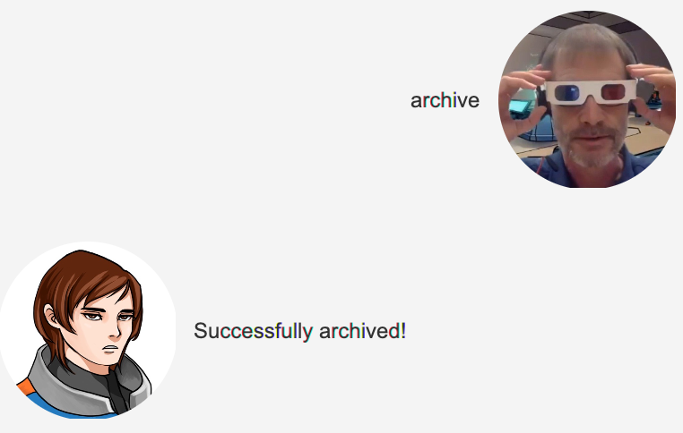
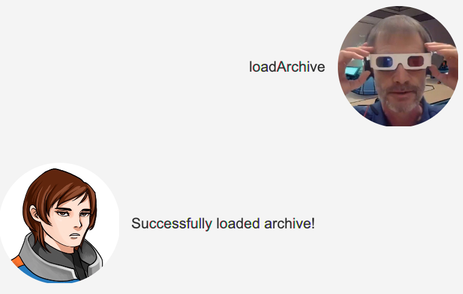

# User Guide
Duke is a simple Java desktop application which tracks tasks, deadlines and events.
It has an intuitive chatbot graphical user interface (GUI), and is optimized for users
who prefer typing.

## Features
### Listing all tasks: `list`
Lists all tasks stored in the application.

Format: `list`

Expected outcome:

### Adding a todo task: `todo`
Adds a todo task to be stored.

Format: `todo TASK_DESCRIPTION`

Example of usage:
* `todo CS2103T assignment`

Expected outcome:

### Adding a deadline task: `deadline`
Adds a deadline task to be stored. `DATE` is in `YYYY-MM-DD` format.

Format: `deadline TASK_DESCRIPTION /by DATE`

Example of usage:

* `deadline assignment 1 /by 2021-09-15`

Expected outcome:

### Adding an event task: `event`
Adds an event task to be stored. `TIME` can be any string.

Format: `event TASK_DESCRIPTION /at TIME`

Example of usage:

* `event dinner with friends /at 6pm`

Expected outcome:

### Marking task as done: `done`
Marks a task as done.

Format: `done TASK_INDEX`

Example of usage:

* `done 1`

Expected outcome:

### Deleting a task: `delete`
Deletes a task.

Format: `delete TASK_INDEX`

Example of usage:

* `delete 1`

Expected outcome:

### Finding a task: `find`
Finds a task based on the given `SEARCH_STRING`.

Format: `find SEARCH_STRING`

Example of usage:

* `find dinner`

Expected outcome:

### Archiving all tasks: `archive`
Archives the current tasklist in the application and empties it.

Format: `archive`

Expected outcome:

### Load tasks from archive: `loadArchive`
Loads all tasks from archive into the current tasklist, and empties the archive.

Format: `loadArchive`

Expected outcome:

### Exiting the application: `bye`
Exits the application.

Format: `bye`

Expected outcome:
Closes and exits the application.

## Command Summary
 Action | Format | Example 
|--------|--------|---------|
List   | `list` | `list` 
Add todo| `todo TASK_DESCRIPTION` |`todo CS2103T assignment`
Add deadline| `deadline TASK_DESCRIPTION /by DATE` | `deadline assignment 1 /by 2021-09-15`
Add event| `event TASK_DESCRIPTION /at TIME` | `event dinner with friends /at 6pm`
Mark as done| `done TASK_INDEX` | `done 1`
Delete task| `delete TASK_INDEX` | `delete 1`
Find task| `find SEARCH_STRING` | `find dinner`
Archive all tasks| `archive` | `archive`
Load archived tasks| `loadArchive` | `loadArchive`
Exit application| `bye` | `bye`