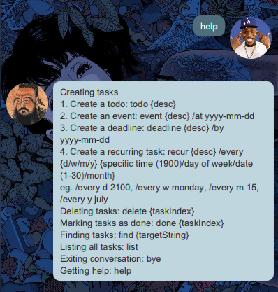
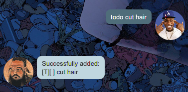
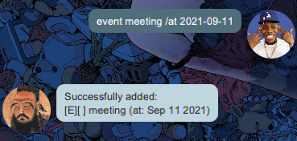
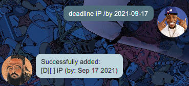
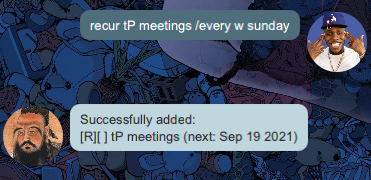
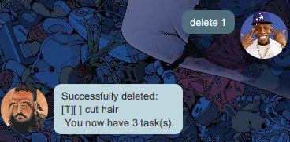
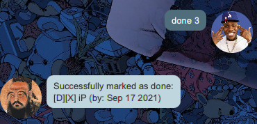
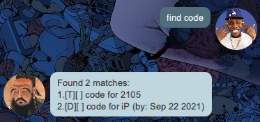
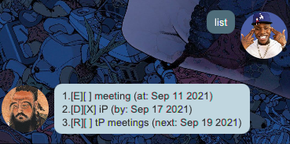
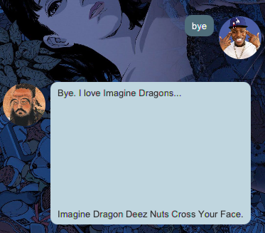

# Ligma User Guide
Ligma is a new task managing app. Users interact with Ligma through its Graphical User Interface (GUI). 
Here's how it looks like: 

## Features
* Viewing help `help`
* Adding tasks
  1. Todos `todo`
  2. Events `event`
  3. Deadlines `deadline`
  4. Recurring tasks `recur`
* Deleting tasks `delete`
* Marking tasks as done `done`
* Finding tasks with search term `find`
* Listing all tasks `list`
* Exiting the program `bye`

## Usage
### `help` - Viewing help

Shows a message explaning every possible user command. 

### Adding tasks
#### `todo` - Todos

Adds a todo task to the task list: `todo {description}` 

#### `event` - Events

Adds an event task to the task list: `event {description} /at yyyy-mm-dd` 

#### `deadline` - Deadlines

Adds a deadline task to the task list: `deadline {description} /by yyyy-mm-dd` 

#### `recur` - Recurring tasks

Adds a recurring task to the task list: 
`recur {description} /every {d/w/m/y} {time/day of week/date/month}` 
d, w, m, y: flags representing frequency of task. The flags means day, week, month, year respectively.  
* time: 0000-2359 format
* day of week: monday-sunday
* date: 1-31
* month: january-december 

### `delete` - Deleting tasks

Deletes a task from task list according to its index in the list: `delete {index}` 

### `done` - Marking tasks as done

Marks a task from task list as completed based on its index in the list: `done {index}` 

### `find` - Finding tasks containing search term

Shows the user tasks with descriptions that contain the search term: `find {target string}` 

### `list` - Listing all tasks

Shows all the tasks currently in task list: `list` 

### `bye` - Exiting Ligma program

Terminates Ligma bot and ends program (although GUI remains open) : `bye` 

