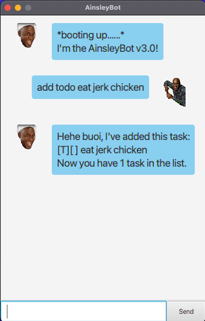
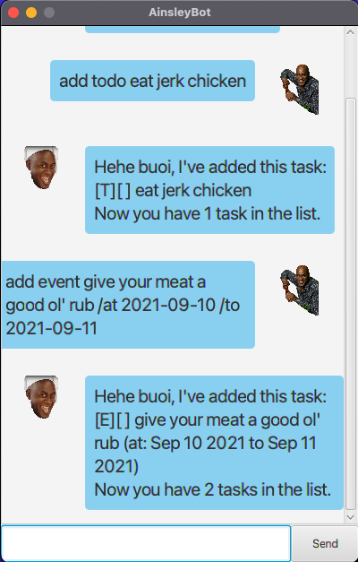
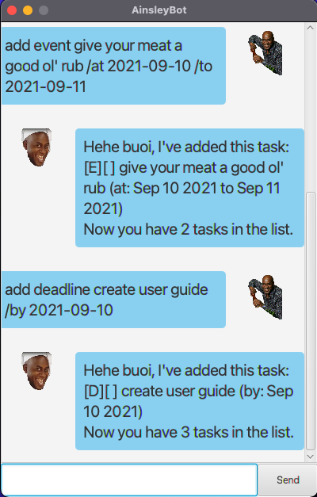
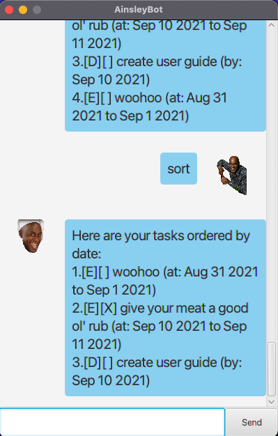

# AinsleyBot User Guide
AinsleyBot is a task manager! Talk to AinsleyBot and get it to keep track of your tasks in a list, hot and spicy! You can interact with it just like chatting with a person on a messaging platform, *hehe boi*.

## Quick Navigation
1. [Starting Up](#starting-up)
2. [Features](#features)
3. [Usage](#usage)
   1. [`add`](#add)
   2. [`list`](#list)
   3. [`find`](#find)
   4. [`done`](#done)
   5. [`delete`](#delete)
   6. [`sort`](#sort)
4. [Exiting the app](#exiting-the-app)
5. [Reporting an issue](#reporting-an-issue)

## Starting Up
Double-click the coffee cup. AinsleyBot will start right up like this:

**Troubleshoot common errors:**
1. Not starting up? Check if your machine has Java 11 installed!

## Features 

### Add Tasks ➕
You can add different types of tasks:
- _Todo:_ a task with description, simple and sweet. Denoted with a `[T]`.
- _Event:_ a **dated** task with a start date and an end date. Great for events. Denoted with an `[E]`.
- _Deadline:_ a **dated** task with a single date. Great for deadlines. Denoted with a `[D]`.

### Mark Tasks as Done ☑️
After you are done with the task, mark it as done!

### Delete Tasks ❌
Remove tasks from the application!

### View All Tasks 👀
See all of your tasks!

### Find Tasks 🔍
Find tasks by querying a word from the description!

### Sort Tasks by Date 🔃
View all your dated tasks in chronological order!

## Usage
Here are some commands to use with AinsleyBot. Be mindful that AinsleyBot can't understand you unless the exact commands and formats are used! The commands are also case-sensitive. Square brackets `[]` denote where users can replace with their own content.

### `add`
Adds a new task in the list.

**General format:** 

`add [type of task] [description] [task-type specific arguments]`

**Example of usage:**

`add todo eat jerk chicken`

Expected outcome:

Now you have a `todo` with description of `eat jerk chicken` in the list of tasks!

#### add a todo
**Format:** 

`add todo [description]`

**Example:** 

`add todo eat jerk chicken`

**Troubleshoot common errors:**
1. Not adding a description. AinsleyBot does not allow for tasks with empty descriptions (applies for all types of tasks!).

#### add an event
**Format:** 

`add event [description] /at [yyyy-MM-dd] /to [yyyy-MM-dd]`

**Example:** 

`add event give your meat a good ol' rub /at 2021-09-10 /to 2021-09-11`

**Caution:**

AinsleyBot will not check if the event's date happened or ended in the past, or if the last day happens before the first. 

**Troubleshoot common errors:** 
1. Bad date formatting. Please follow the prescribed `yyyy-MM-dd` format exactly.
2. Missing final date. Be sure that the command consists of two dates with the correct delimiters `/at` and `/to`.

#### add a deadline
**Format:** 

`add deadline [description] /by [yyyy-MM-dd]`

**Example:** 

`add deadline create user guide /by 2021-09-10`

**Caution:**

AinsleyBot will not check if the deadline occurred in the past.

**Troubleshoot common errors:**
1. Bad date formatting. Please follow the prescribed `yyyy-MM-dd` format exactly.
2. Missing date. Be sure that the command consists of a date with the correct delimiter `/by`.

### `list`
Shows all your tasks as a list.

**Example:** `list`

**Expected outcome:**

**Caution:** 

`list` command stands alone! Any additional text after the command will make it invalid. 

### `find`
Lists all the tasks that contains the keyword you are searching for.

**Format:** 

`find [keyword]`

**Expected outcome:**

### `done`
Marks the task at the specified index as done. Note that tasks that are marked as done is denoted by an `[X]`.

**Format:** 

`done [1-based index number]`

**Expected outcome:**

**Caution:** 

This command is irreversible!

**Troubleshoot common errors:**
1. Attempting to mark a task at index more than the current total number of tasks will cause an error.

### `delete`
Removes the task at the specified index from the list.

**Format:** 

`delete [1-based index number]`

**Expected outcome:**

**Caution:** 

This command is irreversible!

**Troubleshoot common errors:**
1. Attempting to delete a task at index more than the current total number of tasks will cause an error.

### `sort`
Displays the list of dated task sorted chronologically. The list will not contain Todos as they do not have a date.

**Format:** 

`sort`

**Expected outcome:**

**Caution:** 

`sort` command stands alone! Any additional text after the command will make it invalid.

## Exiting the App
To exit AinsleyBot, just type `bye` (and nothing else, please). AinsleyBot saves all the changes you've made to the data and quits gracefully. Here's what you'll expect to see:

**Caution:** 

Exiting AinsleyBot forcefully or by any other way will cause it to not save your changes!

## Reporting an Issue
Encountering something strange or unexpected? File an issue [here](https://github.com/huizhuansam/ip/issues) with the accompanying screenshot of the problem.