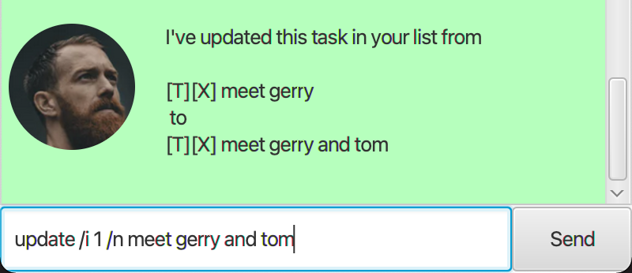
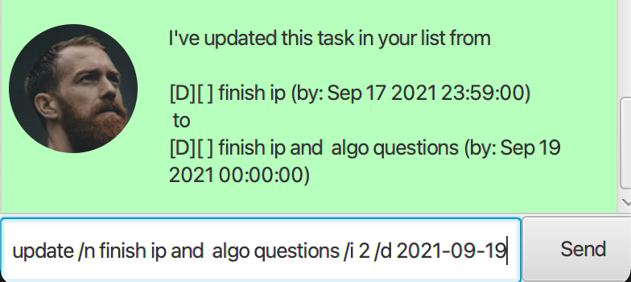

# User Guide

**DUKE** allows you to manage and keep track of your tasks. While it features a chatbot, you can use the Command Line Interface (CLI) to input your commands.

## Features 
### Multiple types of tasks
**DUKE** allows you to track three types of tasks; namely `todo`, `deadline` and `event`.

### Save your tasks to Disk
**DUKE** allows you to save your tasks to your local disk drive, allowing you to easily load previous tasks.
### CLI interface 
**DUKE**'s CLI interface allows keyboard warriors to type even faster and manage your tasks at a quick rate!
## Usage
**Command format notes**

Items enclosed by curly braces ({}) are compulsory.
e.g. `/by {some_parameter}` indicates the need to include `{some_parameter}`.

Items enclosed square braces ([]) are optional.
e.g. `/at {some_parameter} /n [some_other_parameter]` would indicate that `[some_other_parameter]` is optional.

### `help` - Gives a list of commands that you can use with DUKE

Gives a list of commands you can use. 

Example of usage: 
`list`

Expected outcome: 
A list of commands. 

### `list` - Lists all the tasks in your task list.

Shows you the tasks in your list.

Example of usage: 
`list`

Expected outcome: 
A numbered list of tasks. 

### `deadline` - Adds a Deadline type task to your Task List

Adds a Deadline type task to your Task List.

Example of usage: 
`deadline {name_here} /by {date in yyyy-MM-dd [hh:mm]}`

Expected outcome: 
The Deadline task which was added. 

### `event` - Adds an Event type task to your Task List

Adds an Event type task to your Task List.

Example of usage: 
`event {name_here} /at {date in yyyy-MM-dd [hh:mm]}`

Expected outcome: 
The Event task which was added. 

### `todo` - Adds a Todo type task to your Task List

Adds a Todo type task to your Task List.

Example of usage: 
`todo {name_here}`

Expected outcome: 
The Todo task which was added. 

### `done` - Completes a task at the position given in the task list

Marks task as complete.

Example of usage: 
`done {id_of_task_here}`

Expected outcome: 
The task which was completed. 

### `delete` - Removes a task from the task list

Removes a task from the task list.

Example of usage: 
`delete {id_of_task_here}`

Expected outcome: 
The task which was deleted. 

### `find` - Finds a task from the task list which matches the input.

Finds a task from the task list.

Example of usage: 
`find {input_string_here}`

Expected outcome: 
The task(s) which match the input. 

### `update` - Update a task from the task list.

Updates a task's details where the task's ID is *i*.

Example of usage: 
`update {/i id_of_task_here} [/n name_to_update_to] [/d date_to_update_to]`

Note that if a task is an Event or a Deadline task, it requires either the name or the date parameter.

Otherwise, if it is a Todo task, it will require the name parameter.

The parameters do not have to be provided in order.

Expected outcome: 
The task which has been updated. 

### `bye` - Exits DUKE.

Exits and closes **DUKE**.

Example of usage: 
`bye`

Expected outcome: 
**DUKE** closes.
