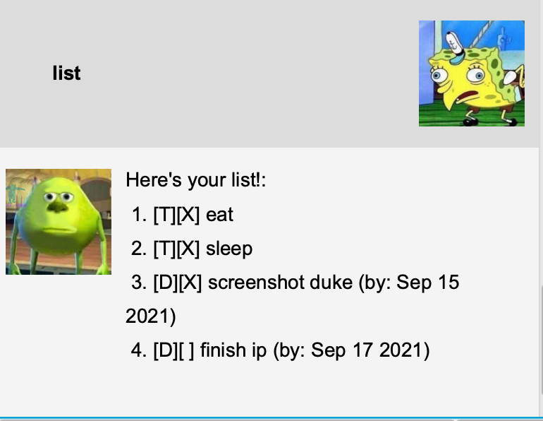
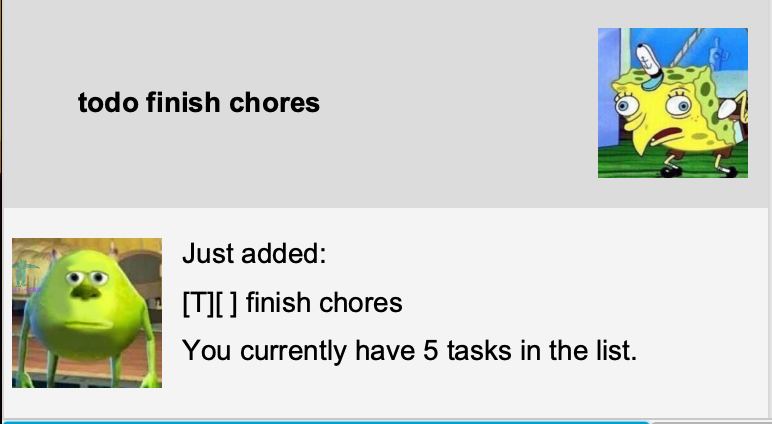
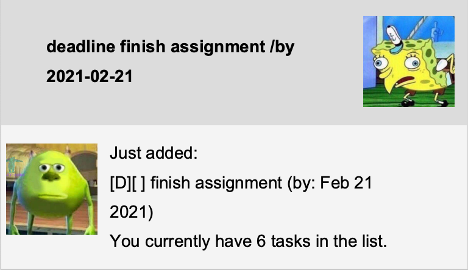
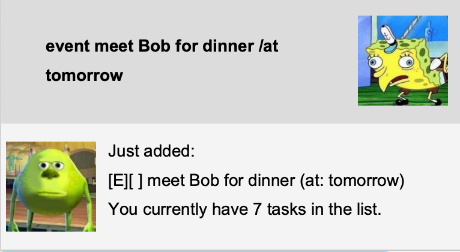
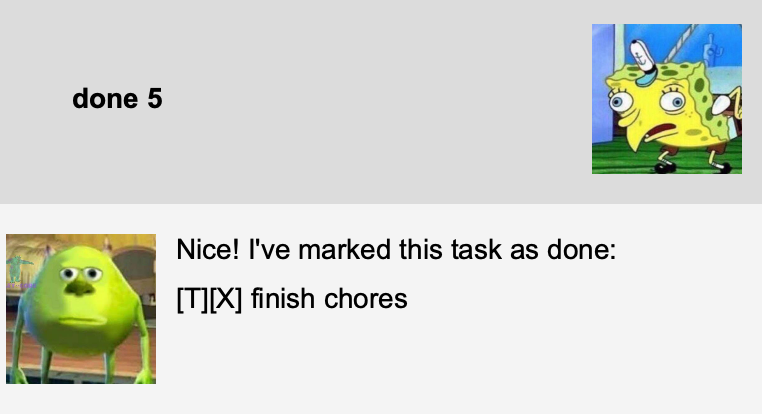
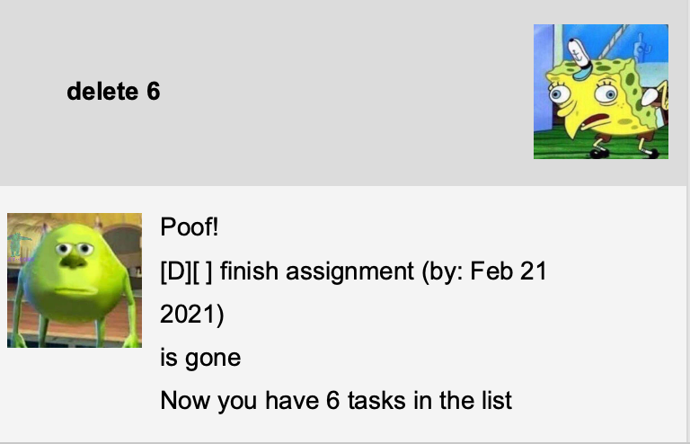
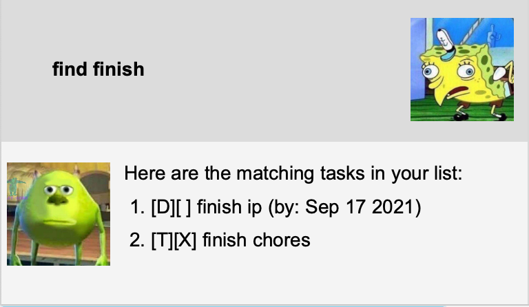
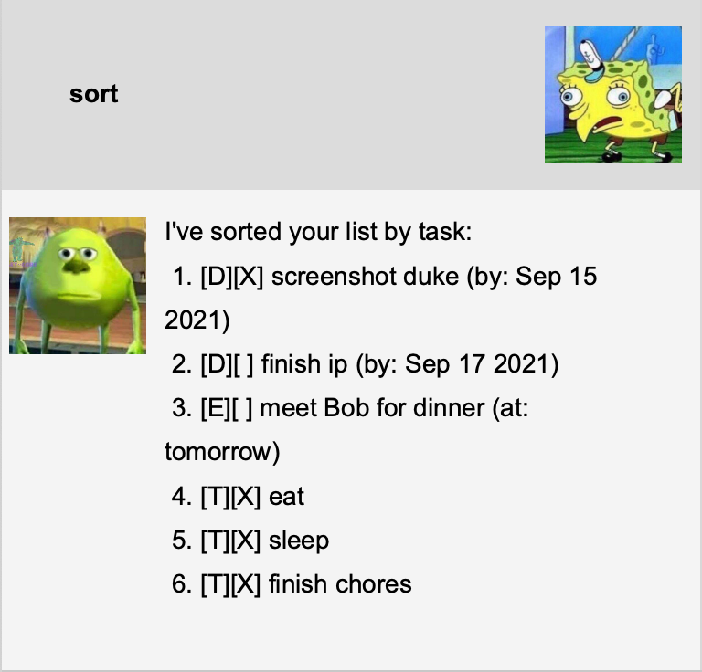

# Duke User Guide

Duke is a desktop app to manage your tasks. Interact with Duke via a Command Line Interface (CLI) and it will respond back! Duke can get your task management done fast just like a real personal assistant.

## Features

### 📃 Listing all tasks - `list`

Displays a list of all tasks saved in Duke.

Format: `list`

Duke will respond by displaying the task list:

### ➕ Add a todo task - `todo`

Adds a new todo task to the task list.

Format: `todo DESCRIPTION`
* A `DESCRIPTION` must be specified.

Example of usage: 
* `todo finish chores`

Duke will respond by displaying the new task and the total number of tasks in the new list:

### ⏳ Add a deadline task - `deadline`

Adds a new deadline task to the task list.

Format: `deadline DESCRIPTION /by DEADLINE`
* A `DESCRIPTION` and `DEADLINE` must be specified.
* `/by` must separate the `DESCRIPTION` and `DEADLINE`.
* `DEADLINE` must be in the format yyyy-mm-dd (e.g. 2021-02-21).

Example of usage:
* `deadline finish assignment /by 2021-02-21`

Duke will respond by displaying the new task and the total number of tasks in the new list:

### 🕙 Add an event task - `event`

Adds a new event task to the task list.

Format: `event DESCRIPTION /at TIME`
* A `DESCRIPTION` and `TIME` must be specified.
* `/at` must separate the `DESCRIPTION` and `TIME`.
* There is no set format for `TIME`.

Example of usage:
* `event meet Bob for dinner /at tomorrow`

Duke will respond by displaying the new task and the total number of tasks in the new list:

### ✅️ Mark a task as done - `done`

Marks the task at the specified index as done in the task list.

Format: `done INDEX`
* A valid positive integer `INDEX` must be specified.
* `INDEX` cannot be a number more than the number of tasks in the list.

Example of usage:
* `done 5`

Duke will respond by displaying the task marked done:

### 🗑 Delete a task - `delete`

Deletes the task at the specified index from task list.

Format: `delete INDEX`
* A valid positive integer `INDEX` must be specified.
* `INDEX` cannot be a number more than the number of tasks in the list.

Example of usage:
* `delete 6`

Duke will respond by displaying the task deleted and the total number of tasks in the new list:

### 🔎 Find tasks by keyword - `find`

Finds all tasks containing the specified keyword.

Format: `find KEYWORD`
* A `KEYWORD` must be specified.

Example of usage:
* `find finish`

Duke will respond by displaying any matching tasks:

### 🔠 Sort tasks - `sort`

Sorts the task list in the following order: deadlines, events, todos.

Format: `sort`

Example of usage:
* `sort`

Duke will respond by displaying the sorted task list:

