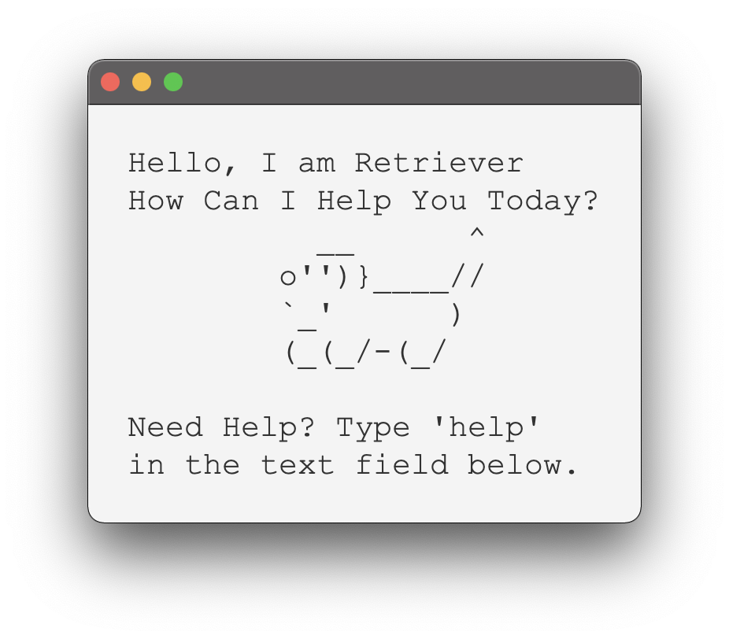
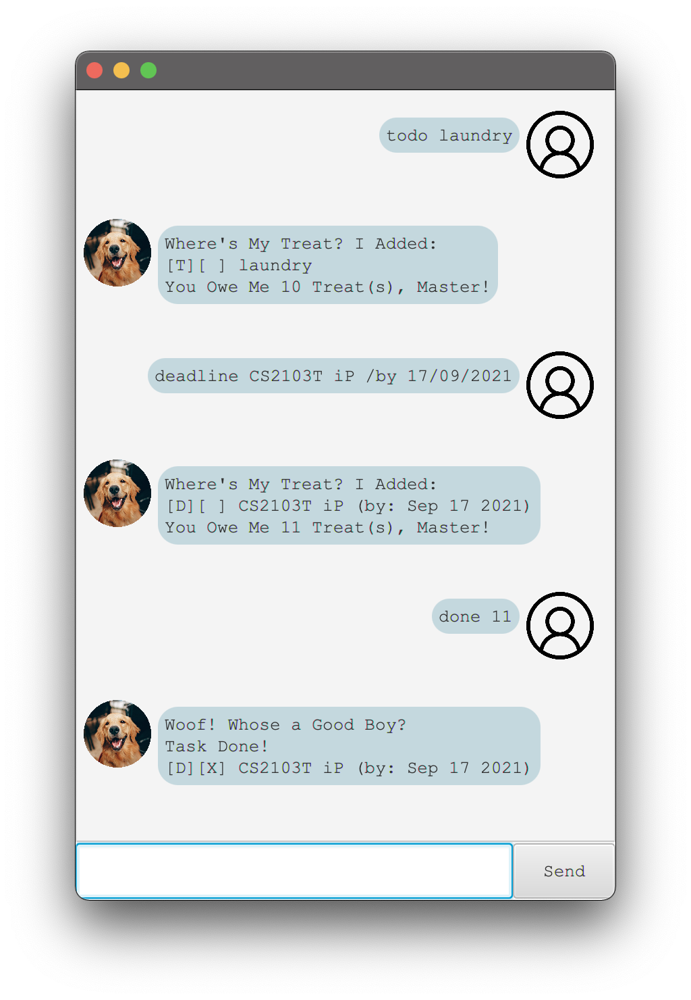

# User Guide

Welcome User! Retriever the Chatbot is a Friendly, Dog themed Chatbot. It
helps you to manage your busy schedule with its chat style user interface.

<p align="center">
Welcome Splash Screen
</p>


<p align="center">
Chatbot Window
</p>



---
## Table of Contents
* [Getting Started](#getting-started)
* [Quick Access Links](#quick-access-links)
* [Features](#features)
* [Usage](#usage)
* [Command Summary](#command-summary)

---
## Getting Started
1. Download the JAR file from [here](https://github.com/Jai2501/ip/releases/tag/v2.0).
2. Open Terminal, and type in the following command to run the App.
```
java -jar retriever-1.0.jar
```

* [OPTIONAL] If you want to enable assertions and run, type in the following command.
```
java -jar -ea retriever-1.0.jar
```

3. That's all. Enjoy and Don't forget to support me on GitHub [here](https://github.com/Jai2501).

---
## Quick Access Links
  * Adding a Task
    * [Deadline Type Task](#to-add-a-deadline-type-task---deadline)
    * [Event Type Task](#to-add-an-event-type-task---event)
    * [Todo Type Task](#to-add-a-todo-type-task---todo)
  * [Deleting a Task](#to-delete-a-task---delete)
  * [Marking a Task as Done](#to-mark-a-task-as-done---done)
  * [Finding a Task](#to-find-tasks-with-similar-keywords---find)
  * [Viewing Your Schedule](#to-view-the-tasks-scheduled-for-a-day---view)
  * [Viewing All Tasks](#to-show-all-the-tasks-present-in-the-task-list---list)
  * [Help Section](#to-show-all-the-possible-commands---help)
  * [Ending the Session](#to-end-the-session-with-the-chatbot---bye)

---
## Features 

### Feature #1 - Add Various Types of Tasks to Your Schedule

> This App allows you to add various types of tasks to your schedule, including:
>
>* Deadline Type Tasks
>* Event Type Tasks
>* Todo Type Tasks

### Feature #2 - View Schedule

> This feature allows you to view your schedule for a particular day.

### Feature #3 - Find

> This feature allows you to find tasks with matching keywords.

### Feature #4 - Mark Tasks as Done

> As you finish your tasks, you can mark them as done!

### Feature #5 - Delete Tasks

> Entered wrong details for a task? Fret not, you can easily delete a task.

### Feature #6 - Your Best Friend

> New Users Fret not! Our App has a help feature, which guides you as to how to use 
a particular feature.

---
## Usage
### To end the session with the Chatbot - `bye`

To quit the Chatbot App after manipulating the tasks, you may use the
```bye``` command.

Format:
```
bye
```

Example of usage:
```
bye
```

Expected outcome:

```
-> Sad To See You Go!
```

The Chatbot would close, indicating that you have successfully terminated the
session.

### To add a deadline type task - `deadline`

If the task you wish to add has a deadline associated with it, you may use the
```deadline``` command to add it.

Format:

```
deadline TASK_DESCRIPTION /by DD/MM/YYYY
```

Example of usage:
```
deadline CS2103T iP /by 17/09/2021
```

Expected outcome:

```
Where's My Treat? I Added:
[D][ ] CS2103T iP (by: Sep 17 2021)
You Owe Me 1 Treat(s), Master!
```

<span color="red">
The Chatbot would print a message suggesting that you have successfully added the
deadline type task. However, if you make a mistake in the ```keyword```,
the ```command format``` or the ```date format```, an error message would be shown.
</span>

### To add an event type task - `event`

If the task you wish to add is event related, you may use the
```event``` command to add it.

Format:
```
event TASK_DESCRIPTION /at DD/MM/YYYY
```

Example of usage:
```
event Apple Event /at 15/09/2021
```

Expected outcome:

```
Where's My Treat? I Added:
[E][ ] Apple Event  (at: Sep 15 2021)
You Owe Me 1 Treat(s), Master!
```

<span color="red">
The Chatbot would print a message suggesting that you have successfully added the
event type task. However, if you make a mistake in the ```keyword```,
the ```command format``` or the ```date format```, an error message would be shown.
</span>

### To delete a task - `delete`

If there is a task you wish to delete, you may use the
```delete``` command to delete it.

Format:
```
delete TASK_NUMBER
```

Example of usage:
```
delete 1
```

Expected outcome:

```
Woof! Whose a Bad Boy?
Task Deleted!
[D][ ] CS2103T iP (by: Sep 17 2021)
You Owe Me 1 Treat(s), Master!
```

<span color="red">
The Chatbot would print a message showcasing the task deleted, and how many
tasks are still present in the task list. However, if you make a mistake
in the ```keyword```, the ```command format``` or the ```TASK_NUMBER```,
an error message would be shown.
</span>


### To mark a task as done - `done`

If you completed a task, you may use the
```done``` command to mark it as done.

Format:
```
done TASK_NUMBER
```

Example of usage:
```
done 1
```

Expected outcome:

```
Woof! Whose a Good Boy?
Task Done!
[D][X] CS2103T iP (by: Sep 17 2021)
```

<span color="red">
The Chatbot would print a message showcasing the task marked as done.
However, if you make a mistake in the ```keyword```, the ```command format```
or the ```TASK_NUMBER```, an error message would be shown.
</span>

### To find tasks with similar keywords - `find`

If you wish to search for tasks with a particular keyword, you may use the
```find``` command to find such tasks.

Format:
```
find KEYWORD
```

Example of usage:
```
find apple
```

Expected outcome:

```
Woof! Look What I Found: 
1. [E][ ] Apple Event (at: Sep 15 2021)
You Owe Me 1 Treat(s), Master!
```

<span color="red">
The Chatbot would print a list of tasks which have the keyword present in them.
However, if you make a mistake in the ```keyword``` or
the ```command format```, an error message would be shown.
</span>

### To show all the tasks present in the task list - `list`

If you want to take a look at the tasks present in your task list, you may use the
```list``` command.

Format:
```
list
```

Example of usage:
```
list
```

Expected outcome:

```
Woof! Whose a Good Boy?
Task Done!
[D][X] CS2103T iP (by: Sep 17 2021)
```

The Chatbot would print a list showcasing the tasks present.

### To show all the possible commands - `help`

If you want to take a look at the commands you can execute, you may use the
```help``` command. You can see command descriptions, formats and usage examples
within the App itself.

Format:
```
help
```

Example of usage:
```
help
```

Expected outcome:

```
Master, I shall guide you to my best ability to smell.

Use the bye command to end the session.
Command Example: bye

Use the deadline command to add a deadline type task.
-> deadline TASK_DESCRIPTION /by DD/MM/YYYY
Command Example: deadline CS2103T iP /by 23/09/2021

Use the event command to add an event type task.
-> event TASK_DESCRIPTION /at DD/MM/YYYY
Command Example: event Apple iPhone 13 /at 14/09/2021

Use the todo command to add a todo type task.
-> todo TASK_DESCRIPTION
Command Example: todo laundry

Use the delete command to delete a task.
-> delete TASK_NUMBER
Command Example: delete 4

Use the done command to mark a task as done.
-> done TASK_NUMBER
Command Example: done 3

Use the find command to find tasks.
-> find KEYWORD
Command Example: find notes

Use the list command to view the tasks currently present in the task list.
Command Example: list

Use the help command to open the help section.
Command Example: help

Use the view command to view scheduled tasks for a day.
-> view DD/MM/YYYY
Command Example: view 23/09/2021
```

The Chatbot would print the list of executable commands and their details.

### To add a todo type task - `todo`

If the task you wish to add is a todo and has no fixed due date, you may use the
```todo``` command to add it.

Format:
```
todo TASK_DESCRIPTION
```

Example of usage:
```
todo Laundry
```

Expected outcome:

```
Where's My Treat? I Added:
[T][ ] Laundry
You Owe Me 1 Treat(s), Master!
```

<span color="red">
The Chatbot would print a message suggesting that you have successfully added the
todo type task. However, if you make a mistake in the ```keyword``` or
the ```command format```, an error message would be shown.
</span>


### To view the tasks scheduled for a day - `view`

This command helps you to quickly look up tasks due by or at a particular day.
This would __only__ show you `event` and `deadline` type tasks. You may use the
```view``` command to use this.

Format:
```
view DD/MM/YYYY
```

Example of usage:
```
view 23/09/2021
```

Expected outcome:

```
Master, You are Busy For The Day...
1. [D][ ] CS2100 Assignment (by: Sep 23 2021)
2. [E][ ] Tesla Cyber Truck Launch (at: Sep 23 2021)
```

<span color="red">
The Chatbot would print a list containing the tasks due on that particular date.
However, if you make a mistake in the ```keyword```,
the ```command format``` or the ```date format```, an error message would be shown.
</span>

---
## Command Summary

Command | Summary | `Syntax`
------- | ------- | -------
bye | To end the session with the Chatbot | `bye`
help | To display the help section | `help`
deadline | To add a deadline type task | `deadline TASK_DESCRIPTION /by DD/MM/YYYY`
event | To add an event type task | `event TASK_DESCRIPTION /at DD/MM/YYYY`
todo | To add a todo type task | `todo TASK_DESCRIPTION`
done | To mark a task as done | `done TASK_NUMBER`
delete | To delete a task from the list | `delete TASK_NUMBER`
find | To find and show tasks with matching keywords | `find KEYWORD`
list | To show all the tasks present in the task list  | `list`
view | To show the tasks scheduled for the date entered | `view DD/MM/YYYY`

---
## Acknowledgments
* Retriever Photo:

File: src/main/resources/images/RetrieverCircular.png

Source: [Popsugar](https://www.popsugar.com/pets/what-kind-health-problems-do-golden-retrievers-have-46909974)

* User Photo:

File: src/main/resources/images/User.png

Source: [Pinterest](https://www.pinterest.com/pin/811210951621719706/)
