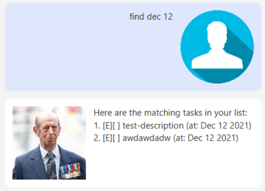

# User Guide

## Features 

### List all tasks: `list`

Lists all tasks in the task list.

format: `list`

### Delete a task: `delete`

Deletes a task from the task list given the task index.

Format: `delete TASK-INDEX`

### Mark a task as done: `done`

Marks a task from the task list as done given the task index.

Format: `done TASK-INDEX`

### Create a Todo: `todo`

Create a todo by providing a description and adds it to the task list.

Format: `todo DESCRIPTION`

Examples:
* `todo buy some milk`
* `todo never come back`

### Create an Event: `event`

Create an event with a description that occurs at a provided date and adds it to the task list.

Format: `event DESCRIPTION /at DATE`

Examples:
* `event son's birthday /at 2021-12-12`
* `event one-way flight to columbia /at 2021-12-11`

### Create a Deadline: `deadline`

Create a deadline with a description that is due by a provided date and adds it to the task list.

Format: `deadline DESCRIPTION /by DATE`

### Get Tasks occurring on date: `occurring`

Get all events and deadlines that occur on a provided date.

Format: `occurring DATE`

### Find Tasks matching query: 'find'

Find all tasks that matches a provided query.
* Not case-sensitive
* Matches with description or date

Format: `find QUERY`

Examples:
* `find father` Finds a task like an event with a description of "father's day"
* `find Dec 12` Finds a task like an event with a date of "2021-12-12"

##FAQ
**Q**: How do I transfer my data to another Computer?  
**A**: Install the app in the other computer and overwrite the empty data file it 
creates with the file that contains the data of your previous DukeMaster home folder.