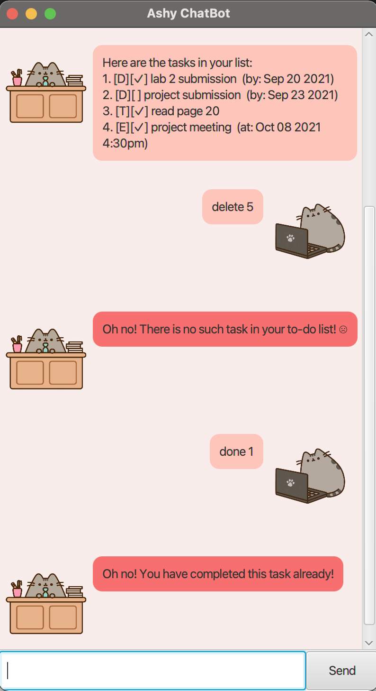

# User Guide for Ashy ChatBot

## About
Ashy is your friendly chatbot that helps you keep track of to-dos, events and deadlines! Ashy will make sure you stay organised and productive! 
<p style="text-align: center"> </p>

## Features 

### Create Tasks
In the Ashy ChatBot, you can create three kinds of tasks: 
* To-Dos
* Deadlines 
* Events
<p style="text-align: center"> </p>

#### To-Dos
To-Dos are simple tasks with just a description.
#### Deadlines
Deadlines are the tasks with a description and due dates.
#### Events 
Events are tasks that have a description and time frame.

### Task Management 
A variety of tasks have been implemented in the Ashy ChatBot to allow you to manage your tasks more effectively! 
<p style="text-align: center"> </p>
The following are the commands you can use: 
* Delete Tasks
* Mark Tasks as Done
* Find Tasks
* Update task description
* List out all tasks 

### Error Handling
If you enter a wrong command by mistake, dont worry! The Ashy ChatBot has various error handling messages that are highlighted in red to guide you through!
<p style="text-align: center"> </p>

### Help
New to the Ashy ChatBot? You can use the help command to find out various features and how to implement them! 
<p style="text-align: center"> </p>

### Save Tasks 
The tasks you create in the Ashy ChatBot are saved to the hard-disk automatically! 

## Usage 

### `todo` - adds a todo task

Example of usage: 
`todo buy bread`

Expected outcome:
```
I have added this task:
[T][]buy bread 
You now have 1 task in your list
```

### `deadline` - adds a deadline task

Example of usage: 
`deadline CS2106 quiz /by 18-09-2021`

Expected outcome: 
```
I have added this task: 
[D][]CS2106 quiz (by: Sep 18 2021)
You now have 2 tasks in your list
```
### `event` - adds an event task

Example of usage: 
`event project meeting /at 08-10-2021 1630`

Expected outcome: 
```
I have added this task: 
[E][]project meeting (at Oct 08 2021 4:30pm)
```
### `delete` - deletes a task from your list

Example of usage: 
`delete 1`

Expected outcome: 
```
Okay! I have removed this task for you: 
[T][]buy bread
You now have 2 tasks in your list.
```

### `done` - mark task a done 

Example of usage: 
`done 1`

Expected outcome: 
```
Good job! I have marked this task as completed: 
[D][✓]CS2106 quiz (by: Sep 18 2021)
You now have 2 tasks to complete.
```

### `find` - searches for a task with a keyword

Example of usage: 
`find project`

Expected outcome: 
```
Here are 2 matching tasks in your list: 
1.[D][]project submission (by: Sep 23 2021)
2.[E][✓]project meeting (at Oct 08 2021 4:30pm)
```

### `update` - updates the task description 

Example of usage:
`update 1 : read AB3 User Guide`

Expected outcome:
```
I have updated the task description for you!
[T][✓]read AB3 User Guide
```

### `list` - lists all the tasks 

Example of usage: 
`list`

Expected outcome: 
```
Here are the tasks in your list: 
1. [D][✓]lab 2 submission (by: Sep 20 2021)
2. [T][ ]read page 2
3. [E][ ]project meeting (at: Oct 08 2021 4:30pm)
4. [T][✓]finish watching lecture 4
```

### `help` - explains all possible commands 

Example of usage: 
`help`

Expected outcome: 
```
Here is what I can do for you!
------------Task Manager------------"
To create new tasks: 
1. todo (task description)
2. deadline (task description) /by dd-MM-yyyy
3. event (task description) /at dd-MM-yyyy HHmm
------------Other Commands------------
4. done (task number)
5. delete (task number)
6. update (task number) : (new task description)
7. list
8. help
```

### `bye` - quits the chat bot

Example of usage:
`bye`

Expected outcome: 
```
ByeBye! Hope to see you again!
```

## Acknowledgments 

### External Packages Used
* [JUnit by JUnit Team](https://github.com/junit-team/junit5/) - For testing classes and components in Ashy.
* [JavaFX by OpenJDK](https://github.com/openjdk/jfx) - For creating user interfaces.


