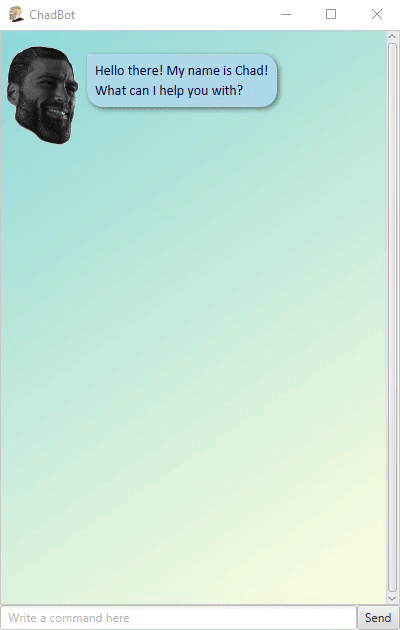
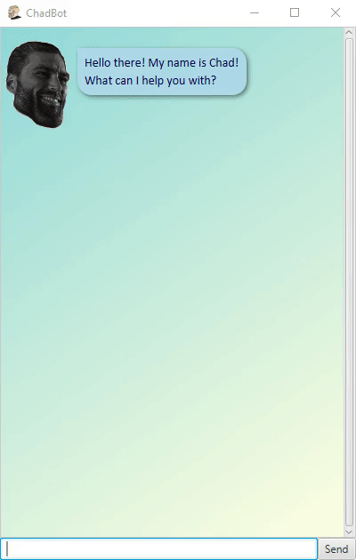

# ChadBot User Guide

_by [Jay Aljelo Saez Ting](https://github.com/jayasting98)_

ChadBot is a chatbot named Chad designed to help you manage your tasks.


## Table of Contents
* [Quick Start](#quick-start)
* [Key Features](#key-features)
* [Usage](#usage)
  * [Notation](#notation)
  * [`todo` - Add to-do task](#todo---add-to-do-task)
  * [`deadline` - Add deadline task](#deadline---add-deadline-task)
  * [`event` - Add event task](#event---add-event-task)
  * [`list` - List tasks](#list---list-tasks)
  * [`find` - Find tasks](#find---find-tasks)
  * [`done` - Mark task done](#done---mark-task-done)
  * [`delete` - Delete task](#delete---delete-task)
  * [`undo` - Undo](#undo---undo)
  * [`bye` - Exit](#bye---exit)
* [Frequently Asked Questions (FAQ)](#frequently-asked-questions-faq)
* [About](#about)

## Quick Start

1. Ensure you have [Java 11 or above installed](https://java.com/en/download/help/version_manual.html). If it is not
installed, then [install it](https://www.oracle.com/sg/java/technologies/javase-jdk11-downloads.html).
2. Download the latest [JAR](https://en.wikipedia.org/wiki/JAR_(file_format)) file from
[here](https://github.com/jayasting98/ip/releases).
3. Start the app by double-clicking the JAR file.
4. Type a command into the command text field and click the Send button or press Enter to execute the command. For
example, to add a to-do task to your tasks list, type the command `todo {task description}` like `todo wash shirts`.

[[Back to table of contents]](#table-of-contents)

## Key Features

### Add different types of tasks

You can add [to-do tasks](#todo---add-to-do-task), [deadline tasks](#deadline---add-deadline-task) which are tasks that
must be done by a deadline, and [event tasks](#event---add-event-task) which are tasks that occur at a certain point in
time.


### See your tasks

You can see your tasks by [listing](#list---list-tasks) them all out, or by [finding](#find---find-tasks) tasks with
matching keywords.



### Mark your tasks as done

Once finished with your tasks, you can [mark them as done](#done---mark-task-done).



### Responsive user interface

The UI adjusts accordingly when the app window is resized.


### Persistent storage

Even after exiting, the data of all the tasks is automatically saved. This is loaded once the app is started again.

[[Back to table of contents]](#table-of-contents)

## Usage

### Notation

Commands are described using command arguments which are in turn described with a command format using the notation

`as_is_argument {replaceable argument}`

where `as_is_argument` indicates an as-is command argument that is to be typed as-is, and

where `{replaceable argument}` indicates a replaceable command argument that is to be replaced with a user-specified
argument. Usually the text within the braces of a replaceable argument describes what should be specified there.

For example,

`deadline {task description} /by {deadline in yyyy/M/d HHmm format (24 hours)}`

indicates that

`deadline` and `/by` should be typed out as-is, while

`{task description}` should be replaced by a user-specified task description, and

`{deadline in yyyy/M/d HHmm format (24 hours)}` should be replaced by a user-specified deadline in that date-time
format.

[[Back to table of contents]](#table-of-contents)

### `todo` - Add to-do task

Adds a to-do task to the tasks list. A to-do task is a task that just has to be done and only has a task description.

Format:

`todo {task description}`

Example of usage:

`todo read textbook`

Expected outcome:

Chad will show you what task was just added as well as the number of tasks that are now currently in the tasks list
after adding the task.

`[T]` indicates that the task is a to-do task.

`[ ]` indicates that it is not marked as done.

```
Got it. I've added this task:
  [T][ ] read textbook
Now you have 4 tasks in the list.
```

[[Back to table of contents]](#table-of-contents)

### `deadline` - Add deadline task

Adds a deadline task to the tasks list. A deadline task is a task with a deadline.

Format:

`deadline {task description} /by {deadline in yyyy/M/d HHmm format (24 hours)}`

Example of usage:

`deadline apply for student exchange /by 2021/10/5 1730`

Expected outcome:

Chad will show you what task was just added as well as the number of tasks that are now currently in the tasks list
after adding the task.

`[D]` indicates that the task is a deadline task.

`[ ]` indicates that it is not marked as done.

`(by: 17:30 October 5 2021)` indicates that the task is to be done by the deadline of 5 October 2021 17:30.

```
Got it. I've added this task:
  [D][ ] apply for student exchange (by: 17:30 October 5 2021)
Now you have 4 tasks in the list.
```

[[Back to table of contents]](#table-of-contents)

### `event` - Add event task

Adds an event task to the tasks list. An event task is a task that occurs at a specific point in time.

Format:

`event {task description} /at {time in yyyy/M/d HHmm format (24 hours)}`

Example of usage:

`event project meeting /at 2021/9/18 2215`

Expected outcome:

Chad will show you what task was just added as well as the number of tasks that are now currently in the tasks list
after adding the task.

`[E]` indicates that the task is an event task.

`[ ]` indicates that it is not marked as done.

`(at: 22:15 September 18 2021)` indicates that the task will be done at 18 September 2021 22:15.

```
Got it. I've added this task:
  [E][ ] project meeting (at: 22:15 September 18 2021)
Now you have 4 tasks in the list.
```

[[Back to table of contents]](#table-of-contents)

### `list` - List tasks

Lists out all the tasks in the tasks list.

Format:

`list`

Example of usage:

`list`

Expected outcome:

Chad will show you all the tasks in the tasks list.

```
Here are the tasks in your list:
1.[T][X] read book
2.[D][ ] return book (by: 17:00 June 6 2022)
3.[E][ ] graduation (at: 23:59 June 30 2024)
```

[[Back to table of contents]](#table-of-contents)

### `find` - Find tasks

Finds any tasks from the tasks list that match a query.

Format:

`find {query}`

Example of usage:

`find book`

Expected outcome:

Chad will show you any tasks from the tasks list that match the query. The numbers do not enumerate the results list but
instead correspond to the actual task numbers on the tasks list. This provides a reference to be used for other commands
such as `done` or `delete` which require the task number as an argument.

```
Here are the 3 matching tasks in your list:
1.[T][X] read book
2.[D][ ] return book (by: 17:00 June 6 2022)
4.[T][ ] read textbook
```

[[Back to table of contents]](#table-of-contents)

### `done` - Mark task done

Marks a task as done.

Format:

`done {tasks list task number of the task to be marked as done}`

Example of usage:

`done 4`

Expected outcome:

Chad will show what task was just marked as done.

`[X]` indicates the task is marked as done.

```
Nice! I've marked this task as done:
  [T][X] read textbook
```

[[Back to table of contents]](#table-of-contents)

### `delete` - Delete task

Deletes a task from the tasks list.

Format:

`delete {tasks list task number of the task to be deleted}`

Example of usage:

`delete 4`

Expected outcome:

Chad will show what task was just deleted and the current number of tasks remaining in the tasks list after deleting the
task.

```
Noted. I've removed this task:
  [T][ ] read textbook
Now you have 3 tasks in the list.
```

[[Back to table of contents]](#table-of-contents)

### `undo` - Undo

Undoes an undo-able command. An undo-able command is a command that can be undone. The undo-able commands are:
* `todo`
* `event`
* `deadline`
* `done`
* `delete`

Format:

`undo`

Example of usage:

`undo`

Expected outcome:

Chad will show what command was just undone.

```
Okay, I have undone the following command:
  done 4
```

[[Back to table of contents]](#table-of-contents)

### `bye` - Exit

Exits the app.

Format:

`bye`

Example of usage:

`bye`

Expected outcome:

Chad will say goodbye before the app exits.

```
Goodbye. Hope we see each other again soon.
```

[[Back to table of contents]](#table-of-contents)

## Frequently Asked Questions (FAQ)

### Where is the data of all the tasks stored?

The data is stored in the `tasks.txt` file which is located in the `data` folder which is in the same folder as the JAR
file.

### Do I need to create the `tasks.txt` file or the `data` folder for my data to be saved?

There is no need to create the `tasks.txt` file or the `data` folder; these are created automatically for you.

[[Back to table of contents]](#table-of-contents)

## About

ChadBot is a greenfield individual project for CS2103T Software Engineering, a module that was a part of the Computer
Science curriculum of the National University of Singapore (NUS) for those who matriculated in the NUS Academic Year
(AY) 19/20. ChadBot was done in the [AY 21/22 Semester 1 version of CS2103T Software Engineering](
https://nus-cs2103-ay2122s1.github.io/website/admin/index.html). ChadBot was written in Java, using the JavaFX library
for its GUI, and JUnit for its unit tests. ChadBot is based off of
[Project Duke](https://nus-cs2103-ay2122s1.github.io/website/se-book-adapted/projectDuke/index.html). ChadBot's GitHub
repository can be found [here](https://github.com/jayasting98/ip).

ChadBot was programmed by [Jay Aljelo Saez Ting](https://github.com/jayasting98).

[[Back to table of contents]](#table-of-contents)
