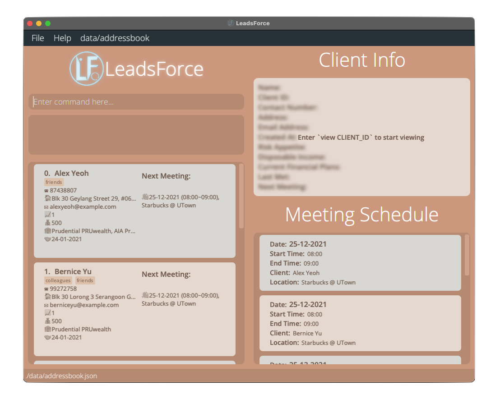
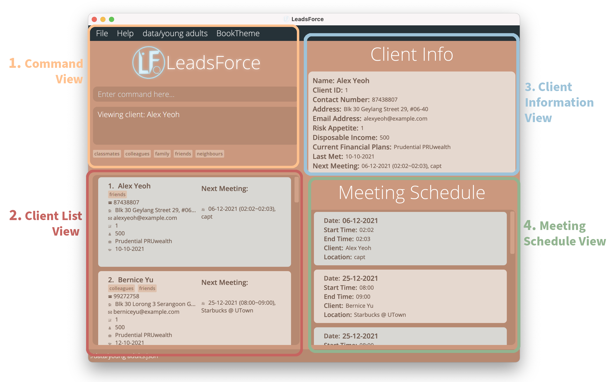
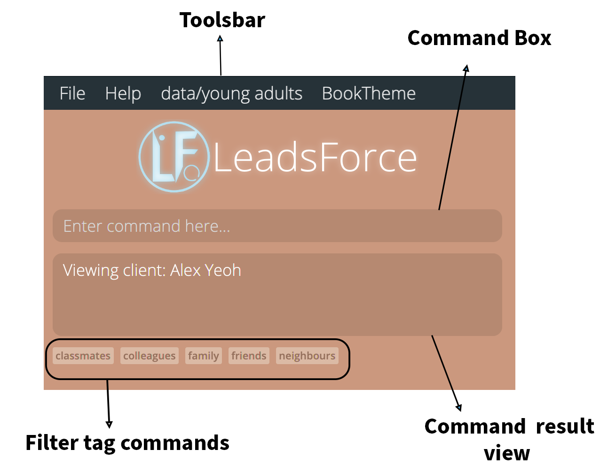
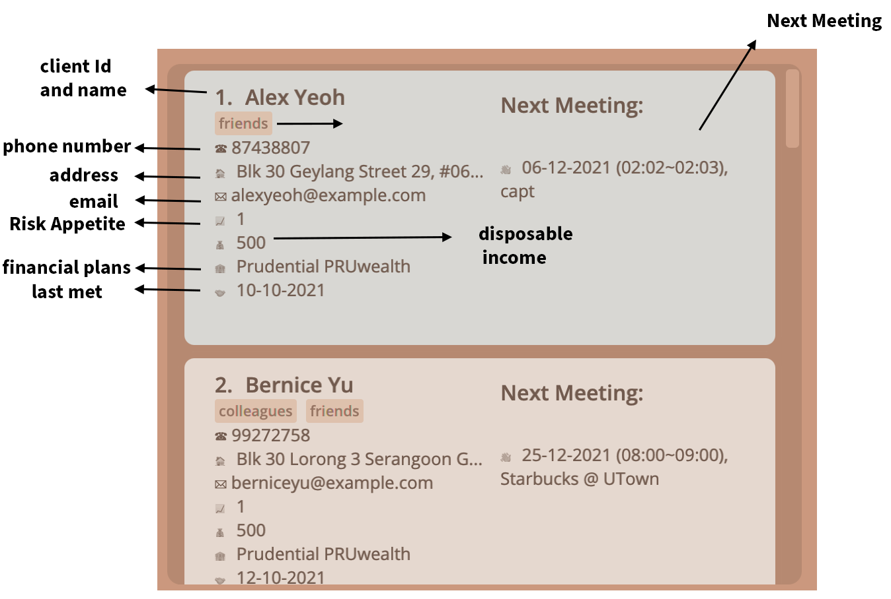

# Mako User Guide
Besides being an expert fire bender, Mako is also great at helping you manage your todos, events and deadlines! The application uses quick-text inputs via a Command Line Interface (CLI) while having an excellent Graphical User Interface (GUI). Organise your tasks by using Mako today! 

* [Quick Start](#quick-start-guide)
* [Features](#features)
* [Usage](#usage)
* [Command Summary](#command-summary)

### Quick Start Guide

1. Ensure you have Java 11 or above installed in your Computer.
2. Download the Mako.jar file from the repository.
3. Move the file to a folder you would want to use as the home folder for Mako.
4. Double-click the file to start the app. The GUI similar to the one shown below should appear in a few seconds.
5. Refer to the Features below for details of each command.


# Features 
* insert tasks which are categorised as todos, deadlines and events
* mark your tasks as done
* remove your tasks from the list 
* view your scheduled events and deadlines on a date 
* find tasks with a specific keyword

### Note about the command format:
Words in `{ }` are the parameters to be supplied by the user. 

e.g. `todo {task's name}` where {task's name} is the user's input. 

# Usage

### View tasks: `list`
showcases the list of tasks given to Mako. Mako also indicates the type of the task and whether the task have been completed or not.

Format: 
`list`

Example: 
`````
Here are the tasks in your list: 
1. [T] [✓] homework 
2. [D] [✕] CS2100 Assignment (by: 2nd Sep 2021 13:00)
3. [E] [✕] Meeting (at: 2nd Sep 2021 15:00)
`````
* [T] indicates that the task is a todo task
* [D] indicates that the task is a deadline
* [E] indicates that the task is an event
* [✕] indicates that the task have not been completed
* [✓] indicates that the task have been completed

### Insert todos: `todo`
Todos are tasks that doesn't have a set deadline or time frame. use the `todo` keyword to insert a todo into Mako. 

Format: 

`todo {task's name}`

Example of `todo` command:

`todo homework`

Expected outcome:
`````
Got it. I've added this task:
[T] [✕] homework
Now you have 1 task in the list.
`````

### Insert deadlines: `deadline`
Deadlines are tasks that have a set completion or submission date and time. use the `deadline` command to insert a deadline into Mako.

Format: 

`deadline {task's name} /by {the deadline of the task in the format: Year-Month-Date Hour:Minute}`

Example of `deadline` command:

`deadline assignment /by 2021-09-15 12:00` 

Expected outcome:
`````
Got it. I've added this task:
[D] [✕] assignment (by: 15 Sep 2021 12:00)
Now you have 1 task in the list.
`````

### Insert events: `event`
Events are tasks that have a set date and time. use the `event` command to insert an event into Mako.

Format: 

`event {task's name} /at {time of the event in the format: Year-Month-Date Hour:Minute}`

Example of `event` command: 

`event carnival /at 2021-09-15 20:00`

Expected outcome:
`````
Got it. I've added this task:
[E] [✕] carnival (by: 15 Sep 2021 20:00)
Now you have 1 task in the list.
`````

### Mark a task as done: `done`
marks a task as completed. If the task is marked as comepleted, performing this task again marks the task as uncompleted.
* Marks the task as completed at the specified INDEX.
* The index refers to the index number shown in the task list when viewing tasks

Format: 

`done {task's reference number on the list}`

Example of `done` command: 

`list` then `done 2`, then `done 2` again. Suppose the "homework" todo is the 2nd task in the list.

Expected outcome:
`````
Nice! I've marked this task as done: 
[T] [✓] homework

I've marked this task as not done:
[T] [✕] homework
`````

### Remove tasks: `remove`
remove a task from the task list
* Removes a task at the specified INDEX.
* The index refers to the index number shown in the task list when viewing tasks

Format: 

`remove {task's reference number on the list}`

Example of `remove` command: 

`list` then `remove 2`. Suppose you have 2 tasks and the "homework" todo is your 2nd task in your list.  

Expected outcome:
`````
Noted. I have removed the task:
[T] [✓] homework
Now you have 1 task in the list.
`````

### Find tasks with specific key word: `find`
finds tasks with the search term in its name. 

Format: 

`find {search term}`

Example of `find` command: 

`find key`. 

Expected outcome: 
`````
Here's the matching tasks in your list:
1. [E] [✓] keynote speech (at: 18 Sep 2021 12:00)
2. [T] [✓] bake key lime cake for movie event 
3. [D] [✕] give key to Sasha (by: 19 Sep 2021 15:00)
`````

### View schedule: `schedule`
sorts tasks chronologically that are on a given date.

Format: 

`schedule {date of schedule in the format: Year-Month-Day}`

Example or `schedule` command: 

`schedule 2021-01-01` 

Expected outcome: 
`````
Here's your schedule for Jan 01 2021:
1. [E] [✕] BTS concert (at: 01 Jan 2021 12:00)
2. [D] [✕] CS2100 assignment (by: 01 Jan 2021 15:00)
3. [E] [✕] Meeting with prof Aaron (at: 01 Jan 2021 20:00)
`````

## Command Summary

| Action | Format | Example |
| ------ | ------ | ------ |
| todo | `todo {task's name}` | `todo homework` |
| deadline | `deadline {task's name} /by {Year-Month-Day Hour:Minute}` | `deadline assignment /by 2021-09-15 13:00` |
| event | `event {task's name} /at {Year-Month-Date Hour:Minute}` | `event carnival /at 2021-09-15 20:00` |
| list | `list` | `list` |
| done | `done {task's reference number}` | `done 2` |
| remove | `remove {task's reference number}` | `remove 2` |
| find | `find {search term}` | `find word` |
| scedule | `schedule {Year-Month-Day}` | `schedule 2021-09-15` |
---
layout: page
title: User Guide
---

<h1 align="center"> LeadsForce User Guide </h1>
<p align="center">
 
</p>
<p align="center">
Welcome to LeadsForce's User Guide! Find answers and step-by-step instructions to the features in LeadsForce, scroll down the table of contents below to get started ☺️
</p>

## Table of Contents

* [**1. Introduction**](#1-introduction)
    * [1.1 Reading this User Guide](#11-reading-this-user-guide)
* [**2. Quick Start**](#2-quick-start)
* [**3. Client Information**](#3-client-information)
    * [3.1 Duplicate Clients](#31-duplicate-clients)
    * [3.2 Next Meeting Attribute](#32-next-meeting-attribute)
    * [3.3 Last Met Attribute](#33-last-met-attribute)
* [**4. Navigating LeadsForce**](#4-navigating-leadsforce)
* [**5. Features**](#5-features)
    * [5.1 Create new contact: add](#51-create-new-contact--add)
    * [5.2 Retrieve particular contact: view](#52-retrieve-particular-contact--view)
    * [5.3 Update existing contact: edit](#53-update-existing-contact--edit)
    * [5.4 Delete particular contact: delete](#54-delete-particular-contact--delete)
    * [5.5 List all contacts: list](#55-list-all-contacts--list)
    * [5.6 Sort Contacts: sort](#56-sort-contacts--sort)
    * [5.7 Find meeting schedule: schedule](#57-find-meeting-schedule--schedule)
    * [5.8 Locating clients by keywords: search](#58-locating-clients-by-keywords--search)
    * [5.9 Filter current list: filter](#59-filter-current-list-by-keywords--filter)
    * [5.10 Clearing all entries: clear](#510-clearing-all-entries--clear)
    * [5.11 Exiting the program: exit](#511-exiting-the-program--exit)
    * [5.12 Saving data](#512-saving-the-data)
    * [5.13 Edit data file](#513-edit-data-file)
* [**6. Multiple Address Books Features**](#6-multiple-address-books-feature)
    * [6.1 Create new address book: ab create](#61-create-new-address-book--ab-create)
    * [6.2 Delete existing address book: ab delete](#62-delete-existing-address-book-ab-delete--ab-delete)
    * [6.3 Switch to different address book: ab switch](#63-switch-to-different-address-book--ab-switch)
    * [6.4 List all address book: ab list](#64-list-all-address-book--ab-list)
* [**7. FAQ**](#7-faq)
* [**8. Troubleshooting**](#8-troubleshooting)
* [**9. Bugs Reporting**](#9-bugs-reporting)
* [**10. Command Summary**](#10-command-summary)
    * [10.1 Client Management Commands](#101-client-management-commands)
    * [10.2 Multiple Address Book Commands](#102-multiple-address-book-commands)

--------------------------------------------------------------------------------------------------------------------

## 1. Introduction
Are you a student financial advisor (FA) who finds it difficult to **manage client information**, and would like a software that could help to **keep track of
meetings**? If so, LeadsForce might just be the app for you!

LeadsForce is a client management software that helps entry-level and student financial advisors to effortlessly keep track of essential client information and
meetings. It is optimized for use via a Command Line Interface (CLI) while still having the benefits of a Graphical User Interface (GUI).

Managing your leads has never been easier.

### 1.1 Reading this User Guide
When reading our User Guide, here are some important information to take note of.

### 1.1.1 Icons and its meaning

| **Icon** | **Meaning of icons** |
| :-: | --- |
|  | Notes are specific conditions or behaviours of a feature. |
|  | tips are suggestions that can help LeadsForce run faster. |
|  | warnings are important information to take note of when using LeadsForce. When these warnings are not followed, this can result in LeadsForce crashing or have corrupted data files. |

## 2. Quick start

1. Ensure you have Java `11` or above installed in your computer.

2. Download the latest `leadsforce.jar` from [here](https://github.com/AY2122S1-CS2103T-T17-3/tp/releases).

3. Copy the file to the folder you want to use as the _home folder_ for your LeadsForce.

4. Double-click the file to start the app. The GUI similar to the below should appear in a few seconds. Note how the app contains some sample data.<br>
   

5. Type the command in the command box and press Enter to execute it. Here are some example commands you can try:

    * **`list`** : Lists all contacts.

    * **`add n/John Doe p/98765432 e/johnd@example.com a/John street, block 123, #01-01`** : Creates a contact named `John Doe` to the Address Book.

    * **`delete 3`** : Deletes the contact with the client ID 3.

    * **`clear`** : Deletes all contacts.

    * **`exit`** : Exits the app.

6. Refer to the [Features](#4-features) below for details of each command.

--------------------------------------------------------------------------------------------------------------------

## 3. Client Information

This section details the client information that financial advisors can keep track of with LeadsForce. Every client that is registered in LeadsForce have the following attributes that has the corresponding type and attribute tag. The attribute tags specified here will be used in the commands of several [features](#4-features).

Client Attribute | Type of Attribute | Attribute tag
-----------------|-----------------|-----------------
Client ID (**Unique**) | Integer (assigned on creation of new contact) | i/
Name (**Compulsory**) | String | n/
Email (**Compulsory**)| String (email address)| e/
Address | String | a/
Current financial plans | String | c/
Disposable Income | Integer | d/
Last met | Date in `dd-MM-yyyy` format | l/
Next Meeting | Composite (More information below table) | m/
Contact number | Integer (at least 3 digits long)| p/
Risk appetite | Integer from 1-5, <br>where 1 is very low risk tolerance and 5 is very high risk tolerance| r/
Tag | String | t/

### 3.1 Duplicate Clients
A client is considered to be the same as another client if they share the same **name** and **email**.

LeadsForce has checks that prevent users from creating duplicated contacts.

<div markdown="block" class="alert alert-info">
 <p><b>Notes about having the same client information for various attributes:</b></p>

* Users have the flexibility to give the same name, email, phone number or any other attributes to multiple users, as long as
  2 separate clients do not end up with the same name and email.

</div>

### 3.2 Next Meeting Attribute
The `Next Meeting` attribute refers to the next meeting that the financial advisor using has with the client. Each `Next Meeting` consists of a *date*, *start time*, *end time* and a *location*.

A NextMeeting needs to be inputted in the following format:

`m/dd-MM-yyyy (hh:mm~hh:mm), (non-empty location string)`

where
* *date* is in the format `dd-MM-yyyy`, where day, month and year are numerical values
* *startTime* and *endTime* are in `hh:mm` (24 hour format)
* *location* is a non-empty string

| example | `m/25-12-2021 (00:00~23:59), Santa's Workshop`|
| :-: | :-- |
|  | • `Next Meeting` will automatically be updated to null when the current time passes the date and end time of the meeting and this happens whenever the application is booted up. At the same time, the `Last Met` attribute will be updated to take on the current date. |

### 3.3 Last Met Attribute

The `Last Met` attribute refers to the last date the user (typically a financial advisor) have met the client.

|  | • `Last Met` can take on any date, including dates which are in the future to provide users the flexiblity in tailoring their address book to their liking. |

--------------------------------------------------------------------------------------------------------------------

## 4. Navigating LeadsForce
This section details the various components of LeadsForce's interface and how you could go about navigating our application. An overview of LeadsForce's interface is shown below.


### 4.1 Command View
<p align="center">

</p>
<br> 
The command view is where you will be able to input commands into LeadsForce. The command view consist of the following components: <br> 

1. **Toolsbar** <br>
   • help bar that directs users to LeadsForce's user guide <br>
   • File bar where users can exit the app <br>
   • Address Book bar which allows users to switch between address books <br>
   • Themes bar which allows users to switch between different themes <br>
2. **Command Box** <br>
   • This is where users can input their commands into LeadsForce <br>

3. **Command Result Display** <br>
   • This is where LeadsForce will display details of the commands from the app <br>

4. **Filter tag** <br>
   • For tags that clients have, they will show up here in the filter tag. By clicking on one of these tags and pressing `enter`, LeadsForce can filter out clients with based on the tag that is chosen. Further details of the `filter` command can be found [here](#59-filter-current-list-by-keywords--filter)

### 4.2 Client List View
<p align="center">

</p>
The client list view consist of the list of clients from the user's address book,and provides an overview of their clients' infomation.

• This list will change according to the commands used such as `list` and `search`. <br>
• When opening the application, all clients in an address book will be shown. <br>

### 4.3 Client Info View
<p align="center">

</p>

The client information view provides in-depth information about the client's attributes. Using the [`View`](#52-retrieve-particular-contact--view) command, users can view the client information in the client info view.

### 4.3 Meeting Schedule View
The meeting schedule view showcases the upcoming meetings that the client has, and they are sorted from the earliest to the latest meeting that the client has. When first booting up the application, all meetings will be shown. Using the [`Schedule`](#57-find-meeting-schedule--schedule) command can change the list of meetings shown to the user.

## 5. Features

This section details the various features available in a single address book in LeadsForce. These features are generally used in the management of client information and client meetings.

<div markdown="block" class="alert alert-info">
 <p><b>Notes about the command format:</b></p>

* When `<attribute>` is given, it means that the any *attribute tag* can be used, with the exception of *client id* in some cases
* In the format for the commands provided, words which are in `UPPERCASE` refers to the `input` that the user must key in
* If the inputs are wrapped in curly brackets `{}`, they are inputs that are related to the preceeding attribute tag

* Inputs in square brackets are optional input:<br>
  e.g. `KEYWORD [OTHER_KEYWORD]` can be in the form of `firstName` or `firstName lastName`

* Inputs with `…`​ at the end refers to commands that can accept multiple attribute inputs
  <br>
  e.g. `<email>/{EMAIL}…​` can be in the form of `e/@gmail.com` or `e/@gmail.com r/5`
</div>


### 5.1 Create New Contact : `add`

Adds a new client to the address book.

| Format | `add n/{CLIENT'S NAME} e/{EMAIL} <attribute>/{OTHER ATTRIBUTES}...`|
| :-: | :-- |
| **example** | • `add n/Benedict Chua e/benchua@hotmail.com` <br> • `add n/Keith e/keithtan@ymail.com p/12345678 r/4`|
|  | • A client must have minimally the name and email tag filled during creation <br> • Any other tags are optional, except for Client ID as client ID cannot be given to the client.  <br> • Tags that can be added are as seen in the client information in the Client Info Section |

### 5.2 Retrieve Particular Contact : `view`

View client's information in detail.

| Format | `view CLIENT'S ID` |
| :-: | :-- |
| **example** | • `view 1` would be used to view client 1's information|

**Expected Outcome:** <br>
For instance, if `Alex Yeoh` is the client with client ID 1, the following will be shown in the client info view of LeadsForce. <br>


### 5.3 Update Existing Contact : `edit`

Update the attributes of existing users using the tag of the client’s attribute, and set/edit meetings with clients.

* Multiple attributes could be changed with one command.
* Multiple clients can be edited at the same time with the provided attributes by indicating their ids separated by a space.

| Format | `edit CLIENT'S ID... <attribute>/{CHANGED VALUE OF ATTRIBUTE}...`|
| :-: | :-- |
| **example** | • `edit 3 p/12345678 r/5` command changes client 3's contact number to “12345678” and the risk appetite to 5. <br> • `edit 15 13 r/3` command changes the risk appetite of client 13 & 15 to “3”. <br> • `edit 3 4 5 m/21-09-2021 (09:00~10:00), Mcdonalds` sets a meeting for clients 3, 4 and 5 to be on 21st September 2021 from 9am to 10 am at Mcdonalds |
|  | • Client Id cannot be changed. |
|  | • multiple clients and their attributes can be updated with one `edit` command! For instance, if you're planning to organise a meeting with several different clients, you could simply use this feature to do so. |

### 5.4 Delete particular contact : `delete`

Deletes an existing client from the address book using their client id.

| Format | `delete CLIENT_ID...`|
| :-: | :-- |
| **example** | • `delete 7` will deletes client with client id 7 <br> • `delete 4 8 6` will deletes the clients whose client id is 4, 6 and 8 |
|  | • Multiple clients can be deleted with one `delete` command |
|  | • This action is irreversible. Once you have deleted a client, the client and his/her corresponding information will be removed from the storage file. |

### 5.5 List all contacts : `list`

Shows the full list of all clients in the address book.

| Format | `list` |
| --- | :--|
|  | • As long as the first word in the command is `list`, the command will still work regardless of the additional inputs. <br> eg. the command `list asdknkjsaf` will still work |

### 5.6 Sort Contacts : `sort`

Sorts clients in order based on the inputted attribute. Clients can be sorted ascendingly or descendingly, and is based on the given `SORT DIRECTION`.

| Format | `sort <attribute>/{SORT DIRECTION}...` <br> <br> • `SORT DIRECTION` can take on the values `asc` or `dsc`, and will sort the clients based on the given attribute in an ascending and descending order respectively. |
| :-: | :-- |
| **examples** | • `sort r/ASC` will sort the list by ascending risk-appetite <br> • `sort i/dsc` will sort the list by descending client id |
|  | • If multiple attributes are provided, then the clients will be sorted by the attributes sequentially. <br> e.g. `sort d/asc m/dsc`, this will sort the clients by disposable income in ascending order first, then for those clients whose disposable income are the same, they will be sorted by next meeting in descending order. <br> • Sorting by the attribute Tag (t/) is not supported. <br> • The tags are case-insensitive. (ASC and asc are both okay.) |

### 5.7 Find meeting schedule : `schedule`

Finds the meeting schedule on a specified date.

| Format | `schedule [DATE]`|
| :-: | :-- |
| **examples** | • `schedule 22-09-2021` allows the user to view the schedule that the user has on the 22nd September 2021. <br>  • `schedule` displays all meetings|
|  | • `DATE` has to be in the format of dd-MM-yyyy. <br> • if the `DATE` is not specified, all meetings will be displayed.|

### 5.8 Locating clients by keywords : `search`

Finds clients whose contacts match with the given keywords.

| Format | `search KEYWORD... <attribute>/{ATTRIBUTE_KEYWORD}...` <br> <br>• `KEYWORD` will be used to match with all attribute of the client. <br> • `{ATTRIBUTE_KEYWORD}` refers to the keyword that is to be matched with the corresponding client attribute.|
| :-: | :-- |
| **examples** | • `search John` returns *john* and *John Doe* <br> • `search alex david` returns *Alex Yeoh*, *David Li* |
|  | • If no `KEYWORD` is provided, search will be based on `<attribute>/{ATTRIBUTE_KEYWORD}` only. <br> • The search is case-insensitive. e.g `keith` will match `Keith`. <br> • The order of the keywords does not matter. e.g. `John Doe` will match `Doe John`.<br> • Clients matching at least one keyword will be returned). <br> e.g. `Hans Bo` will return `Hans Gruber`, `Bo Yang`. <br> • If attribute keyword is provided, only clients whose attribute matches with the attribute keyword will be returned. <br> e.g. `Tom Tim e/@gmail.com` will return `Tom Lee e/Tom@gmail.com` and not `Tim Shum e/Tim@yahoo.com`. |

### 5.9 Filter current list by keywords : `filter`


Filters the current list by the given keywords.

| Format | `filter KEYWORD... <attribute>/{ATTRIBUTE_KEYWORD}...` <br> <br>• `KEYWORD` will be used to match with all attribute of the client. <br> • `{ATTRIBUTE_KEYWORD}` refers to the keyword that is to be matched with the corresponding client attribute.|
| :-: | :-- |
| **examples** | • `filter John` returns `john` and `John Doe` <br> • `filter alex david` returns `Alex Yeoh`, `David Li` |
|  | • Works similar to `search` but `filter` works based on the current list shown as opposed to entire lists of contacts. <br> • If no `KEYWORD` is provided, then filter will be based on `<attribute>/{ATTRIBUTE_KEYWORD}` <br> • The filter is case-insensitive. e.g `keith` will match `Keith`. <br> • The order of the keywords does not matter. e.g. `John Doe` will match `Doe John`. <br> • Clients matching at least one keyword will be returned). <br> e.g. `Hans Bo` will return `Hans Gruber`, `Bo Yang`. <br> • If attribute keyword is provided, only clients whose attribute matches with the attribute keyword will be returned. <br> e.g. `Tom Tim e/@gmail.com` will return `Tom Lee e/Tom@gmail.com` and not `Tim Shum e/Tim@yahoo.com`.|
|  | • Use the tags found under the command box to quickly filter clients by their tags. Simply click on a tag and press enter to filter clients with the specific tag. <br> eg. Pressing the `classmate` button allows you to filter clients with the `classmate` tag. <br> |

### 5.10 Clearing all entries : `clear`

Clears all entries from the address book.

| Format | `clear`|
| :-: | :-- |
|  | • As long as the first word in the command is `clear`, the command will still work regardless of the additional inputs. <br> eg. the command `clear asdknkjsaf` will still work. <br> • This command clears all clients in the **current** address book <br> • After inputting `clear`, another prompt will appear requesting for confirmation to clear the address book. The input required for the confirmation will either be: <br>    • `yes`: to confirm and proceed with the clear command. <br>    •`no`: to cancel the clear command.|
|  | •  This action is irreversible. Once you have clear all client information from the current address book, this information will be removed from the storage file and will not be retrievable.|

### 5.11 Exiting the program : `exit`

Exits LeadsForce.

| Format | `exit` |
| --- | :-- |
|  | • As long as the first word in the command is `exit`, the command will still work regardless of the additional inputs. <br> eg. the command `exit asdknkjsaf` will still work |

### 5.12 Saving the data

LeadsForce's data are saved in the hard disk automatically after any command that changes the data. There is no need to save manually.

### 5.13 Edit data file

LeadsForce's data are saved as a JSON file `[JAR file location]/data/addressbook.json`. Advanced users are welcome to update data directly by editing that data file.

|  | If your changes to the data file makes its format invalid, LeadsForce will discard all data and start with an empty data file at the next run. |

## 6. Multiple Address Books Feature
This section details the multiple address book feature in LeadsForce. Seperate your clients into different address books to better manage your clients!

### 6.1 Create new address book : `ab create`

Create a new address book by the name provided and switches to it.

| Format | `ab create ADDRESSBOOK_NAME` <br> <br> • `ADDRESSBOOK_NAME` refers to the name to be given to the new address book.|
| :-: | :-- |
| Example | `ab create vip clients` will create a new address book named `vip clients` |
|  | • The name of the addressbook cannot be the same as an existing address book.|

### 6.2 Delete existing address book: ab delete : `ab delete`

Delete an address book that currently exists.

| Format | `ab delete ADDRESSBOOK_NAME`<br> <br> • `ADDRESSBOOK_NAME` refers to the name of the address book to be deleted.|
| :-: | :-- |
| Example | `ab delete test` will delete the address book named `test` |
|  | • The current address book cannot be deleted, switch to another address book first before deleting the address book.|

### 6.3 Switch to different address book : `ab switch`

Switch to a different address book that currently exists.

| Format | `ab switch ADDRESSBOOK_NAME` <br> <br> • `ADDRESSBOOK_NAME` refers to the name of the address book to switched to .|
| :-: | :-- |
| Example | `ab switch other` will switch over to the address book named `other` |
|  | • Switch between different address books by toggling the address book tab (which is the 3rd tab from the left) <br>  |


### 6.4 List all address book : `ab list`

List all the name of all the existing address books

| Format | `ab list` |

--------------------------------------------------------------------------------------------------------------------

## 7. FAQ

**Q**: Is LeadsForce free to use? <br>
**A**: Yes, LeadsForce is free for use as long as you have a computer with you. <br>

**Q**: Does LeadsForce require internet connection? <br>
**A**: No, LeadsForce doesn't require any internet connection. This is great because you can use LeadsForce without having to worry about having adequate internet connection!

**Q**: Is LeadsForce safe to use? <br>
**A**: Yes, LeadsForce is 100% safe for use! Our team regularly reviews our code to ensure that there isn't any security vulnerabilities.

**Q**: Will LeadsForce be consistently updated? <br>
**A**: Yes, our team is consistently updating LeadsForce to better meet the needs of our user.

**Q**: Can i use LeadsForce on a mobile device? <br>
**A**: Unfortunately, LeadsForce is only available for use on computers. The team is thinking of implementing a mobile version of LeadsForce in the near future so do tuned in to our updates. 🙂

**Q**: I have downloaded the `LeadsForce.jar` and is unable to open the application. Is there anything I could do? <br>
**A**: Yes, there is another way to open up LeadsForce. Open the command prompt on your computer, navigate to the directory where you have stored the `LeadsForce.jar` file, and type `java -jar LeadsForce.jar`.

**Q**: How do I transfer my data to another computer?<br>
**A**: Install LeadsForce on the other computer and overwrite the empty data file it creates with the file that contains the data of your previous LeadsForce home folder.

--------------------------------------------------------------------------------------------------------------------

## 8. Troubleshooting

### Unable to launch LeadsForce
* Do check that you indeed have Java 11 or above installed in your computer.

**For Mac users,**

1. Open the terminal and type `java -version`, and press `enter`.
2. If you get the version information, and have made sure that the java version is `11` and above. You have downloaded the correct java version, and can skip the rest of this tutorial.
3. Otherwise, head to the Oracle website [here](https://www.oracle.com/java/technologies/downloads/#java11-mac) to download the mac version of the java JDK.

**For Windows users,**

1. Open the command prompt, and type `java -version`, and press `enter`.
2. If you get the version information, and have made sure that the java version is `11` and above. You have downloaded the correct java version, and can skip the rest of this tutorial.
3. Go to `start menu` → `System` → `Advanced` → `Environment Variable`. Set the `JAVA_HOME` to the path of your JDK, and press `update`. For more details, the link to a more in-depth guide can be found [here](https://javatutorial.net/set-java-home-windows-10).
4. If none of the above worked, do search your system for the `javac.exe` file. If it cannot be found, head to the Oracle website [here](https://www.oracle.com/java/technologies/downloads/#java11-mac) to download the PC version of the java JDK.

## 9. Bugs Reporting

The latest version of LeadsForce (version 1.4) is currently undergoing rigorous testing. This version would serve as the public beta testing of LeadsForce. We have done comprehensive tests on the application, including integration and unit testing. In addition, several students from NUS School of Computing have also contributed towards the rigorous testing of LeadsForce.

However, if you do happen to encounter any bugs while using LeadsForce, please go to LeadsForce's [issue page](https://github.com/AY2122S1-CS2103T-T17-3/tp/issues) to issue the bug with the steps to recreate the bug.

## 10. Command summary

This section details all commands in using the features in LeadsForce.

### 10.1 Client Management Commands

Action | Format | Examples
--------|---------|---------
**Create** | `add n/{CLIENT'S NAME} e/{EMAIL} <attribute>/{OTHER ATTRIBUTES}...`| add n/benedict e/benedict@gmail.com p/90909898 r/3 |
**View** | `view CLIENT'S ID` | view 123 |
**Edit** | `edit CLIENT'S ID... <attribute>/{CHANGED VALUE OF ATTRIBUTE}...` | edit 12 n/Dominic p/12345678 |
**Delete** | `delete CLIENT'S ID...` | delete 4  |
**List** | `list` | - |
**Sort** | `sort <attribute>/{ASC/DESC}...` | sort r/asc |
**Schedule** | `schedule [DATE]` | schedule 22-09-2021 |
**Search** | `search KEYWORD... <attribute>/{ATTRIBUTE_KEYWORD}...` | search e/doe@gmail.com r/5 |
**Filter** | `filter KEYWORD... <attribute>/{ATTRIBUTE_KEYWORD}...` | filter e/doe@gmail.com p/9 |
**Clear** | `clear` | - |
**Exit** | `exit` | - |

### 10.2 Multiple Address Book Commands

Action | Format | Examples
--------|---------|---------
**Create Address Book** | `ab create ADDRESSBOOK_NAME` | ab create vip
**Delete Address Book** | `ab delete ADDRESSBOOK_NAME` | ab delete book
**Switch Address Book** | `ab switch ADDRESSBOOK_NAME` | ab switch another
**List Address Book** | `ab list` | -
