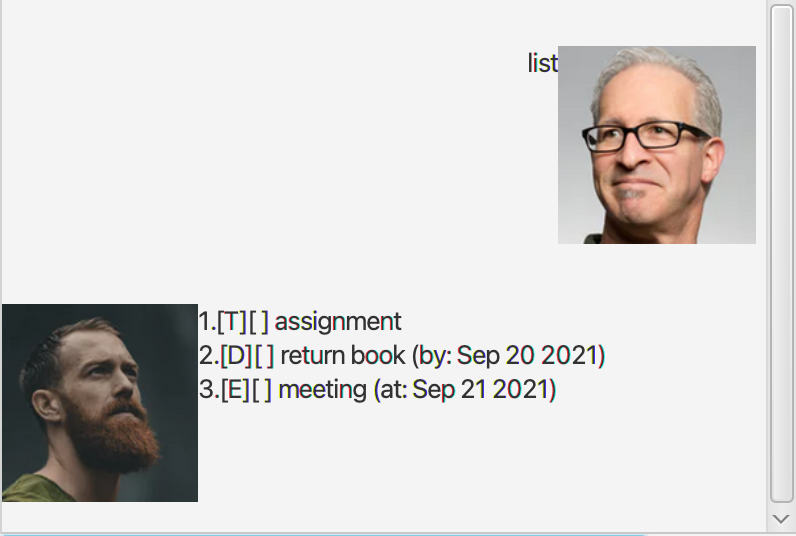
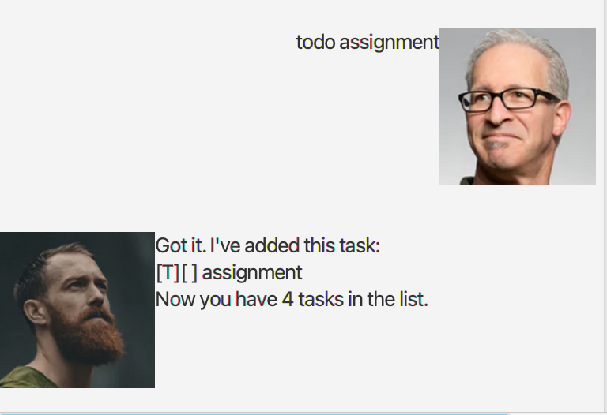
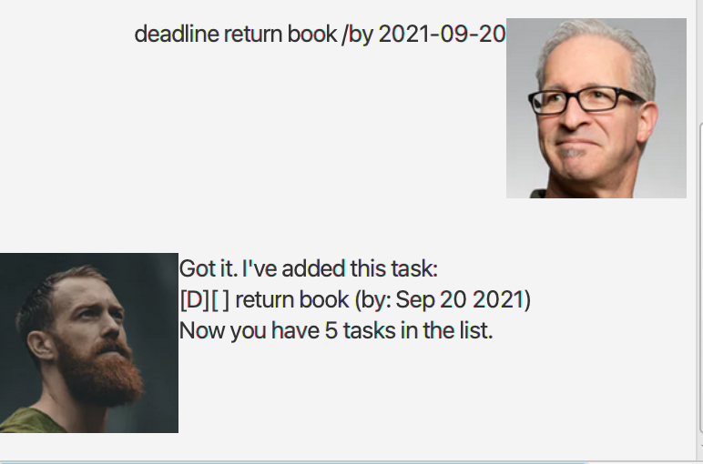
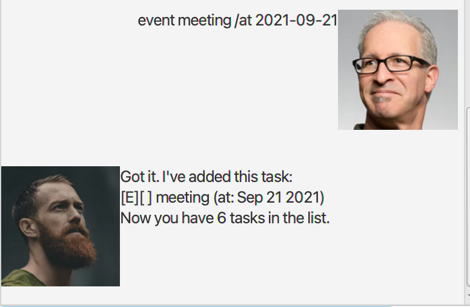
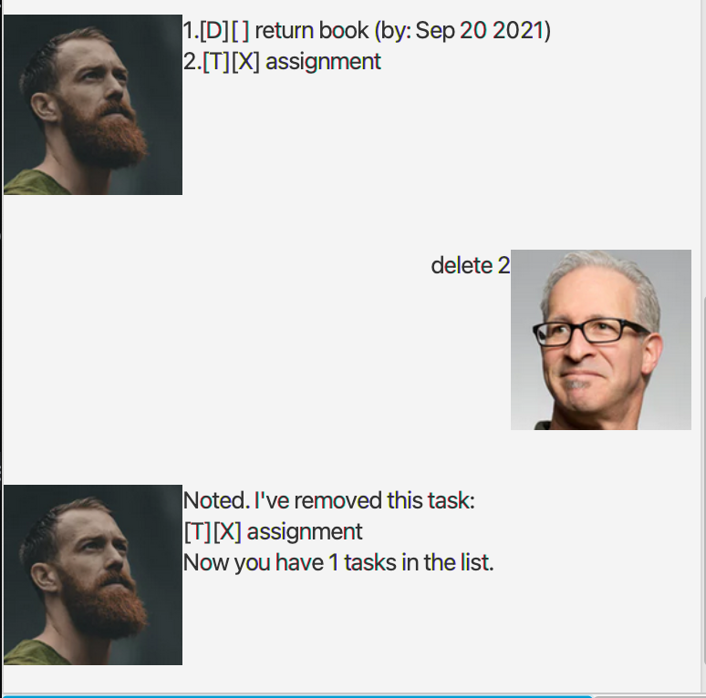

# User Guide
Duke is a desktop application for managing and tracking different types of tasks.
## Features 

### Listing all tasks: `list`

Shows the list of tasks.

Format: `list`

Example: 

### Adding todo task: `todo`

Adds a todo task to the task list.

Format: `todo TASK_DESCRPTION`

Example: `todo assignment`

### Adding deadline task: `deadline`

Adds a deadline task to the task list.

Format: `deadline TASK_DESCRPTION /by YYYY-MM-DD`

Example: `deadline return book /by 2021-09-20`

### Adding event task: `event`

Adds an event task to the task list.

Format: `event TASK_DESCRPTION /at YYYY-MM-DD`

Example: `event meeting /at 2021-09-21`

### Marking task as done: `done`

Marks the task specified by user as done.

Format: `done TASK_NUMBER`

Example: `done 3`

### Deleting task: `delete`

Deletes the task specified by user from list of tasks.

Format: `delete TASK_NUMBER`

Example: `delete 2`

### Exiting duke: `bye`

Exits the duke application.

Format: `bye`

Example:

### Saving the data

By default, duke automatically saves the task list data into /data/duke.txt.

