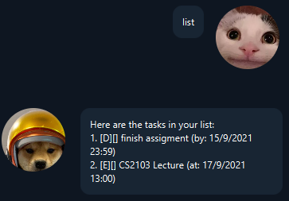
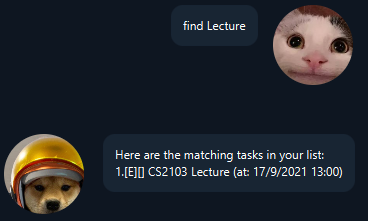

# User Guide

**Duke** is a desktop task manager app for you to keep track of your tasks and is optimized for use via a Command Line Interface (CLI).
## Features
### Support for multiple type of tasks
**Duke** allows you to track three type of tasks `todo`, `deadline`, `event`.
* `todo` task allows user to specify the description of the task that you need to do.
* `deadline` task allows user to specify the description and when is the deadline of the task.
* `event` task allows user to specify the description and when is the upcoming event.

All the tasks created will be saved locally, allowing for easy backups and transfer.

### CLI Commands
**CLI commands** allows fast typers to input, edit and delete tasks at a fast rate.

## Usage
**Notes about the command format:**

Items in angle brackets(<>) are compulsory.
e.g `/by <10/10/2021>` cannot be used as `/by`

Items in square brackets are optional.
e.g `/by 10/10/2021 [2300]` can be used as `/by 10/10/2021 [2300]` or as `/by 10/10/2021`

The format of the date is `d/M/YYYY` 
The format of the time is `HHmm` (24 hrs format)

### Listing all the tasks : `list`

Shows you all the tasks. 
**Format:** `list` 
**Example:** `list` 
**Expected output:** 

### Create a todo: `todo <todo description>`
Creates a todo. 
**Format:** `todo <task description>` 
**Example:** `todo homework` 
**Expected output:** 

### Create a deadline: `deadline <deadline description> <date of deadline> [time]`
Creates a deadline. 
**Format:** `deadline <deadline description> <date of deadline> [time]` 
**Example:** `deadline finish assigment /by 15/9/2021 2359` 
**Expected output:** 

### Create an event: `event <event description> <date of event> [time]`
Creates a event. 
**Format:** `event <event description> <date of event> [time]` 
**Example:** `event CS2103 Lecture /at 15/9/2021 1300` 
**Expected output:** 

### Find task: `find <task name>`
Find the task with the text specified . 
**Format:** `find <task name>` 
**Example:** `find Lecture` 
**Expected output:** 

### Delete a task: `delete <task number>`
Deletes the task that corresponds to that task number. 
**Format:** `delete <task number>` 
**Example:** `delete 1` 
**Expected output:** 

### Mark task as done: `done <task number>`
Marks the task that corresponds to that task number as done. 
**Format:** `done <task number>` 
**Example:** `done 1` 
**Expected output:** 

### Update task: `update <task number> <new task (same format as creating a new task)>`
Updates the task with the new task inputted. **(Must be same type of task)** 
**Format:** `update <task number> <new task (same format as creating a new task)>` 
**Example:** `update 2 event CS2103 Lecture /at 17/9/2021 1300` 
**Expected output:** 

### Exit: `bye`
Updates the task with the new task inputted.(Must be same type of task) 
**Format:** `bye` 
**Example:** `bye` 
**Expected output:** 
