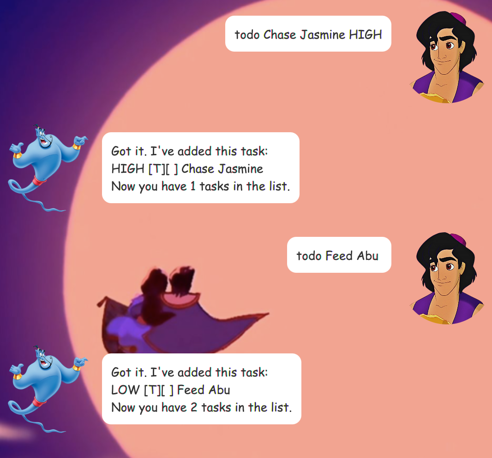
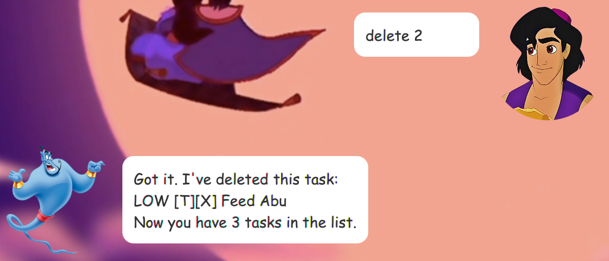

# User Guide
💙 *Bubbles* is a desktop app for task tracking, optimized for used via a
Command Line Interface (CLI) while having the benefits of a Graphical
User Interface (GUI). As the cutest Powerpuff Girl, Bubbles will 
provide **constant encouragement** to make sure you are the most 
productive you've ever been.


## Features 
Features supported by Bubbles are:
- Add a new task to your task list
- View all your tasks
- Mark a task as completed
- Delete a task
- Find task(s) based on keywords
- Remind you of your upcoming tasks in the next 7 days
- Save and load your tasks automatically from your hard drive

### Add a task
Adds a new task to the current list of tasks.

**Three** types of tasks are supported:
1. To do
2. Deadline
3. Event

### View all your tasks
Displays a list of all the tasks in your task list.

### Complete a task
Marks a task as completed.

### Delete a task
Deletes a task permanently from your task list.

### Find task(s) based on keywords
Displays all task(s) that contain all the keywords that 
you have entered.

### Reminders
Reminds you of all the upcoming tasks (deadlines and events)
that are coming up within the next 7 days.

### Help
Provides a list of commands that Bubbles support.

### Exit the program
Exits the program and closes the app immediately, saving 
your updated list of tasks into your hard disk.

## Usage

### `todo` - Add a to-do task
Use this command to add a to-do task, a task that you 
do not have to complete by a certain date/time.
- The description field is compulsory.

Example of usage: `todo sweep the floor`

Expected outcome:

```
Received order! I've added this task:
   [T] [ ] sweep the floor
Now you have 1 task(s) in the list!
```

### `deadline` - Add a deadline task
Use this command to add a deadline task, a task that you
**have to complete** by a certain date.
- The description field is compulsory.
- The date should be in the format of yyyy-mm-dd.

Example of usage: `deadline sign the form /by 2021-09-15`

Expected outcome:
```
Received order! I've added this task:
   [D] [ ] sign the form (by: 15 Sep 2021)
Now you have 2 task(s) in the list!
```

### `event` - Add an event task
Use this command to add an event task, that will be 
occurring at a date.
- The description field is compulsory.
- The date should be in the format of yyyy-mm-dd.

Example of usage: `event birthday dinner /at 2021-09-22`

Expected outcome:
```
Received order! I've added this task:
   [E] [ ] birthday dinner (at: 22 Sep 2021)
Now you have 3 task(s) in the list!
```

### `list` - View your list of tasks

Generates a list of all the tasks in your task list,
completed or not.

Example of usage: `view`

Expected outcome:

```
Below are some of the tasks in your list!
1. [T] [ ] sweep the floor
2. [D] [ ] sign the form (by: 15 Sep 2021)
3. [E] [ ] birthday dinner (at: 22 Sep 2021)
```

### `done` - Complete a task

Marks a task as completed.

Example of usages: `done 2`

Expected outcome:

```
Good job! I've marked this task as done:
   [D] [X] sign the form (by: 15 Sep 2021)
Bubbles will reward you with a piece of candy!
```

### `delete` - Delete a task

Deletes a task from the list (permanently).

Example of usages: `delete 1`

Expected outcome:

```
Noted! I've removed this task:
   [T] [ ] sweep the floor
Now you have 2 task(s) in the list!
```

### `find` - Find task(s) based on keywords

Displays all task(s) that contain all the keywords that
you have entered.
- The function is case-sensitive.
- The `keyword` can be more than one word long, but the 
returned task(s) are tasks that contain all words (in the 
keyword entered).

Example of usages: `find birthday`

Expected outcome:

```
Here are the matching tasks in your list!
1. [E] [ ] birthday dinner (at: 22 Sep 2021)
```

### `remind` - Receive reminders on upcoming tasks

Displays all the task(s) (deadlines and events) that 
are due/occurring within the next 7 days.

Example of usages: `remind`

Expected outcome:

```
Here are the upcoming deadlines and events coming up
soon! 
1. [D] [X] sign the form (by: 15 Sep 2021)
```

### `help`

Displays a list of commands with the respective formats that
Bubbles supports.

Example of usages: help

Expected outcome:


### `bye`

Exits the program and saves the changes made to your
task list.

Example of usages: `bye`

Expected outcome:
```
Bye-bye! Hope to see you again soon!
```

### Saving the data
The data in Bubbles are saved in the hard disk 
automatically, there is no need to change manually. The
next time you open up Bubbles, the changes made to the
task list would be registered. 