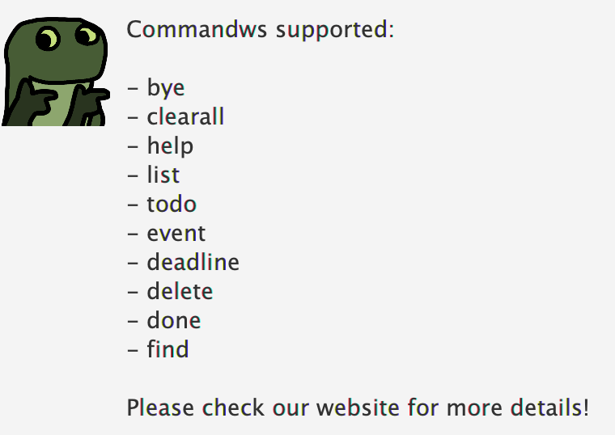

# User Guide for Ashy ChatBot

## About
Ashy is your friendly chatbot that helps you keep track of to-dos, events and deadlines! Ashy will make sure you stay organised and productive! 

 

## Features 

### Create Tasks
In the Ashy ChatBot, you can create three kinds of tasks: 
* To-Dos
* Deadlines 
* Events

 

#### To-Dos
To-Dos are simple tasks with just a description.
#### Deadlines
Deadlines are the tasks with a description and due dates.
#### Events 
Events are tasks that have a description and time frame.

### Task Management 
A variety of tasks have been implemented in the Ashy ChatBot to allow you to manage your tasks more effectively! 

 

The following are the commands you can use: 
* Delete Tasks
* Mark Tasks as Done
* Find Tasks
* Update task description
* List out all tasks 

### Save Tasks 
The tasks you create in the Ashy ChatBot are saved to the hard-disk automatically! 

 

### Error Handling
If you enter a wrong command by mistake, dont worry! The Ashy ChatBot has various error handling messages that are highlighted in red to guide you through!

### Help
New to the Ashy ChatBot? You can use the help command to find out various features and how to implement them! 

 

