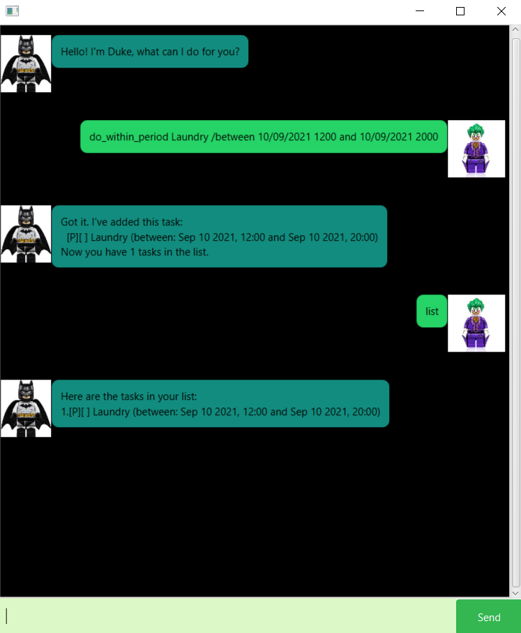

# User Guide

## Features
* DEADLINE
* DELETE
* DONE
* DO_WITHIN_PERIOD
* EVENT
* FIND
* LIST
* TODO
* BYE


## Usage

### `DEADLINE`
**FORMAT:** ```deadline <description> /by <dd/MM/yyyy HHmm>```

This feature allows the user to add a Deadline Task to the Task List

A Sample use case is `deadline Return the Book to the Bookstore /by 17/09/2021 2359`


### `DELETE`
**FORMAT:** ```delete <index>```

This feature allows the user to Delete a Task from the Task List

A Sample use case is `delete 4`


### `DONE`
**FORMAT:** ```done <index>```

This feature allows the user to Mark a Task from the Task List as Completed

A Sample use case is `done 4`


### `DO_WITHIN_PERIOD`
**FORMAT:** ```do_within_period <description> /between <dd/MM/yyyy HHmm> and <dd/MM/yyyy HHmm>```

This feature allows the user to add a Do Within Period Task to the Task List

A Sample use case is `do_within_period Laundry /between 10/09/2021 1200 and 10/09/2021 2000`



### `EVENT`
**FORMAT:** ```event <description> /at <dd/MM/yyyy HHmm>```

This feature allows the user to add an Event Task to the Task List

A Sample use case is `event Abhishek's Wedding /at 01/09/2000 1800`


### `FIND`
**FORMAT:** ```find <search_string>```

This feature allows the user to Find Tasks in the Task List having the search string in the description

A Sample use case is `find Bookstore`


### `LIST`
**FORMAT:** ```list```

This feature allows the user to display all the Tasks in the Task List

A Sample use case is `list`


### `TODO`
**FORMAT:** ```todo <description>```

This feature allows the user to add a ToDo Task to the Task List

A Sample use case is `todo Go to the Bookstore`


### `BYE`
**FORMAT:** ```bye```

This feature allows the user save all the tasks in the Task List and exit the duke chatbot

A Sample use case is `bye`


