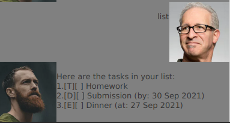

# User Guide

BobCat is a desktop app for you to manage your todos. This application is optimised for the fast typist out there!

## Features

### Add Todo Task: `todo`

Add a ToDo task into your task list.

Format: `todo DESCRIPTION`

Example: `todo Read Book`

### Add Event Task: `event`

Add an Event into your task list.

Format: `event DESCRIPTION /at yyyy-mm-dd`

Example: `event Career Fair /at 2021-09-11`

### Add Deadline Task: `deadline`

Add a Deadline into your task list.

Format: `deadline DESCRIPTION /by yyyy-mm-dd`

Example: `deadline CS2103T iP Submission /at 2021-09-17`

### List all added Task: `list`

List all added task

Format: `list`

### Delete Task: `delete`

Delete a previously added task in the task list.

Format: `delete INDEX`

Example: `delete 3`

### Find Task by description: `find`

Find a task with a matching description. If no exact match are found, tasks will be shown in order of similarity to given description, starting from the most similar.  

Format: `find DESCRIPTION`

Example: `find read`

### Exit: `bye`

Close the application

Format: `bye`

## Usage and Examples

Type the commands into the given space, and press enter to run it!

### List all tasks
`list`: list all tasks

Output:

### Add Tasks
`todo Homework`: add Homework as a todo

`deadline Submission /by 2021-09-30`: add Submission as a deadline due 30 September 2021

`event Dinner /at 2021-09-27`: add Dinner as an event happening on 27 September 2021

Output:

### Mark a Task in the task list as done
`done 1`: mark task with index 1 (Homework) as done

Output: 

### Delete a Task in the task list
`delete 2`: delete task with index 2 (Submission) 

Output: 

### Find a Task in the task list
`find home`: find tasks whose description contain "home" (case-insensitive), if any. Otherwise, rank task according to similarity 

Output: 

`find h0m3`: find tasks whose description contain "h0m3" (case-insensitive), if any. Otherwise, rank tasks according to closest match

Output: 

## Acknowledgement

I would like to acknowledge [JavaFX tutorial @SE-EDU/guides](https://se-education.org/guides/tutorials/javaFx.html) as this project's GUI is based on the JavaFX tutorial, including design and assets. 