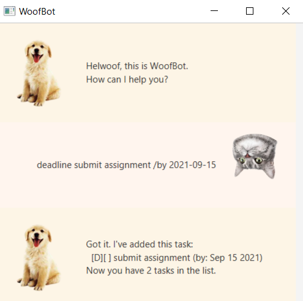
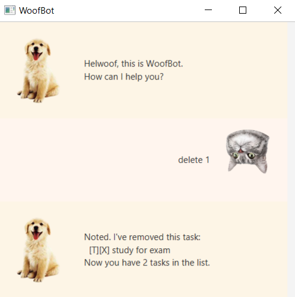
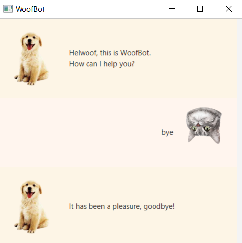

# User Guide

Duke is a desktop chat-bot app that helps you keep track of tasks, deadlines and events.
Duke is optimized for use via a Command Line Interface (CLI) while having a simple
Graphic User Interface (GUI). Duke is for users that prefer typing. 

## Command Summary

Action | Format, Examples
--------|----------------
Add task | `todo TASK_DESCRIPTION` e.g. `todo buy groceries`
Add task with deadline | `deadline TASK_DESCRIPTION /by YYYY-MM-DD` e.g. `deadline return book /by 2021-09-20`
Add event | `event TASK_DESCRIPTION /at YYYY-MM-DD` e.g. `event team meeting /at 2021-10-24`
Mark as complete | `done TASK_NUMBER` e.g. `done 3`
Delete | `delete TASK_NUMBER` e.g. `delete 2`
Find | `find KEYWORD` e.g. `find groceries`
List | `list`
Help | `help [COMMAND]` e.g. `help` or `help deadline`
Bye | `bye`

## Features

### Getting help: `help`

Shows the various commands supported by Duke and provides more information on each of them.

Format:

`help [COMMAND]`
* The COMMAND parameter is **optional**. Use it to find out more about a specific command.

Example of usage:

`help`

Expected outcome:

Example of usage:

`help deadline`

Expected outcome:

### Adding a task: `todo`

Adds a task and its description to the task list.

Format:

`todo TASK_DESCRIPTION`

Example of usage: 

`todo buy groceries`

Expected outcome:

### Adding a task with a deadline: `deadline`

Adds a task with a deadline and its description to the task list.

Format:

`deadline TASK_DESCRIPTION /by YYYY-MM-DD`

Example of usage:

`deadline return book /by 2021-09-20`

Expected outcome:

### Adding an event: `event`

Adds an event with a date and its description to the task list.

Format:

`event TASK_DESCRIPTION /at YYYY-MM-DD`

Example of usage:

`event team meeting /at 2021-10-24`

Expected outcome:

### Listing out all tasks: `list`

Displays all events added to the task list thus far.

Format:

`list`

Example of usage:

`list`

Expected outcome:

### Marking a task as complete: `done`

Marks a task on the task list as completed.

Format:

`done TASK_NUMBER`

Example of usage:

`done 3`

Expected outcome:

### Deleting a task: `delete`

Deletes a task from the task list.

Format:

`delete TASK_NUMBER`

Example of usage:

`delete 2`

Expected outcome:

### Searching for tasks: `find`

Searches for tasks from the task list that contain the keyword.

Format:

`find KEYWORD`

Example of usage:

`find groceries`

Expected outcome:

### Exiting Duke: `bye`

Shuts down the Duke chat-bot.

Format:

`bye`

Example of usage:

`bye`

Expected outcome:

### Saving the data

Your data is saved to a file each time you execute a command that modifies data. No manual saving is required.

### Editing the data file

Your data is saved in a text file in the following path: `/[JAR_file_location]/data/duke.txt`.
It is recommended that you **do not modify** the data unless you are familiar with the data's save format.
* If your data format is invalid, Duke will create a temporary session for you. No data will be saved to
`duke.txt`.