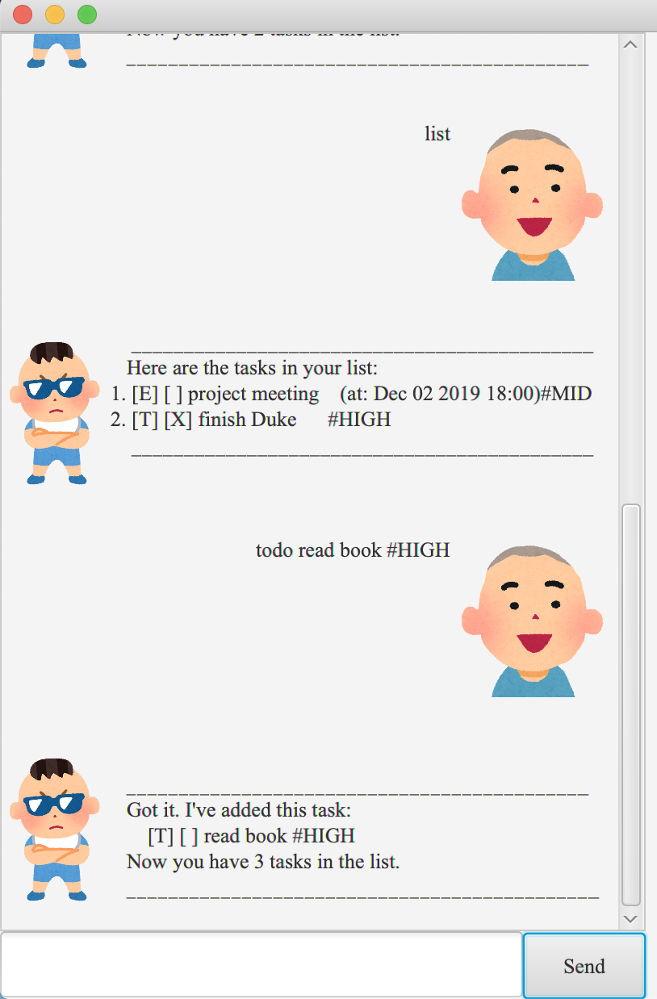

# User Guide

Duke is a desktop app for **managing your daily tasks**, optimized for use via a
Command Line Interface while still having the benefits of a Graphical User Interface.



## Features 

### Adding Tasks

Add various types of tasks to your work list such as:
* Todos
* Deadlines
* Events

### Viewing your worklist
View the tasks in a list with their respective types and information. Find the tasks that you require
easily by just searching by keywords.

## Usage

### Notes on Command format:
* Words in UPPER_CASE are the parameters to be supplied by the user.
e.g. in `todo NAME`, NAME is a parameter which can be used as `todo hw`.
* Extraneous parameters for commands that do not take in parameters (such as 
`list`) will be ignored.
* e.g. if the command specifies `list 123`, it will be interpreted as `list`.


### `todo, deadline, event` - Adding tasks of varying types

### Adding ToDo type

Format: `todo NAME`

Example: 
`todo CS2100 Tutorial`

Expected outcome: Todo task of CS2100 Tutorial added


```
Got it. I've added this task:
[T][ ] CS2100 Tutorial
Now you have 6 tasks in your list.
```

###Adding Deadline Type

Format: `deadline NAME /by YYYY-MM-DD`
* Date should only be specified in the following format given

Example:
`deadline homework /by 2020-09-18`

Expected outcome: Deadline task of homework due by 18th September 2020 added

```
Got it. I've added this task:
[D][ ] homework (by: Sep 18 2020)
Now you have 7 tasks in your list.
```

###Adding tasks of the Event type

Format: `event NAME /at DATE`

Example:
`event Lab /at next friday`

Expected outcome: Event task of lab at next friday added
```
Got it. I've added this task:
[E][ ] Lab (at: next friday)
Now you have 8 tasks in your list.
```

### `done` - Marking tasks as done

Mark a task as completed.

Example: `done 6`

Expected outcome: Task at index 6 is marked as completed

```
Nice! I've marked this task ad done:
[T][X] CS2100 Tutorial
```

### `delete` - Delete task

Delete a task from the list.

Format: `delete INDEX`
* Deletes the task at the specified INDEX. Index refers to the index number shown
in the displayed task list. The index **must be a positive integer** 1, 2, 3, ...
* INDEX must be provided.

Example: `delete 4`

Expected outcome: Task at index 6 is deleted

```
Noted. I've removed this task:
[T][X] CS2100 Tutorial
Now you have 6 tasks in your list.
```

### `list` - View task list

View the list of tasks

Format: `list`

Expected outcome: List of tasks is being displayed

```
Here are your tasks:
1.[T][X] homework
2.[E][ ] Welcome Paty (at: 25 Aug)
3.[D][ ] iP (by: Sep 5 2021)
...
```

### `find` - Search for a task

Search for tasks that have related keyword

Format: `find KEYWORD`
* KEYWORD is the keyword that duke searches through the task list for

Example: find lab

Expected outcome: Displays a list of tasks with 'lab' keyword in its name

```
Here are the matching tasks in your list:
1.[D][X] Graphics Lab 2 (by: Oct 10 2020)
```

### `undo` - Undo an action

Undo the previous command. If called at initial state, no action is taken.

Format: `undo`

Expected outcome: Undoes the previous command 

```
Successfully undone delete on: [T][X] CS2100 Tutorial
```