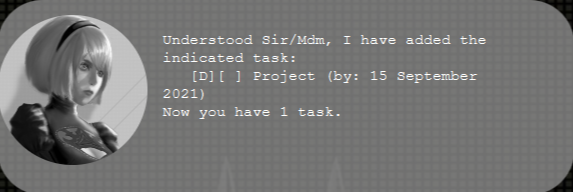
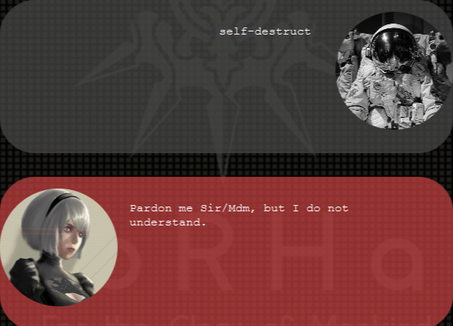

# 2Butler User Guide

## What is 2Butler?
2Butler is a desktop task management application that can be used to set dates and times for various tasks and events. It features a Command line Interface (CLI) for you to input text commands and provides a fast and efficient way of laying down your todo list. It is themed based on the Nier Automata video game, and sports a unique look that will appease any Nier Automata and 2B fans out there.

## Features 

### Add a todo task: `todo`

- A todo is a task with a description.
- You may use the `todo` command to add a todo along with its description.

Format:

`todo TASK_DESCRIPTION`

Example of usage:

`todo Homework`

Expected outcome:

### Add a deadline task: `deadline`

- A deadline is a task with a description and due date.
- You may use the `deadline` command to add a todo along with its description and due date.

Format:

`deadline TASK_DESCRIPTION /by DD/MM/YYYY` or `deadline TASK_DESCRIPTION /by DD/MM/YYYY TTTT`

Example of usage:

`deadline Project /by 15/09/2021`

Expected outcome:

### Add an event task: `event`

- An event is a task with a description, start date and end date.
- You may use the `event` command to add an event with its description, start date and end date.

Format:

`event TASK_DESCRIPTION /at DD/MM/YYYY to DD/MM/YYYY` or `event TASK_DESCRIPTION /at DD/MM/YYYY TTTT to DD/MM/YYYY TTTT`

Example of usage:

`event Staycation with Mary /at 15/09/2021 1200 to 16/09/2021 1400`

Expected outcome:

### Show your lists of tasks: `list`
- You can show the list of all your tasks with the `list` command.
- Each task will be assigned a task index in the order that they were added to the task. e.g. `todo Assignment` followed by `todo Homework` results in`1. [T][ ] Assignment` ordered before `2. [T][ ] Homework`

Format:

`list`

Example of usage:

`todo Assignment` followed by `deadline Assignment /by 15/09/2021` and then`list`

Expected outcome:

### Delete a task: `delete`
- All tasks are arranged by index in a list.You can then use the `delete` command to delete a task by specifying its task index.

Format:

`delete TASK_INDEX
`

Example of usage:

`todo Assignment` followed by `delete 1`

Expected outcome:

### Mark task as done: `done`
- Similar to deleting a task, you can use the `done` command to mark a task as done by specifying its task index.

Format:

`done TASK_INDEX
`

Example of usage:

`todo Assignment` followed by `done 1`

Expected outcome:

### Find task by description: `find`
- You can `find` tasks by their description by inputting a search string. 
- The search is case-sensitive. e.g. `hans` will not match `Hans`
- The searched string can be a substring of the target description. e.g. `Hans` will match `dinner at Hans`

Format:

`find KEYWORDS`

Example of usage:

`todo Assignment` followed by `find Assign`

Expected outcome:

### Find task by date: `find/date`
- You can use `find/date` command to find a deadline or event by date. 
- You can search for dates in between the start and end times of events. e.g. `find/date 15/09/2021` will match `[E][ ] Staycation (at: 14 September 2021 to 16 September 2021)`
- `find/date` only looks at dates and not times hence `find/date 15/09/2021` matches with `[D][ ] Assignment (by: 15 September 2021 13:00)`.

Format:

`find/date DD/MM/YYYY`

Example of usage:

`deadline Assignment /by 15/09/2021 ` followed by `find/date 15/09/2021`

Expected outcome:

### Sort all tasks: `sort`

- You can use the `sort` command to sort your tasks by chronological order.
- When sorting deadlines and events, the start date of events will be compared with the due dates of tasks. e.g. `[E][ ] Staycation (at: 14 September 20201 to 16 September 2021)` will be ordered before `[D][ ] Assignment (by: 15 September 2021` by `sort`.
- Todos will always be ordered before deadlines and events by `sort`.

Format:
`sort`

Example of usage:

`deadline Assignment /by 15/09/2021` followed by `event Staycation /at 14/09/2021 to 16/09/2021`, `todo Homework` 
and then `sort`.

### Exiting the application: `bye`
- You can use the `bye` command to exit the app

Format:
`bye`

### Saving the data
- 2Butler data is saved in the hard disk automatically after any command that changes the data. There is no need to save manually.

### Invalid commands

- Everytime an invalid command is given, 2Butler will reply with a warning.

Examples:

Unknown command warning:

Invalid format warning:

## Command Summary

Action | Format | Examples
--------|--------|--------
Add todo | `todo TASK_DESCRIPTION` | `todo Calculus assignment`
Add deadline | `deadline TASK_DESCRIPTION /by DD/MM/YYYY` or `deadline TASK_DESCRIPTION /by DD/MM/YYYY TTTT` | `deadline Project /by 15/09/2021`
Add event |`event TASK_DESCRIPTION /at DD/MM/YYYY to DD/MM/YYYY` or `event TASK_DESCRIPTION /at DD/MM/YYYY TTTT to DD/MM/YYYY TTTT` | `event Staycation with Mary /at 15/09/2021 1200 to 16/09/2021 1400`
List | `list` | -
Delete task | `delete TASK_INDEX` |  `done 1`
Mark task as done | `delete TASK_INDEX` | `delete 1`
Find by description| `find KEYWORDS` | `find school assignment`
Find by date | `find/date DD/MM/YYYY` | `find/date 15/09/2021`
Sort | `sort` | -
Bye | `bye` | -

