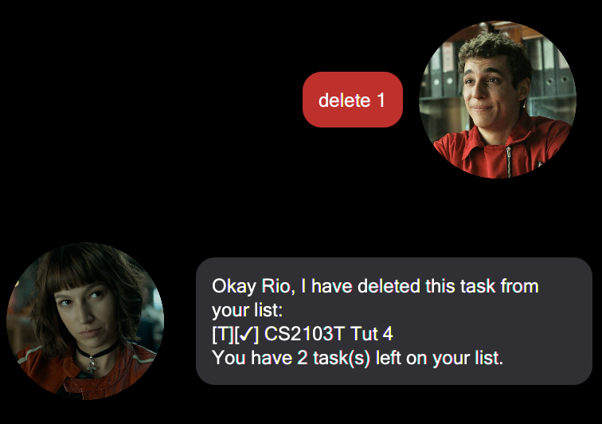

# Tokio User Guide
Tokio is a personal assistant chatbot that helps the user, Rio, to keep track of various things.

Here is a sample interaction with Tokio,  

## Features 
> __Notes about the Command Format :heart:__
> 1. Words in UPPER_CASE are the parameters to be supplied by the user.  
> e.g. in `todo DESCRIPTION`, `DESCRIPTION` is a parameter which can be used as `todo task 1`  
> 2. Date accepted is strictly in `yyyy-MM-dd` format  
> e.g. in `deadline DESCRIPTION /by yyyy-MM-dd`, `yyyy-MM-dd` is a parameter which can be used as `deadline DESCRIPTION /by 2021-09-16`  
> 3. Time accepted is strictly in `HH:mm` format  
> e.g. in `event DESCRIPTION /at yyyy-MM-dd HH:mm`, `HH:mm` is a parameter which can be used as `event DESCRIPTION /at yyyy-MM-dd 12:00`
> 

### Types of tasks
Tokio is able to store 3 types of tasks:
1. `todo`: A task without any date/time attached to it *e.g., visit new theme park*
2. `deadline`: A task that needs to be done before a specific date *e.g., submit report by 11/10/2019*
3. `event`: A task that starts at a specific time *e.g., team project meeting on 2/10/2019 14:00*

### Feature 1 - Add tasks
Adds specified type of task to list.

#### Add todo
Format: `todo DESCRIPTION`  

#### Add deadline  
Format: `deadline DESCRIPTION /by yyyy-MM-dd`  

#### Add event
Format: `event DESCRIPTION /at yyyy-MM-dd HH:mm`  
  

:warning: *__note__: cannot add tasks with the same description*  

### Feature 2 - List tasks
Lists all tasks in list.  
Format: `list`  

### Feature 3 - Mark task as done
Marks a task as done.  
Format: `done INDEX`  
  
:warning: *__note__: total number of tasks does not change after you have completed your task*

### Feature 4 - Delete task
Removes a task from the list.  
Format: `delete INDEX`  

### Feature 5 - Find task
Lists out all task with the specified keyword.  
Format: `find KEYWORD`  

### Feature 6 - Bye
Exits Tokio after 2s.  
Format: `bye`  
 

## Command Summary
Action    | Format, Examples
--------- | -----------------------------------------------------------------------------------------------
todo      | `todo DESCRIPTION`  e.g., `todo CS2103T Tut 4`  
deadline  | `deadline DESCRIPTION /by yyyy-MM-dd`  e.g., `deadline CS2013T iP Submission /by 2021-09-17`
event     | `event DESCRIPTION /at yyyy-MM-dd HH:mm`  e.g., `event CS2013T tP meeting /at 2021-09-28 20:00`
list      | `list`
done      | `done INDEX`  e.g., `done 1`
delete    | `delete INDEX`  e.g., `delete 1`
find      | `find KEYWORD`  e.g., `find sep`
bye       | `bye`
