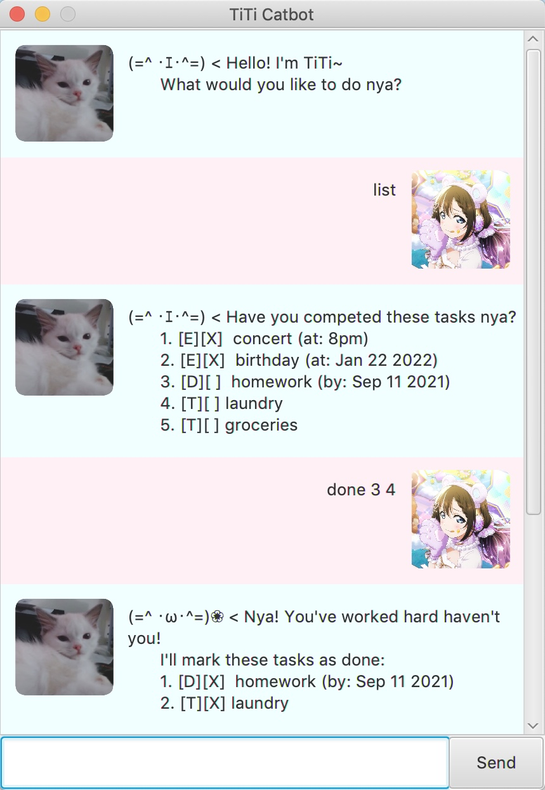

# User Guide

## Introduction
Mange your upcoming deadlines, events, and tasks with Borat Sagdiyev Bot, a task manager to manage all your tasks.
<br>



<hr>

## Installation
### Prerequisites 
1. If you have Java 11 installed in your computer you are good to go!
2. Else, [install Java](https://java.com/en/download/help/download_options.html) first

### Setting up
1. Download the `Borat.jar` file [here](https://github.com/aryagiat/ip/releases)
2. Once installed, click the `Borat.jar` file to run the app.
3. **(Optional)** You can also run the app through the command line.
    - [ ] Open your favorite terminal
    - [ ] Go to the directory of your `Borat.jar` file
    - [ ] Use this command: 
   ```bash
   java -jar Borat.jar
   ```
4. Borat likes you, take good care of him!

<hr>

## Features 
Features that Borat Bot offers:
- [LIST - Show all tasks](#show-tasks)
- [TODO - Add a todo task](#add-todo)
- [DEADLINE - Add a deadline](#add-deadline)
- [EVENT - Add an event](#add-event)
- [DELETE - Delete a task](#delete-task)
- [DONE - Mark a task as done](#mark-done)
- [FIND - Search a task](#search-task)
- [BYE - Close the app](#close-app)

Simple Guide Commands:
- [HELP - Show all commands](#show-commands)
- [DATES - Show all accepted dates](#show-dates)
<hr>

## Usage

### <a id="show-tasks"></a>LIST all tasks that you have
```
LIST
```
Shows all the tasks that you have. 

Example: `list` will show you all the tasks that you have.

Expected outcome: 
```
This your task in list:
 1. [E][ ] I go to America (at: Sep 20 2021 23:59)
 2. [T][X] meet Azamat Bagatov
 3. [D][ ] Import potassium (by: Sep 15 2021 23:59)
```
`[T|D|E]` denotes the type of the task. 
- `T` stands for TODO
- `D` stands for DEADLINE
- `E` stands for EVENT

`[ ]` denotes that the task is not done yet. `[X]` shows that the task is completed.


### <a id="add-todo"></a>Add TODO Task
```
TODO [description]
```
Adds a todo task.

Example: `todo Meet Azamat Bagatov` will add "Meet Azamat Bagatov" to your task list.

Expected outcome:
```
Got it. I've added this task: 
  [T][ ] Meet Azamat Bagatov
Now you have 1 task in the list
```
`[T]` denotes the type of the task which a TODO. `[ ]` denotes that the task is not done yet.
`Meet Azamat Bagatov` is the description of the task.


### <a id="add-deadline"></a>Add a DEADLINE
```
DEADLINE [description] /by [DATE] [OPTIONAL TIME]
```
Adds a task with a deadline.

Example: `deadline Import potassium /by today` will add "Import Potassium" to your task list with a deadline of today.

Expected outcome:
```
Got it. I've added this task: 
  [D][ ] Import potassium (by: Sep 15 2021 23:59)
Now you have 1 tasks in the list
```
`[D]` denotes the type of the task which a DEADLINE. `[ ]` denotes that the task is not done yet.
`Import potassium` is the description of the task. `(by: Sep 15 2021 23:59)` is today's date with a default time of 23:59 since a time is not specified.


### <a id="add-event"></a>Add an EVENT
```
EVENT [description] /at [DATE] [OPTIONAL TIME]
```
Adds an event.

Example: `event I go to America /at monday 14:35` will add "I go to America" to your task list with a date of the following Monday.

Expected outcome:
```
Got it. I've added this task: 
  [E][ ] I go to America (at: Sep 20 2021 14:35)
Now you have 3 tasks in the list
```
`[E]` denotes the type of the task which an Event. `[ ]` denotes that the task is not done yet.
`I go to America` is the description of the task. `(at: Sep 20 2021 14:35)` is the following Monday's date with a time of 14:35.


### <a id="delete-task"></a>Delete a Task
```
DELETE [index]
```
Deletes a task from the list.

Example: `delete 2` will delete task number 2 in your list.

Expected outcome:
```
Got it. I've removed this task: 
  [D][ ] Import potassium (by: Sep 15 2021 23:59)
Now you have 2 tasks in the list
```
The message will show the task deleted and the amount of tasks remaining.


### <a id="mark-done"></a>Mark a Task as DONE
```
DONE [index]
```
marks a task as done from the list.

Example: `DONE 1` will mark task number 1 in your list as completed.

Expected outcome:
```
Great success! Task Complete: 
  [T][X] meet Azamat Bagatov
```
`[T]` denotes the type of the task which a TODO. `[X]` denotes that the task is completed.
`Meet Azamat Bagatov` is the description of the task.


### <a id="search-task"></a>FIND a Task
```
FIND [keyword]
```
Searches for a task with the given keyword

Example: `find potassium` will look for all the task in the list with a keyword of "potassium".

Expected outcome:
```
Here are the matching tasks in your list:
1. [D][ ] Import potassium (by: Sep 15 2021 23:59)
```
It will list all the matching tasks with potassium as a keyword.


### <a id="close-app"></a>Close App -- BYE
```
BYE
```
Closes the app.

Example: `bye` will close the app.

Expected outcome:
```
Bye. Have a good time!
```
It will shutdown the app. Don't worry! your data will be saved automatically.


### <a id="close-app"></a>HELP me!!
```
HELP
```
Shows a list of commands and a brief description to help you.

Example: `HELP` will show you a list of commands and arguments needed.

Expected outcome:
```
(1) LIST    -->   Lists all the tasks.
(2) TODO [description]   -->   Adds a todo task.
(3) DEADLINE [description] /by [dd-MM-yyyy] [*optional hh:mm]   -->   Adds a task with a deadline
(4) EVENT [description] /at [dd-MM-yyyy] [*optional hh:mm]   -->   Adds an event to the task
(5) DELETE [index]   -->   Removes a task from the task list
(6) DONE [index]   -->   Marks a task as done
(7) FIND [keyword]   -->   Find a task by searching for a keyword
(8) HELP    -->   Shows all the commands available
(9) DATES    -->   Shows all the available date and time type
(10) BYE    -->   Quit the app
```


### <a id="close-app"></a>DATES
```
DATES
```
Shows a list of accepted date and time types.

Example: `DATE` will show you a list of accepted dates for tasks with dates.

Expected outcome:
```
(1) today   -->   example: today
(2) tomorrow   -->   example: tomorrow
(3) yyyy-MM-dd   -->   example: 2021-12-25
(4) yyyy/MM/dd   -->   example: 2021/12/25
(5) dd-MM-yyyy   -->   example: 25-12-2021
(6) dd/MM/yyyy   -->   example: 25/12/2021
(7) [date] hh:mm   -->   example: [date] 18:00
(8) [date] hhmm   -->   example: [date] 1800
```
<hr>
