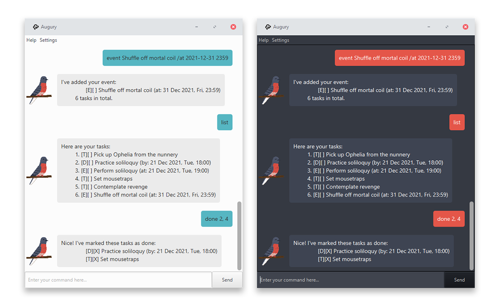
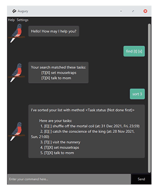

# Augury User Guide
*Jefferson LIM ([@qreoct](https://github.com/qreoct))*



Augury is a task-management app for organized minds 🐤

Track your todos, events, and deadlines, through your choice of CLI or GUI!

---
- [Features](#features)
- [Usage](#usage)
- [GUI Specific Features](#gui-specific-features)
- [Command Summary](#command-summary)
---

## Features 

### Creating Tasks

In Augury, there are 3 different types of tasks you can create.

- Todos
- Events
- Deadlines

**Todos**

**Todos** are basic tasks that have a **description** and **completion status**.
They are represented with `[T]` in the app.

**Events**

**Events** are tasks that happen at a specific time.
Events contain a **description**, **completion status**, and the **time**.
They are represented with `[E]` in the app.

**Deadlines**

**Deadlines** are tasks that have to be completed by a specific time.
Deadlines contain a **description**, **completion status**, and the **time**.
They are represented with `[D]` in the app.


### Command Line Interface

Prefer to be working in your terminal instead? Augury comes with a CLI mode!

Simply run the application using `java -jar duke.jar -mode console` and enjoy the experience!


## Usage

### `todo` - Create a new Todo

A Todo is added to your list of tasks.

**Command syntax:** `todo [description]`

**Example usage:** 

`todo set mousetraps`

**Expected outcome:**

```
 I've added your todo:
        [T][ ] set mousetraps
 1 task in total.
```

### `event` - Create a new Event

An Event is added to your list of tasks.

**Command syntax:** `event [description] /at [time]`

`time` follows the format `YYYY-MM-DD HHMM`

**Example usage:**

`event catch the conscience of the king /at 2021-11-28 2100`

**Expected outcome:**

```
 I've added your event:
        [E][ ] catch the conscience of the king (at: 28 Nov 2021, Sun, 21:00)
 1 task in total.
```

### `deadline` - Create a new Deadline

A Deadline is added to your list of tasks.

**Command syntax:** `deadline [description] /by [time]`

`time` follows the format `YYYY-MM-DD HHMM`

**Example usage:**

`deadline shuffle off the mortal coil /by 2021-12-31 2359`

**Expected outcome:**

```
 I've added your event:
        [D][ ] shuffle off the mortal coil (at: 31 Dec 2021, Fri, 23:59)
 1 task in total.
```

### `list` - View all tasks

Prints out all tasks in your task list.

**Command syntax:** `list`

**Example usage:**

`list`

**Expected outcome:**

```
 Here are your tasks:
 1. [T][ ] set mousetraps
 2. [E][ ] catch the conscience of the king (at: 28 Nov 2021, Sun, 21:00)
 3. [E][ ] shuffle off the mortal coil (at: 31 Dec 2021, Fri, 23:59)
```

**Command aliases:** `ls`, `l`

### `find` - Search for tasks

Search for all tasks matching a search query.

**Command syntax:** `find (status) (time) (type) (query)`

Arguments are optional, but at least one is required.
Including multiple arguments will filter the search to match all the arguments provided.

`status` represents whether tasks are done. Either `[X]` for done or `[]` for not done.

`time` represents the *date* of tasks. Use `YYYY-MM-DD` format.

`type` represents the *type* of tasks. One of `[T]` (Todo), `[E]` (Event), `[D]` (Deadline).

`query` is a single word that you want to search for in the task description.

**Example usage:**

The following searches will return the same result:
- `find 2021-12-31`
- `find [] coil`
- `find mortal [E]`
- `f shuffle 2021-12-31 [E] []`

**Expected outcome:**

```
Your search matched these tasks:
 [E][ ] shuffle off the mortal coil (at: 31 Dec 2021, Fri, 23:59)
```

### `sort` - Sorts the tasks

Sorts the tasks according to a given sort method.

**Command syntax:** `sort [option]`

If `option` is left out, sort will use the default method, which is `Lexicographic (ascending)`.

`option` is a number from `0` to `6`.

**Sort options:**

Value | Sort method
---|---
`0` | Lexicographic (ascending)
`1` | Lexicographic (descending)
`2` | Task type
`3` | Task status (ascending)
`4` | Task status (descending)
`5` | Task time (ascending)
`6` | Task time (descending)

**Example usage:**
`sort 6`

**Expected outcome:**

```
I've sorted your list with method <Task time (descending)>

Here are your tasks:
 1. [E][ ] shuffle off the mortal coil (at: 31 Dec 2021, Fri, 23:59)
 2. [E][ ] catch the conscience of the king (at: 28 Nov 2021, Sun, 21:00)
 3. [T][ ] set mousetraps
```

**Command aliases:** `f`

### `done` - Mark tasks as done

Marks the selected tasks as done, represented with an `[X]` checkbox in Augury.

**Command syntax:** `done [index of tasks]`

`index of tasks` can be a single integer, or a comma-separated list of integers representing the index of tasks to mark

**Example usage:**

`done 1,3`

**Expected outcome:**

```
Nice! I've marked these tasks as done:
      [T][X] set mousetraps
      [D][X] shuffle off the mortal coil (at: 31 Dec 2021, Fri, 23:59)
```

### `delete` - Remove tasks

Removes the selected tasks from your list.

**Command syntax:** `delete [index of tasks]`

`index of tasks` can be a single integer, or a comma-separated list of integers representing the index of tasks to mark

**Example usage:**

`delete 1,2,3`

**Expected outcome:**

```
I've removed these tasks:
    [D][X] shuffle off the mortal coil (at: 31 Dec 2021, Fri, 23:59)
    [E][ ] catch the conscience of the king (at: 28 Nov 2021, Sun, 21:00)
    [T][X] set mousetraps
0 tasks remain.
```

**Command aliases:** `del`, `rm`

### `help` - Show help menu

**Command syntax:** `help`

Shows the in-app help menu, which links to this user guide.

**Command aliases:** `faq`, `?`

### `quit` - Exits Augury

**Command syntax:** `quit`

Closes Augury, saving your tasks.

**Command aliases:** `bye`, `exit`, `q`

## GUI Specific Features

### Themes



Augury comes with various colour themes.

From the menu-bar, click on `Settings > Theme` in order to select your theme.

Themes are based off [Hundred Rabbits' Theme Framework](https://github.com/hundredrabbits/Themes).

## Command Summary

Action | Format, Examples
--------|------------------
**Todo** | `todo [description]`
**Event** | `event [description] /at [time]` <br><br> e.g. `event nunnery open house /at 2021-08-24 0930`
**Deadline** | `deadline [description] /by [time]` <br><br> e.g. `deadline avenge Claudius /by 2021-09-15 1800`
**Delete** | `delete [...index]`<br><br> e.g. `delete 3, 4, 8`
**Mark as done** | `done [...index]`<br><br> e.g. `done 1, 2, 5`
**Find tasks** | `find [query] [time] [status] [type]`<br><br> e.g. `find revenge [] 2021-08-20`
**Sort tasks** | `sort [option]`, where `option` is a number `0`-`6`
**List tasks** | `list`, `ls`
**Help** | `help`, `faq`
**Quit** | `quit`, `exit`
