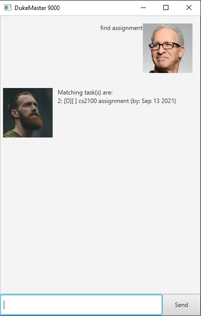
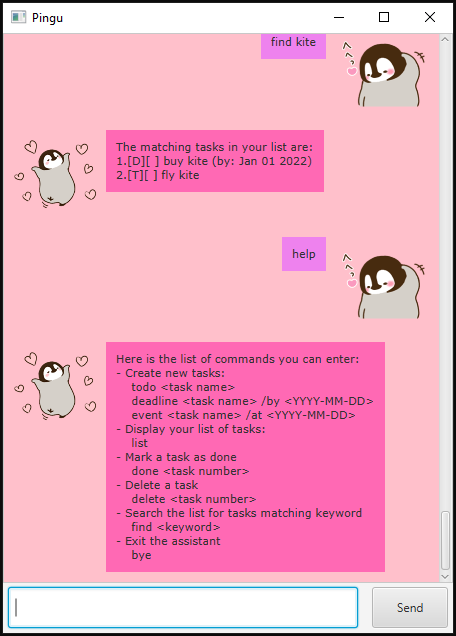
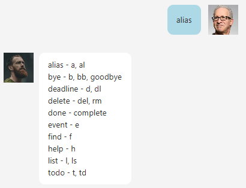

# User Guide for Lifeline
Welcome to Lifeline! Your all-in-one task manager! Don't worry about forgetting important tasks anymore! Lifeline helps 
you to remember your todos, upcoming deadlines and events.


## Features
1. Add 3 different types of tasks 
   * ToDo
   * Deadline
   * Event
2. Mark tasks as completed
3. Quickly find tasks you have added
4. Delete tasks that you are done with
5. Support for both GUI or CLI

### ToDo

Todos are tasks with a description but no deadlines.

### Deadline

Deadlines are tasks with strict due dates. It has to be completed by a certain date and time.

### Events

Events are tasks with a date, start time and end time. Some examples of events include weddings, sporting events, 
fairs and festivals.

### Manage tasks easily

You can mark a specific task as completed or even multiple tasks at once. Same goes for deleting! You can also 
efficiently find a task using a keyword.

### CLI


If you do not like to use GUI, you can run the following command to launch the CLI version of Lifeline.

```java -jar duke.jar --mode console```


## Usage

Note: 
* Dates should be in the following format `dd/MM/yy`
* Time should be in the following format `HHmm`

### `todo <description>` - Adds a ToDo

Aliases: `t`, `td`, `todo`

Adds a ToDo to Lifeline

Example of usage:

```todo read book```

Expected outcome:


### `deadline <description> /by <date> <time>` - Adds a Deadline

Aliases: `d`, `dl`, `deadline`

Adds a Deadline to Lifeline

Example of usage:

```deadline project /by 10/10/21 1830```

Expected outcome:


### `event <description> /at <date> <startTime> <endTime>` - Adds an Event

Aliases: `e`, `event`

Adds a Event to Lifeline

Example of usage:

```event wedding /at 21/10/21 1230 1430```

Expected outcome:


### `find <keyword>` - Finds a task

Aliases: `f`, `find`

Find tasks in Lifeline whose description contains specified keyword

Example of usage:

```find book```

Expected outcome:



### `list` - Lists all the tasks you have added

Aliases: `l`, `ls`, `list`

List all the tasks you have added. This command also lets you know which tasks are already completed and the type of 
the tasks. Any subsequent arguments after `list` will be ignored.

Example of usage:

```list```

Expected outcome:


### `done <index>` - Marks tasks as completed

Aliases: `complete`, `done`

Marks tasks as completed. You can specify a single index or multiple indices separated by commas. You cannot mark a 
task as completed more than once. If no value is specified between commas, it will be ignored.

Example of usage:

```done 1,2```

Expected outcome:


### `delete <index>` - Delete tasks

Aliases: `del`, `rm`, `delete` 

Delete tasks. You can specify a single index or multiple indices separated by commas. If no value is specified between commas, it will be ignored.

Example of usage:

```delete 1,3```

Expected outcome:

   

### `help` - Prints the help message

Aliases: `h`, `help`

The help message includes all available commands and how to use them. Any subsequent arguments after `help` will be ignored.

Example of usage:

```help```

Expected outcome:



### `alias` - Prints the aliases for each command

Aliases: `a`, `al`, `alias`

The aliases allows users to type lesser characters to achieve the same results. Any subsequent arguments after `alias` will be ignored.

Example of usage:

```alias```

Expected outcome:



### `bye` - Prints farewell message

Aliases: `b`, `bb`, `goodbye`, `bye`

This command exits the program and prints a farewell message. Any subsequent arguments after `bye` will be ignored.

Example of usage:

```bye```

Expected outcome:

                    
