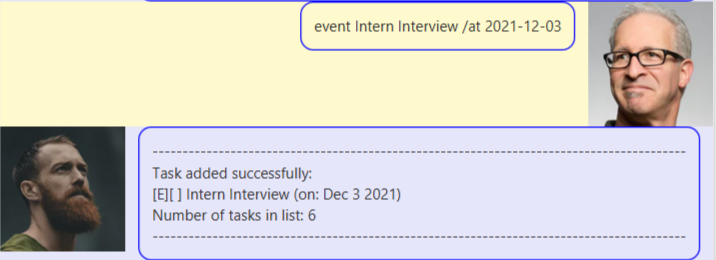

# User Guide
Duke is a program that helps you to manage your tasks via a GUI interface.

## Features 
Duke supports 3 types of tasks, `To-Do`, `Deadline` and `Event`.
<br>
Duke also saves the list to storage. Users can also mark tasks as 
<br>
done, delete tasks, tag tasks and see all the tasks in a list.

## Usage
```
Notes about the command format: Words surrounded by `{}` are parameters
provided by the user. Example: todo {DESCRIPTION}, where DESCRIPTION 
is a parameter provided by the user as the description of the To-Do task.
```
### `list` - View the full list of tasks.

Displays the current list of tasks.

Format: `list`

### `bye` - Exits the program.

Exits the program and close the GUI window.

Format: `bye`

### `todo` - Adding a To-Do task.

Adds a To-Do task to the list of tasks.

Format: `todo {DESCRIPTION}`

Examples:
- `todo water plants`
- `todo cook dinner`

### `deadline` - Adding a task with a deadline

Adds a task that has an attached deadline.

Format: `deadline {DESCRIPTION} /by {DEADLINE_DATE}`

- `{DEADLINE_DATE}` represents a date in the form of `YYYY-MM-DD`.

Examples:
- `deadline Assignment 1 /by 2021-11-02`
- `deadline School Project /by 2022-01-02`


### `event` - Adding an event happening at a certain date

Adds a task that happens at a certain date.

Format: `event {DESCRIPTION} /at {EVENT_DATE}`

- `{EVENT_DATE}` represents a date in the form of `YYYY-MM-DD`.

Examples:
- `event Intern Interview /at 2021-12-03`
- `event Computing Conference /at 2022-07-05`


### `tag` - Add a tag to a task

Adds a tag to a task in the list.

Format: `tag {INDEX} #{TAG}`
- Tags the task at `INDEX` position in the list.
- `{TAG}` represents the exact tag description.

Examples:
- `tag 2 #Due Soon`
- `tag 4 #Important`
  

### `done` Mark a task as done

Marks the specified task as done.

Format: `done {INDEX}`
- Marks the task at `INDEX` position as done.

Examples: 
- `done 1`

### `delete` Delete a task

Deletes the specified task.

Format: `delete {INDEX}`
- Deletes the task at position `INDEX`.

Examples:
- `delete 1`

### `find` Finds task(s)

Finds task(s) that has description matching the given keyword,<br>
or that is tagged with the specified tag.

Format: 
1. `find {KEYWORD}`
2. `find #{TAG}`
- Use either format (1) or (2) to search by keyword and tag respectively.
- `find {KEYWORD}` returns all tasks with description containing `{KEYWORD}`.
- `find #{TAG}` returns all tasks tagged with `{TAG}`. The tags must be an **EXACT** match.

Examples:
- `find school`
- `find #Important`


### Saving the data
Duke automatically saves the tasks in the hard disk after any command that adds <br>
or modifies the tasks.
