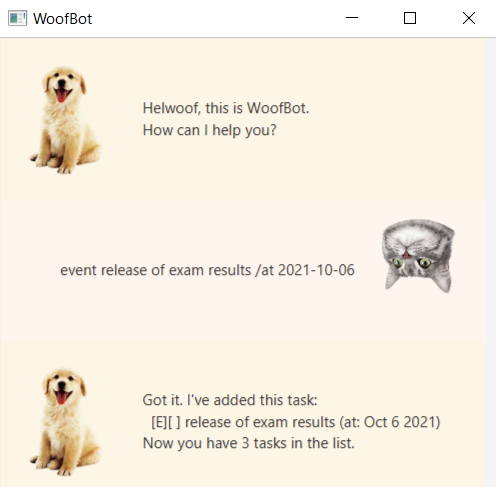
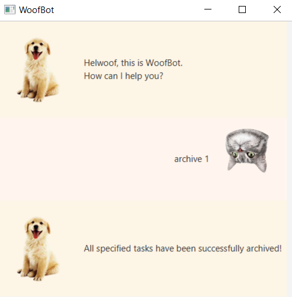
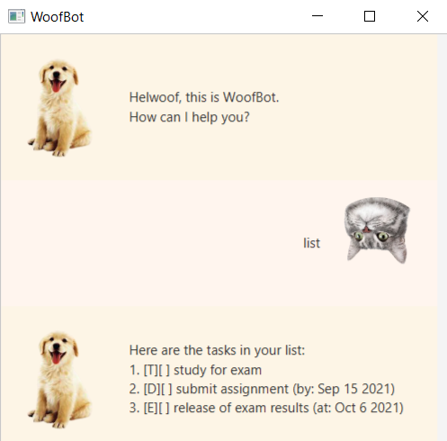

# User Guide
_Adapted from AddressBook3 [SE-Edu User Guide](https://se-education.org/addressbook-level3/)_


Sun is your own Personal Assistant Chatbot for managing tasks, 
optimized for use via a Command Line Interface (CLI) while still 
having the benefits of a Graphical User Interface (GUI).

## Getting Started

1. Ensure you have `Java 11` or above installed in your Computer.
2. Download the latest `Sun.jar` from [here](https://github.com/wonyeji/ip/releases).
3. Copy the file to the folder you want to use as the home folder for your Sun Chatbot.
4. Double-click the file to start the app. The GUI that is similar to the picture above should appear in a few seconds.

## Features 

> Notes about command format: 
> * Words in `UPPER_CASE` are the parameters to be supplied by the user.
>   * e.g. in `done INDEX`, `INDEX` is a parameter which can be used as `done 1`.
> * Extraneous parameters for commands that do not take in parameters (such as `help`, `list`, `archives` and `bye`) 
> will be ignored.
>   * e.g. if the command specifies `list 123`, it will be interpreted as `list`.
> * Format supported for date and time is only `DDMMYY HHmm `
>   * e.g `190921 1700` refers to 19 September 2021, 5:00PM.

### Viewing Help: `help` 

Shows the list of commands Sun can handle.

Format:  `help`

Expected outcome: 


### Adding a To Do task: `todo`

Adds a task to the task list.

Format: `todo TASK_DESCRIPTION`

Example of usage:

```
todo read book
```

Expected outcome:


### Adding a Deadline task: `deadline`

Adds a task with a deadline to the task list.

Format: `deadline TASK_DESCRIPTION /by DATE`

Example of usage:

```
deadline essay /by 120421 2359
```

Expected outcome:


### Adding an Event task: `event`

Adds an event to the task list.

Format: `event TASK_DESCRIPTION /at DATE`

Example of usage:

```
event party /at 120421 1700
```

Expected outcome:



### Marking a task as done: `done`

Marks the specified task as done.

Format: `done INDEX`

* Marks as done the task at the specified `INDEX`. 
* The index refers to the index number shown in the displayed task list.
* The index **must be a positive integer** 1, 2, 3, ...

Example of usage:

```
done 1
```

Expected outcome:


### Deleting a task: `delete`

Deletes the specified task from the task list.

Format: `delete INDEX`

* Deletes the task at the specified `INDEX`.
* The index refers to the index number shown in the displayed task list.
* The index **must be a positive integer** 1, 2, 3, ...
  
Example of usage:

```
delete 1
```

Expected outcome:


### Archiving a task: `archive`

Archives the specified task from the task list.

Format: `archive INDEX`

* Archives the task at the specified `INDEX`.
* The index refers to the index number shown in the displayed task list.
* The index **must be a positive integer** 1, 2, 3, ...

Example of usage:

```
archive 1
```

Expected outcome:



### Finding a task: `find`

Find tasks whose descriptions contain the keyword.

Format: `find KEYWORD`

* The search is case-insensitive. e.g book will match Book.
* The order of the keywords does not matter. e.g. read book will match book read.

Example of usage:

```
find book
```

Expected outcome:


### Listing all tasks: `list`

Shows a list of all tasks.

Format: `list`

Expected outcome:



### Listing all archived tasks: `archives`

Shows a list of all archived tasks.

Format: `archives`

Expected outcome:


### Terminating Sun: `bye`

Exits Sun GUI.

Format: `bye`

Expected outcome: 


## Command summary

Action | Format
-------|-------------------
**Add ToDo**   | `todo <description>` Adds a task to the task list.                                                          
**Add Deadline** | `deadline <description> /by <date> <time>` Adds a task with a deadline to the task list.                    
**Add Event**   | `event <description> /at <date> <time>` Adds an event to the task list.                                     
**Done**     | `done <index>` Marks the specified task as done.                                                           
**Delete**    | `delete <index>` Deletes the specified task.                                                                
**Archive**    | `archive <index>` Archives the specified task.                                                            
**List**     | `list` Shows a list of all tasks.                                                                                    
**Archives**    | `archives` Shows a list of all archived tasks.                                                           
**Find**     | `find <keyword>` Find tasks whose descriptions contain the keyword.                                        
**Help**     | `help` Shows the list of commands Sun can handle.                                                          
**Terminate**     | `bye` Exits Sun GUI.
