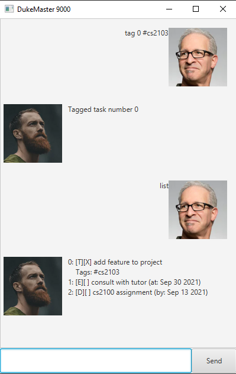

# User Guide

---

## Quick Start
1. Install [Java 11](https://www.oracle.com/sg/java/technologies/javase-jdk11-downloads.html)
2. Download .jar file from [latest release](https://github.com/CSYGalvin/ip/releases/tag/A-Release).
4. Double-click on the .jar file to run DukeMaster9000.
5. Refer to the **Usage** for the details of each command.

---

## Features

1. Add and delete Tasks
2. Mark Task as done
3. Find Tasks using keyword
4. List all Tasks
5. Save Tasks to hard disk after session
6. Load Tasks from hard disk during session
7. Tag Tasks with more information

---

## Commands in Duke
Command | Description
----------- | ------------
`todo { name }` | Creates a to do task with specified name
`deadline { name } /by { YYYY-MM-DD }` | Creates a deadline task with specified name and time
`event { name } /at { YYYY-MM-DD }` | Creates an event task with specified name and time
`list` | List all tasks
`done { number }` | Marks the specified task as done
`delete { number }` | Deletes the specified task
`find { keyword }` | Finds all tasks that contains the specified keyword
`tag { number } # { name }` | Tags the specified task with the specified tag
`bye` | Saves tasks to hard disk and closes session

---

## Usage

### `todo` - Creates to do task

Example of usage: 

`todo add feature to project`

Expected outcome:

![Added task: [T][ ] add feature to project](todo.png)

### `event` - Creates event task

Example of usage:

`event consult with tutor /at 2021-09-30`

Expected outcome:

![Added task: [E][ ] consult with tutor (at: Sep 30 2021)](event.png)

### `deadline` - Creates deadline task

Example of usage:

`deadline cs2100 assignment /by 2021-09-13`

Expected outcome:

![Added task: [D][ ] cs2100 assignment (by: Sep 13 2021)](deadline.png)

### `list` - Lists all task in task list

Example of usage:

`list`

Expected outcome:

### `done` - Marks task as done

Example of usage:

`done 0`

Expected outcome:

### `delete` - Deletes task from task list

Example of usage:

`delete 0`

Expected outcome:  

### `find` - Finds task containing keyword

Example of usage:

`find assignment`

Expected outcome:

### `tag` - Adds a tag to the task

Example of usage:

`tag 0 #cs2103`

Expected outcome:

### `bye` - Save tasks to hard disk

Example of usage:

`bye`

Expected outcome:

