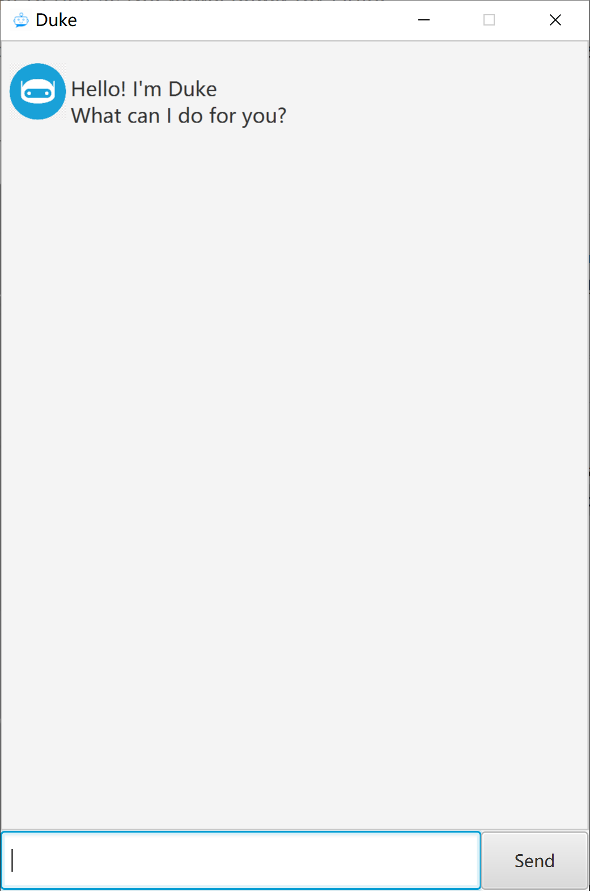

# User Guide

Duke is a **desktop app for managing tasks, optimized for use via a Command Line Interface** (CLI) while still having the benefits of a Graphical User Interface (GUI). If you can type fast, Duke can help you manage tasks faster than traditional GUI apps.

- [Quick start](#quick-start)
- [Features](#features)
    - [Adding a Todo task : `todo`](#adding-a-todo-task-todo)
    - [Adding a Deadline task : `deadline`](#adding-a-deadline-task-deadline)
    - [Adding an Event task : `event`](#adding-an-event-task-event)
    - [Listing all tasks : `list`](#listing-all-tasks-list)
    - [Marking tasks as done : `done`](#marking-tasks-as-done-done)
    - [Deleting tasks : `delete`](#deleting-tasks-delete)
    - [Locating tasks by description : `find`](#locating-tasks-by-description-find)
    - [Exiting the program : `bye`](#exiting-the-program-bye)
    - [Saving the data](#saving-the-data)
    - [Editing the data file](#editing-the-data-file)
- [FAQ](#faq)
- [Command summary](#command-summary)
- [Acknowledgements](#acknowledgements)

------

## Quick start

1. Ensure you have Java `11` or above installed in your Computer.
2. Download the latest `duke.jar` from [here](https://github.com/fans2619/ip/releases/download/A-Release/duke.jar).
3. Copy the file to the folder you want to use as the *home folder* for Duke.
4. Double-click the file to start the app. The GUI similar to the below should appear in a few seconds. See [FAQ](#faq) if double-click does not work.  

   
   
    

5. Type the command in the command box and press Enter or Send to execute it.
   Some example commands you can try:
    - **`list`** : Lists all tasks.
    - **`todo`**`return book` : Adds a Todo task with the description "return book".
    - **`delete`**`3` : Deletes the 3rd task shown in the current list.
    - **`bye`** : Exits the app.
6. Refer to the [Features](#features) below for more commands and details of each command.

------

## Features

**Notes about the command format:** 

- Words in `UPPER_CASE` are the parameters to be supplied by the user.
  e.g. in `todo TASK_DESCRIPTION`, `TASK_DESCRIPTION` is a parameter which can be used as `todo return book`.

- Extra leading and trailing spaces inside commands will be ignored.

  e.g. if the command specifies `‎‎‎‎‎‎ todo              return     book ‎‎‎‎`, it will be interpreted as `todo return     book`.

  e.g. if the command specifies `‎‎‎‎‎‎ done              1     2	3 ‎‎‎‎`, it will be interpreted as `done 1 2 3`.

- Extraneous parameters for commands that do not take in parameters (such as `list`, `bye`) will make the command invalid.

### Adding a Todo task: `todo`

Adds a Todo task to the task list.

Format: `todo TASK_DESCRIPTION`

Example:

- `todo return book`

### Adding a Deadline task: `deadline`

Adds a Deadline task to the task list.

Format: `deadline TASK_DESCRIPTION /by TASK_DEADLINE`

`TASK_DEADLINE` must be in the format of **yyyy-mm-dd**.

Example:

- `deadline return book /by 2021-09-12`

### Adding an Event task: `event`

Adds an Event task to the task list.

Format: `event TASK_DESCRIPTION /at TASK_PERIOD`

Example:

- `event team meeting /at Sat 2-3pm`

### Listing all tasks: `list`

Shows all the tasks in the task list.

Format: `list`

### Marking tasks as done: `done`

Marks the specified tasks in the task list as done.

Format: `done INDEX1 [INDEX2] ...`

- Marks the tasks at the specified `INDEX`s as done.
- The index refers to the index number shown in the displayed task list.

Examples:

- `done 2` marks the 2nd task in the task list as done.
- `done 2 3 4` marks the 2nd task and the 3rd task and the 4th task in the task list as done.
- `done 4 2 3` marks the 2nd task and the 3rd task and the 4th task in the task list as done.
- `done 0` will show an error since there will never be a task at `index 0`.
- `done 0 1` marks only the 1st task in the task list as done.

### Deleting tasks: `delete`

Deletes the specified tasks from the task list.

Format: `delete INDEX1 [INDEX2] ...`

- Deletes the tasks at the specified `INDEX`s.
- The index refers to the index number shown in the displayed task list.

Examples:

- `delete 2` deletes the 2nd task in the task list.
- `delete 2 3 4` deletes the 2nd task and the 3rd task and the 4th task in the task list.
- `delete 4 2 3` deletes the 2nd task and the 3rd task and the 4th task in the task list.
- `delete 0` will show an error since there will never be a task at `index 0`.
- `delete 0 1` deletes only the 1st task in the task list.

### Locating tasks by description: `find`

Finds tasks whose descriptions contain the given keyword.

Format: `find KEYWORD`

- The search is case-insensitive e.g. `Return book` will match `return book`
- Only the description is searched, i.e., not the deadline of a Deadline task or the period of an Event task.
- Partial words can be matched e.g. `return` will match `return book`
- Spaces **except** leading and trailing spaces of the `KEYWORD` will be treated as part of the `KEYWORD` e.g. `find ‎‎‎‎ return book ‎‎‎` will return tasks whose descriptions contain "return book" but not "return" or "book" or "return       book".

### Exiting the program: `bye`

Exits the program.

Format: `bye`

### Saving the data

Duke data are saved in the hard disk automatically after any command. There is no need to save manually.

### Editing the data file

Duke data are saved as a text file `[JAR file location]/data/duke.txt`. Advanced users are welcome to update data directly by editing that data file.

**Caution:** If your changes to the data file makes its format invalid, Duke will discard all data and start with an empty data file at the next run.

------

## FAQ

1. **Q**: Why doesn't double-clicking the file `duke.jar` start the app? 
   **A**: This could be due to your system configuration for the default application to open any `.jar` file. If you are on Windows, firstly set the default application to open a `.jar` file to **Java(TM) Platform SE Binary** and then double-clicking `duke.jar` should be able to start the app properly. Alternatively, you can open a terminal on your computer and navigate to the folder where `duke.jar` is stored. Then run command `java -jar duke.jar`.

   **NOTE:**

    1. If you are on Windows, please do **NOT** start the app by right-clicking `duke.jar` and using "open with **Java(TM) Platform SE Binary**". You should change the default application to open any `.jar` file first and use double-click to start the app. Otherwise, the app may not run properly.

2. **Q**: How do I transfer my data to another computer? 
   **A**: Install the app in the other computer and overwrite the empty data file it creates with the file that contains the data of your previous Duke home folder.

------

## Command summary

| Action                | Format, Examples                                             |
| --------------------- | ------------------------------------------------------------ |
| **Add Deadline task** | `deadline TASK_DESCRIPTION /by TASK_DEADLINE` e.g., `deadline return book /by 2021-09-12` |
| **Add Event task**    | `event TASK_DESCRIPTION /at TASK_PERIOD` e.g., `event team meeting /at Sat 2-3pm` |
| **Add Todo task**     | `todo TASK_DESCRIPTION` e.g., `todo return book`          |
| **Delete task**       | `delete INDEX1 [INDEX2] ...` e.g., `delete 2`, `delete 2 3 4` |
| **Done task**         | `done INDEX1 [INDEX2] ...` e.g., `done 2`, `done 2 3 4`  |
| **Exit**              | `bye`                                                        |
| **Find task**         | `find KEYWORD` e.g., `find return`, `find return book`    |
| **List all tasks**    | `list`                                                       |

---

## Acknowledgements

**This User Guide is adapted from the [AddressBook Level 3 (AB3) User Guide](https://se-education.org/addressbook-level3/UserGuide.html).**
