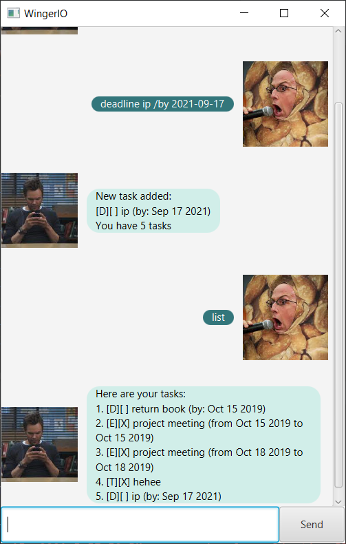

# User Guide for Duke
Duke is a desktop app designed to help you keep track of tasks through
a Graphical user Interface (GUI).
## Features and Usage
Upon starting Duke, you will see this:  
  
Simply click into the command box at the bottom and type any of the commands listed below!  
### Add tasks as a Todo, Event, or Deadline : <mark>todo</mark> or <mark>event</mark> or <mark>deadline</mark>
  * Todo is formatted as __todo task__. Eg: todo run
  * Event is formatted as __event task /at YYYY-MM-DD HH:MM__. Eg:event meeting /at 2021-07-09 13:00
  * Deadline is formatted as __deadline task /by YYYY-MM-DD HH:MM__. Eg:deadline assignment /by 2021-07-09 13:00
### Delete tasks: <mark>delete</mark>
  * Delete is formatted as __delete task number__. Eg: delete 1
### Mark tasks as done: <mark>done</mark>
  * All tasks are marked as  not done when created
  * Mark as done is formatted as __done task number__. Eg: done 1
###Snooze/reschedule tasks: <mark>snooze</mark>
  * Events and Deadlines can be rescheduled to a different date and time.
  * Snooze/reschedule is formatted as __snooze task number YYYY-MM-DD HH:MM__. Eg: snooze 2 2021-07-09 13:00
### All tasks are saved to your local disk 
  * Tasks will be exactly as you saved it when you open up Duke again!
### Quit Duke: <mark>bye</mark>
  * To quit Duke, simply type __bye__ and Duke will exit.
