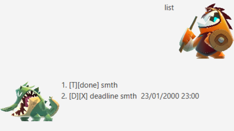

# User Guide
Project Duke Chatbot will be officially known as Dukebot for short.

Greetings summoner, this is the user manual for dukeBot. A general guideline for
the functionality of the bot is listed here. For more detailed information regarding
the software architecture etc, please refer to the developer's guide below.
Below is the general UI of the bot. Dukebot mainly focuses on keyboard input so
all commands can simply be typed. Dukebot also does not require connection as you can run
the files locally.

##Features

###Help command
Dukebot supports the usage of help command. This help command is intended to act as a quick 
reference to users.

The above is a general help command. We can search for specific commands by typing either the number
or the word.

###Add and manage your tasks
Dukebot supports the use of three tasks. Creation of these tasks would be added to log 
of the bot.

* Todo: The simplest task that records and event. There is no fixed condition for this 
task. The format for this is task {insert task here}

* Deadline: A task with a deadline that it needs to be completed by. The format is 
deadline {insert task name here} {/by DD/MM/YYYY HH/MM}.

* Event: A task with a time that it is conducted at. The format is 
deadline {insert task name here} {/by DD/MM/YYYY HH/MM}.

###List tasks
We are able to list the tasks in the log using the list command. Previously created tasks
will be displayed here.

###Complete Tasks

Tasks can be completed to show the user that the command has been executed already.
**Completed Commands are automatically deleted to prevent long text**
The format for done command is done {insert task number here}

Precompleted tasklist:

After done command:

###Delete tasks
Tasks can be deleted to prevent long text fields. The format for deleting tasks is
delete {insert task number here}

Precompleted tasklist:

Completed delete command:

### Find command
The find command can be used to search for certain tasks to see the deadline.

After find command:

# Dev Guide

This is the for the current version of Dukebot lvl 1.

The below is an attached image of what the architecture of the DukeBot is.

