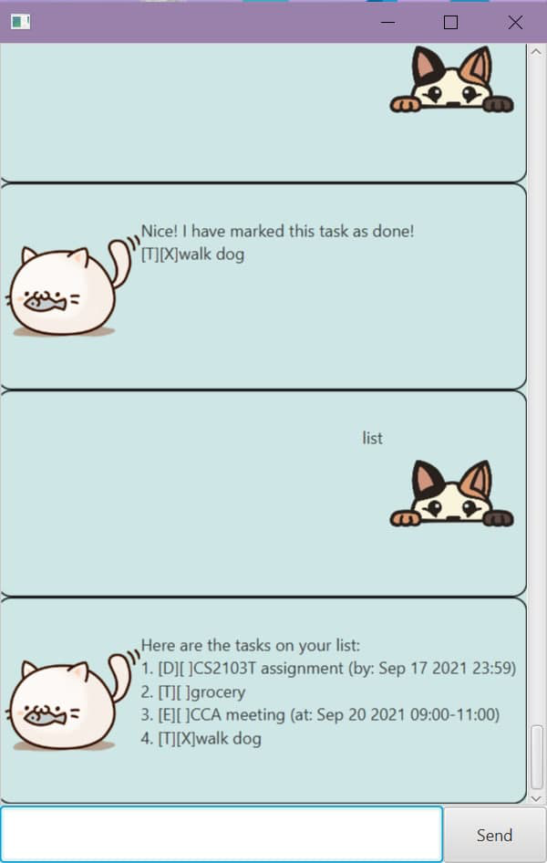

# User Guide



Duke is an application that allows easy task creation and management.

## Features

### Intuitive GUI

An intuitive user interface allows Duke GUI to be used easily.

### Easy-to-use CLI

Duke can also be launched in CLI mode, which allows quick adding of tasks in via a command line interface.

### Dates

Date information can be added to tasks, making it easy to keep track of deadlines and events.

## Usage

Set the `USE_GUI` flag in Duke to set whether to run Duke in GUI or CLI mode.

### `help` - Show help

Shows the help command, which lists all the other commands.

Example of usage:

`help`

Expected outcome:

```
ALL COMMANDS:
add         Add a task (with optionally a deadline or a date)
bye         Exit Duke
delete      Delete a task
done        Mark the task as done
find        Find a task
help        Display all commands, or detailed info of given command
list        List all tasks
```

The list of commands are shown above.
