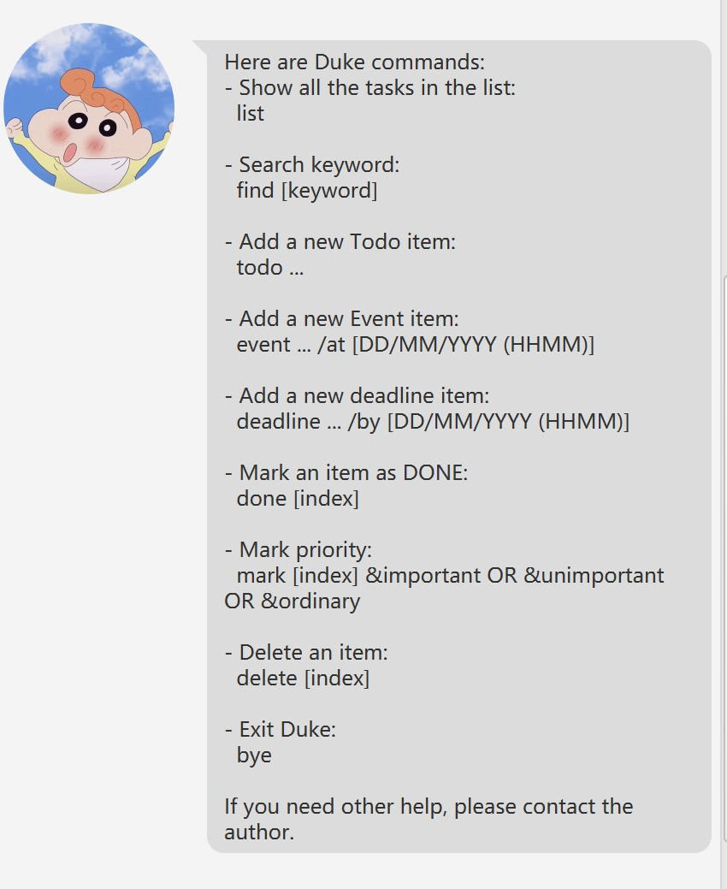

# User Guide
Duke is your personal assistance that keeps track of all your tasks.

## Features 

### Add Todo `todo`
Add a simple todo to the list.\
Format: `add  TASK_NAME`\
Example: `add  finish iP task`

### Add Deadline `deadline`
Add a simple task with deadline.\
Format: `deadline TASK_NAME /by YYYY-MM-DD`\
Example: `deadline finish tP task /by 2021-12-08` \
Note: the input time format has to be exactly `YYYY-MM-DD`

### Add Event `event`
Add a simple event.\
Format: `event EVENT_NAME /at YYYY-MM-DD`\
Example: `event attend 2103t lecture /at 2021-12-10` \
Note: the input time format has to be exactly `YYYY-MM-`DD`

### List Tasks `list`
List out all tasks in your list \
Format: `list`

### Delete Task `delete`
Delete a task by its id \
Format: `delete TASK_ID` \
Example: `delete 1`

### Mark tasks as done `done`
Delete a task by its id \
Format: `done TASK_ID` \
Example: `done 1`

### Save task automatically
Tasks are saved automatically when you enter, or delete or modify them

### Find task by key phrase `find`
Find tasks by keywords in their name \
Format: `find KEY_PHRASE` \
Example: `find tP`

### Exit the program `bye`
Exit the program \
Format: `bye`

## Usage

### `todo` - Add todo task
Example of usage:\
`add finish iP task`

Expected outcome: \

### `deadline` - Add deadline task
Example of usage:\
`deadline finish tP task /by 2021-12-08`

Expected outcome: \

### `done` - Mark task as done
Example of usage:\
`done 1`

Expected outcome: \

### `find` - Find task
Example of usage:\
`find tP`

Expected outcome: \

