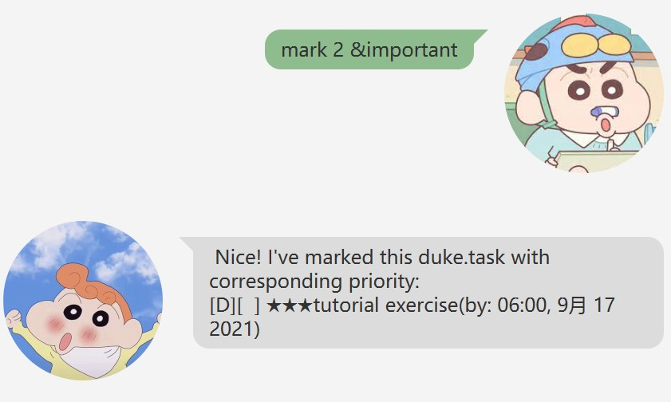

# User Guide

Duke is **an interactive desktop app for managing tasks**, optimized for use via **a Command Line Interface (CLI)** while still having the benefits of **a Graphical User Interface (GUI)**. If you can type fast, Duke can get your task operations done faster than traditional GUI apps.

## Quick Start

1. Ensure you have JDK 11 on your computer, and update Intellij to the most recent version.
2. Download the latest released jar file from [here](https://github.com/wengYing227/ip/releases) to your computer.
3. Double-click the file or run the command `java -jar duke.jar` to start the app. The GUI similar to the below will
appear in several seconds. (Note: some sample data are inside the database)

4. Type in commands in the command box and click `Send` button to execute your command.
You can try the following commands.
   - **`list`**: Lists all task items
   - **`todo`**`return book`: Adds a new Todo task
   - **`done`**`6`: Marks an item as Done
   - **`bye`**: Exits the app
5. More commands can be found in [Features](https://github.com/wengYing227/ip/blob/master/docs/README.md#features).

## Features 
Note the following about command format:
1. The identifiers are not case-sensitive. e.g. `bye` and `BYE` is the same command.
2. Fields in the curly braces such as `{description}` are for you to specify the input.
3. Date/Time in commands should be formatted in `DD/MM/YY hhmm`, such as `20/09/2021 1800`. (Note: `hhmm` is optional.)
4. Fields in square brackets such as `[&important OR &unimportant OR &ordinary]` are for you to choose one as input.
### Viewing help: `help`

Shows a message explaning all commands used to execute the app.

Format: `help`

### Listing all items: `list`

Lists all task items in the database.

Format: `list`

### Adding a Todo task: `todo`

Adds a Todo task with its description.

Format: `todo {description}`

Examples:
- `todo buy milk`
- `todo return book`

### Adding an Event task: `event`

Adds an Event task with its description and date(time).

Format: `event {description} /at {date(time)}`

Examples:
- `event meeting /at 20/09/2021 1400`
- `event Estela's party /at 02/10/2021`

### Adding a Deadline task: `deadline`

Adds a Deadline task with its description and date(time).

Format: `deadline {description} /by {date(time)}`

Examples:
- `deadline GEQ1000 Quiz /by 06/09/2021`
- `deadline submit lab6 /by 18/09/2021 1400`

### Marking a task as Done: `done`

Marks a task specified by its index as Done.

Format: `done {index integer}`

Example: 
- `done 2`

### Marking a task with a priority level: `mark`

Marks a task specified by its index with a specified priority level.

Format: `mark {index integer} [&important OR &unimportant OR &ordinary]`

Examples:
- `mark 2 &important`
- `mark 11 &ordinary`
- `mark 5 &unimportant`

### Deleting a task item: `delete`

Deletes a task specified by its index.

Format: `delete {index integer}`

Example:
- `delete 10`

### Searching for task item: `find`

Searches for task item containing the keyword.

Format: `find {keyword}`

Examples:
- `find meeting`
- `find buy`

### Exiting: `bye`

Exits from the app and closes the window as well.

Format: `bye`

## Command Summary
Action|Format
------|------
Help | `help`
List | `list`
ToDo | `todo {description}`
Event | `event {description} /at {date(time)}`
Deadline | `deadline {description} /by {date(time)}`
Done | `done {index integer}`
Priority | `mark {index integer} [&important OR &unimportant OR &ordinary]`
Delete | `delete {index integer}`
Find | `find {keyword}`
Exit | bye