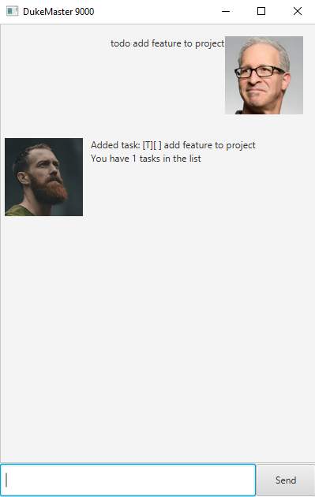

# User Guide

## Introduction

Bloom is a personal task manager that helps you manage the task you need to keep track of.


Tasks are classified into three categories: Todos, Events, and Deadlines. Events and deadlines are tasks associated with a date or time. Each task can be either marked as completed or not completed.

Commands include a keyword, some mandatory arguments, and some optional arguments. The keyword comes first and then the mandatory arguments, i.e., `[keyword] [mandatory arguments]`

## Setting up
**For all platforms:** `cd` to the directory containing `bloom.jar,` and run:
```
java -jar bloom.jar
```
Alternatively, double-click on the ```bloom.jar``` file to open the application.

## Features

The features offered are:

- [Adding a task](#adding-tasks)
- [Listing all tasks](#listing-all-tasks)
- [Deleting a task](#deleting-a-task)
- [Marking a task as done](#marking-a-task-as-done)
- [Finding a task](#finding-a-task)
- [Exiting the app](#exiting-the-app)
- [Adding note to a task](#adding-note-to-a-task)

### Adding tasks
The string representation of a task is as such:
```
[T|E|D][ |X] [task description] [task date]
```
`T, E, D` denotes a Todo, Event or Deadline tasks respectively. `X` denotes completed tasks.

_________________________

To add a new Todo, enter `todo [task description]`.

Example: `todo prepare meeting` adds a new Todo named "prepare meeting".

Expected outcome:
```
Got it. I've added this task:
[T][ ] prepare meeting
```



_________________________

To add a new Deadline, enter `deadline [task description] /by [task date]`. The ```task date``` should be in format of either ```dd/mm/yyyy``` or ```dd-mm-yyyy```.

Example: `deadline iP /by 17-09-2021 2359` adds a new Deadline named ```iP``` due at ```Sep 17 2021 23:59```.

Expected outcome:
```
Got it. I've added this task:
[D][ ] iP (by: Sep 17 2021 23:59)
```


_________________________

To add a new Event, enter `event [task description] /at [task date]`. The ```task date``` should be in format of either ```dd/mm/yyyy``` or ```dd-mm-yyyy```.

Example: `event meeting /by 23-09-2021 2200` adds a new Event named ```meeting``` happening at ```Sep 123 2021 22:00```.

Expected outcome:
```
Got it. I've added this task:
[E][ ] meeting (by: Sep 17 2021 22:00)
```


_________________________

### Listing all tasks
Lists all tasks. The usage is `list`.

Example: `list` lists all tasks.

Expected outcome:
```
Here are the tasks in your list:
1. [T][ ] prepare meeting
2. [D][ ] iP (by: Sep 17 2021 23:59)
3. [E][ ] meeting (at: Sep 23 2021 22:00)
```


-------------------------

### Deleting a task
Deletes the task at the specified index. Use the command `list` to get the list of tasks and indexes. The usage is `delete [task index].`

Example: `delete 1` deletes the task at index 1.

Expected outcome:
```
Noted. I've remove this task:
[T][ ] prepare meeting
```


_________________________

### Marking a task as done
Marks the task at a specified index as done.  Use the command `list` to get the list of tasks and indexes. The usage is `done [task index]`

Example: `done 1` marks the task at index 1 as done.

Expected outcome:
```
Nice! I've marked this task as done:
[D][X] iP (by: Sep 17 2021 23:59)
```


_________________________

### Finding a task
Find tasks based on a specific keyword. The search is case sensitive, i.e., `search woodlands` and `search Woodlands` gives different results. The usage is `search [substring].`

Example: `search meet` searches for tasks with task description containing the string "prepare meeting".

Expected outcome:
```
Here are the matching tasks in your list:
1. [E][ ] meeting (at: Sep 23 2021 22:00)
```


_________________________

### Adding note to a task
Adds note to a task. Marks the task at a specified index as done.  Use the command `list` to get the list of tasks and indexes. The usage is `note [task index] [note content]`

Example: `note 1 CS2103T` marks the task at index 1 as done.

Expected outcome:
```
Noted. I've added a note to this task:
[D][X] iP (CS2103T) (by: Sep 17 2021 23:59)
```


_________________________

### Exiting the app
Exits the app. The usage is `bye`.

Example: `bye` quits the app.

Expected outcome: The window will close after a few seconds!
_________________________

## Uninstallation
To uninstall, simply remove `bloom.jar` in the directory containing `bloom.jar.`
